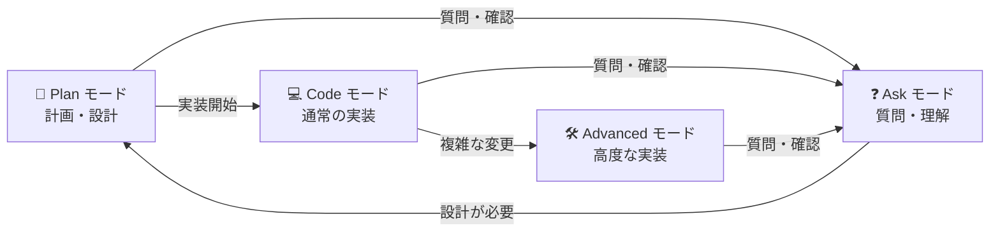
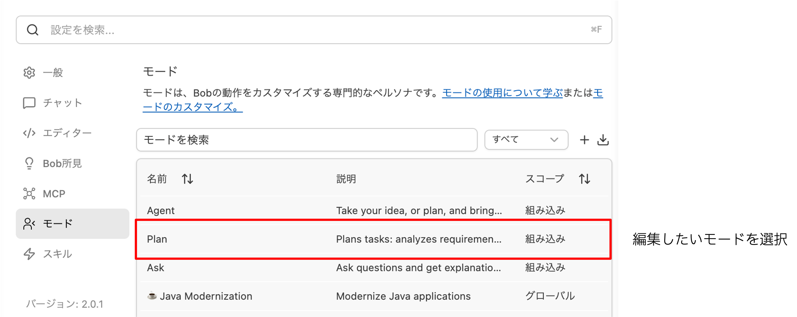
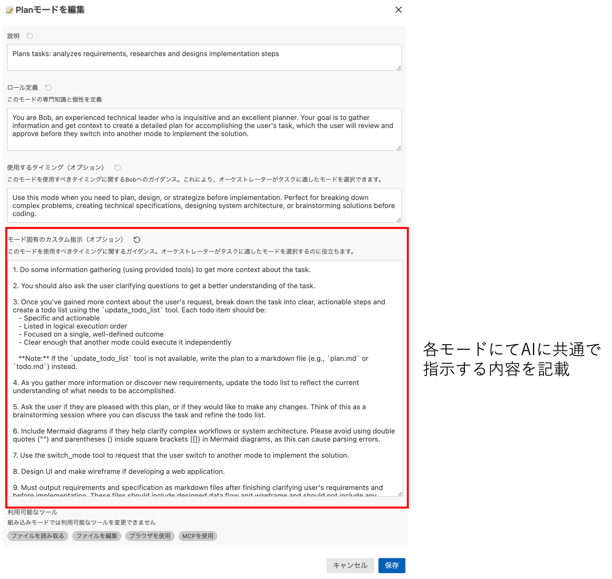
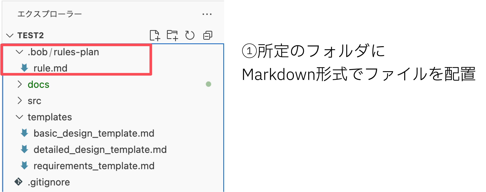
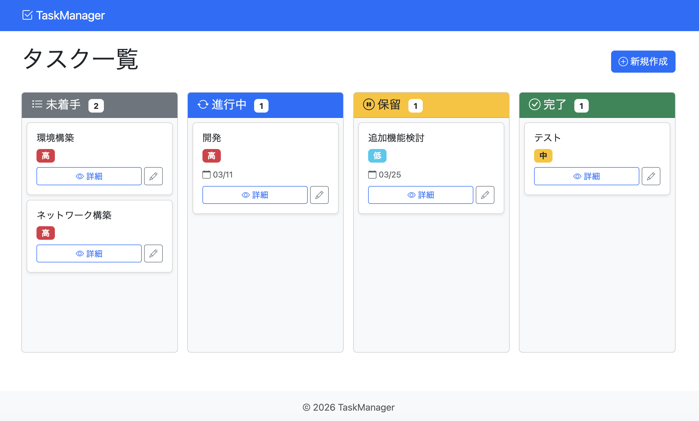
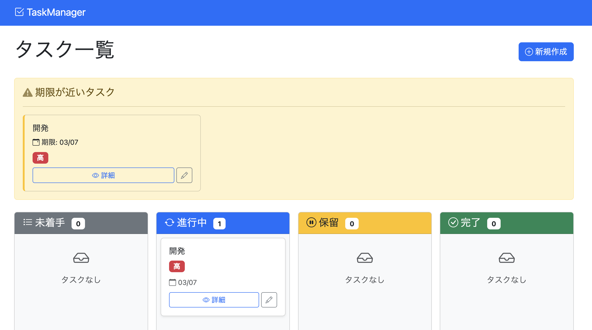
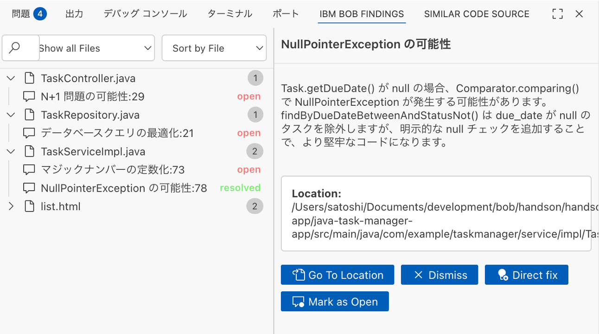

# Bobハンズオン

2026年04月16日  
日本アイ・ビー・エム株式会社

---

## Bobのモード

Bobにはそれぞれに特化したモードが存在します。

### Planモード
- 実装前の計画・設計・戦略立案に特化
- Markdownファイル(.md$)のみ編集可能
- 技術仕様書、アーキテクチャ設計、要件定義書の作成に使用

### Codeモード
- コードの作成、修正、リファクタリングを実行
- 新機能実装、バグ修正、テストコード作成に使用

### Advancedモード
- 全てのファイル編集とコマンド実行が可能
- Codeモードと同等の機能を提供
- より複雑な実装タスクや大規模な変更に適している
- システム全体に影響する高度なリファクタリングに使用

### Askモード
- 説明、ドキュメント、技術的な質問への回答に特化
- コード変更は行わず、分析と情報提供のみ
- Mermaid図を使った視覚的な説明が可能

### モード間の遷移フロー



**モード遷移の説明：**
- **Plan → Code**: 設計完了後、実装フェーズへ移行
- **Code → Advanced**: より複雑な変更が必要な場合に移行
- **Code/Advanced → Ask**: 実装中に質問や確認が必要な場合
- **Ask → Plan**: 質問の結果、再設計が必要と判断された場合

---

## 開発ルールの設定方法

### 1. Bobウィンドウ上部`⋯`→「モード」から設定
各モード共通のカスタム指示が可能。

1. モードにて、編集するモードを指定
2. 編集ボタンを押して、編集画面を開く
3. 「モード固有のカスタム指示」にて、各モードにてAIに共通で指示する内容を記載
4. 保存ボタンを押して、設定を保存




### 2. プロジェクト固有の設定
プロジェクト配下所定のフォルダにルールファイルを置くことでプロジェクト・モード固有でのカスタム指示が可能。

プロジェクト配下の以下のフォルダにMarkdown形式でファイルを配置：

- **Planモード**: `.bob/rules-plan`
- **Codeモード**: `.bob/rules-code`
- **Advancedモード**: `.bob/rules-advanced`
- **Askモード**: `.bob/rules-ask`
- **Java Modernizationモード**: `.bob/rules-javamodernization`



---

## ハンズオンの流れ

以下の流れでハンズオンを実施します。

**前提条件：**
- 既存アプリケーションの設計書は`docs`フォルダに格納済み
  - `docs/requirements.md`: 要件定義書
  - `docs/basic_design.md`: 基本設計書
  - `docs/detailed_design.md`: 詳細設計書

### 1. 追加機能の要件定義と既存設計書の更新
- Bobと要件定義を行い、仕様を詰める
- 既存設計書の修正箇所を洗い出す
- 既存設計書（requirements.md、basic_design.md、detailed_design.md）を更新

### 2. 実装
- Bobと実装
- 設計書に沿ったコードが生成されることを確認

### 3. 単体テスト
- 要件に沿ったテストコードが生成されることを確認
- テストコードを実行し、パスすることを確認

### 4. IT仕様書の作成
- 統合テスト仕様書を作成
- テストシナリオとテストケースが適切に定義されていることを確認

### 5. ST仕様書の作成
- システムテスト仕様書を作成
- エンドツーエンドのテストシナリオが網羅されていることを確認

### 6. IT/STの実行（オプション）
- SeleniumでIT/STのテストコードを作成
- テストを実行し、結果を確認

---

## 事前準備

### ① モード設定

Planモードの「モード固有のカスタム指示」に以下の設定を追加します。

※先頭の数字は、適宜修正してください。

```
8. Design UI and make wireframe if developing a web application.

9. Must output requirements and specification as markdown files after finishing clarifying user's requirements and before implementation. These files should include designed data flow and wireframe and should not include any source codes of programming languages. If these markdown specification files already exist, add, update and revise the existing files instead of creating new ones.

10. When designing web application, must ask your users for details about what items they want to see.
```

**設定の意図：**
- 画面デザインを同時に行うようにする
- 設計書をファイルとして出力するようにする
- Webアプリで、画面上の詳細項目を質問するようにする

### ② ハンズオンアプリの展開

#### ⅰ. ハンズオン用資材の取得

タスク管理Webアプリケーションを以下のいずれかから取得してください。

- [GitHub](https://github.com/skoibuchi/bob-handson-app-java-todo-application.git)
- [BOX](https://ibm.box.com/s/mb21108531o81lr5mzb9eppu7a9mdtdi)

#### ⅱ. フォルダ構成の確認

Bobにて展開先のフォルダを開いてください。以下の構成になっていればOKです。

**各フォルダ内容：**

- **`.bob`**: Bobへの各モードの指示を格納しています
- **`docs`**: 既存アプリケーションの設計書を格納しています
  - `requirements.md`: 要件定義書
  - `basic_design.md`: 基本設計書
  - `detailed_design.md`: 詳細設計書
- **`templates`**: 設計書のテンプレートを格納しています
- **`html-task-manager-app`**: デモ用のタスク管理Webアプリケーション（HTML/CSS/JavaScript）

#### ⅲ. 動作確認

[`html-task-manager-app/README.md`](./html-task-manager-app/README.md)を参考に、実行して、動作を確認してください。



---

## 1. 追加機能の要件定義と既存設計書の更新

既存アプリに追加機能の要件定義をリクエストし、既存設計書を更新します。

### 手順

1. **Planモードに設定**

2. **Bobに追加機能の要件定義をリクエストします**
   ```
   期限が3日以内のタスクを通知する機能を追加したい。
   ```
   
   ※Bobから仕様を詰めるための質問が来る場合は適宜答えていきます。
   
   例：
   ```
   ダッシュボード一覧に「期限が近いタスク一覧」セクションを追加して一覧表示する
   ```

3. **Bobがプロジェクト内にあるファイル（既存設計書を含む）から情報を読み取り、プロジェクトを理解しようとするので、適宜承認していきます**
   
   Bobは`docs`フォルダ内の既存設計書やソースコードを確認します。

4. **不足している情報や、設計書の出力方法について聞かれた場合は、適宜答えていきます**

5. **情報が揃ったと判断すると、BobがTodoリストを作成し、計画を立てるので、内容を確認します**
   
   計画には以下が含まれることを確認：
   - 既存設計書の修正箇所の洗い出し
   - 各設計書（requirements.md、basic_design.md、detailed_design.md）の更新計画
   
   問題がなければ承認し、工程が不足している場合はBobに伝えます。  
   例：
   ```
   既存設計書の修正・上書きで追加機能の設計を出力してください。まず、既存設計書の修正箇所を洗い出してください
   ```

6. **Bobが既存設計書を更新していくので、内容を確認します**
   
   以下の点を確認：
   - 既存の内容との整合性が取れているか
   - 追加機能の要件が適切に反映されているか
   - 設計書間の一貫性が保たれているか
   
   内容に問題なければ承認、問題があれば適宜Bobに伝えて修正を促します。

---

## 2. 実装

作成した設計書を基に、Bobに実装をリクエストします。

### 手順

1. **Bobに実装をリクエストします**
   
   - `1. 追加機能の要件定義`のチャットの続きで、以下のリクエストを送信します
      ```
      実装を進めてください
      ```
   - もし、チャットを削除・新規プロジェクトとして作成した場合は、新しいチャットで以下のリクエストを送信します。
      ```
      設計書を基に実装を行なってください
      ```

2. **Codeモードでない場合は、BobがCodeモードへの変更を要求してくるので、承認します**

3. **必要に応じて、Bobが既存ファイルを確認するため、承認します**

4. **実装が開始したら、適宜内容を確認し、承認・保存していきます**
   
   ※CodeモードではBobがコマンドを実行しようとする場合があります。問題ないか確認してください。

5. **実装が完了したら、動作確認を行います**
   
   - HTMLファイルを直接開くコマンドをBobに実行させる、もしくはhtml-task-manager-app/index.html`をユーザーで直接ブラウザで開いてください。  
      ※Bobから以下のようにローカルサーバーを起動するコマンドを提示される場合がありますが、拒否してください。

     ```sh
     # 拒否するコマンド
     cd html-task-manager-app && python -m http.server
     ```
     
     以下のようなコマンドであれば、ブラウザで開く動作となります。承認してください。

     ```sh
     # 承認するコマンド
     open html-task-manager-app/index.html
     ```
   
   - 問題がなければ実装を終了します。以下のように追加機能が実装された状態になれば成功です。

   

---

## 2. 実装（補足）：コードレビュー

`/review`コマンドを使用してコードの静的解析を行います。

### 手順

1. **Advancedモードに設定します**

2. **`/review`を実行することで、Bobが静的解析を行います**

3. **Bob Findingsにて、解析結果を確認可能です**

4. **Bobに修正をリクエストすることも可能です**



---

## Bobコマンド

参考）Bobが提供している主要なスラッシュコマンド：

| 分類 | コマンド | 説明 |
|------|----------|------|
| **コード関連** | `/review` | コードレビュー実行 |
| | `/fix` | コード問題修正 |
| | `/test` | テストコード生成 |
| | `/optimize` | コード最適化提案 |
| **ドキュメント関連** | `/doc` | ドキュメント生成 |
| | `/explain` | コード・概念説明 |
| **プロジェクト関連** | `/plan` | タスク計画立案 |
| | `/commit` | コミットメッセージ生成 |
| **その他** | `/help` | ヘルプ表示 |
| | `/clear` | 会話履歴クリア |

---

## 3. 単体テスト

Bobに作成したアプリケーションの単体テスト工程の実施をリクエストします。

### 手順

1. **Planモードに設定されていることを確認します**
   
   Planモードからだとテスト実施計画書の作成から実施してくれます。

2. **Bobに単体テストの実施をリクエストします**
   ```
   タスク管理Webアプリケーションの単体テストの実施をお願いします。
   ```
   
   実施計画書が作成されて、計画書が出力されない場合は以下のようにリクエストしてください：
   ```
   カバレッジ率を含めた実施計画書を出力してください。
   ```

3. **内容に問題がなければテストの実装をリクエストします**
   ```
   テストを実装してください。
   ```

4. **Bobにテストコード実行を実施させ、最後にテストレポートを出力させます**
   ```
   テストを実行し、レポートを出力してください。
   ```
   
   ※ テストはブラウザを使用するためAdvancedモードで実行されることを確認してください。

---

## 4. IT仕様書の作成

Bobに統合テスト仕様書の作成をリクエストします。

### 手順

1. **Planモードに設定されていることを確認します**

2. **BobにIT仕様書の作成をリクエストします**
   ```
   タスク管理Webアプリケーションの統合テスト仕様書を作成してください。
   ```

3. **Bobがプロジェクト内のファイルを確認するので、適宜承認していきます**

4. **IT仕様書が作成されるので、以下の内容が含まれているか確認します**
   - テスト目的と範囲
   - テスト環境
   - 統合テストシナリオ
   - テストケース（入力値、期待結果、実際の結果）
   - 合格基準

5. **内容に問題がなければ承認し、問題があれば修正をリクエストします**

---

## 5. ST仕様書の作成

Bobにシステムテスト仕様書の作成をリクエストします。

### 手順

1. **Planモードに設定されていることを確認します**

2. **BobにST仕様書の作成をリクエストします**
   ```
   タスク管理Webアプリケーションのシステムテスト仕様書を作成してください。
   ```

3. **Bobがプロジェクト内のファイルを確認するので、適宜承認していきます**

4. **ST仕様書が作成されるので、以下の内容が含まれているか確認します**
   - テスト目的と範囲
   - テスト環境
   - エンドツーエンドのテストシナリオ
   - 機能テストケース
   - 非機能要件テスト（パフォーマンス、セキュリティ、ユーザビリティ等）
   - 合格基準

5. **内容に問題がなければ承認し、問題があれば修正をリクエストします**

---

## 6. IT/STの実行（オプション）

Bobに統合テストまたはシステムテストの自動化テストコードを作成し、実行させます。

### 手順

1. **Advancedモードに設定します**
   
   Seleniumを使用したブラウザ操作が必要なため、Advancedモードで実行します。

2. **BobにSeleniumを使用したテストコードの作成をリクエストします**
   
   統合テストの場合：
   ```
   IT仕様書に基づいて、Seleniumを使用した統合テストコードを作成してください。
   ```
   
   システムテストの場合：
   ```
   ST仕様書に基づいて、Seleniumを使用したシステムテストコードを作成してください。
   ```

3. **必要な環境設定について確認します**
   
   Bobが以下を確認・提案する場合があります：
   - Seleniumのインストール
   - WebDriverのセットアップ
   - テストフレームワークの選択（例：pytest、unittest等）

4. **テストコードが作成されたら、内容を確認します**
   
   以下の点を確認：
   - IT/ST仕様書のテストケースが網羅されているか
   - 適切なアサーションが含まれているか
   - エラーハンドリングが適切か

5. **Bobにテストの実行をリクエストします**
   ```
   テストを実行してください。
   ```

6. **テスト結果を確認します**
   
   - 成功したテストケース数
   - 失敗したテストケース数
   - エラーの詳細（失敗した場合）

7. **必要に応じて、テストレポートの出力をリクエストします**
   ```
   テスト結果のレポートを作成してください。
   ```

**注意事項：**
- Seleniumテストはブラウザを起動するため、実行環境によっては追加の設定が必要な場合があります
- ヘッドレスモードでの実行も可能です（Bobに指示してください）
- テスト実行時間が長くなる可能性があるため、時間に余裕を持って実施してください

---

## まとめ

このハンズオンでは、Bobを使用して以下の開発プロセスを体験しました：

1. 新機能の要件定義と既存設計書の更新
2. 設計書に基づいた実装
3. コードレビューと静的解析
4. 単体テストの計画と実施
5. IT仕様書（統合テスト仕様書）の作成
6. ST仕様書（システムテスト仕様書）の作成
7. IT/STの自動化テスト実行（オプション）

既存アプリケーションの設計書（`docs`フォルダ）を基に、追加機能の要件定義を行い、既存設計書を更新します。その後、Bobの各モードを適切に使い分けることで、実装からテスト仕様書作成、さらには自動化テストの実行まで、一貫した効率的な開発が可能になります。
