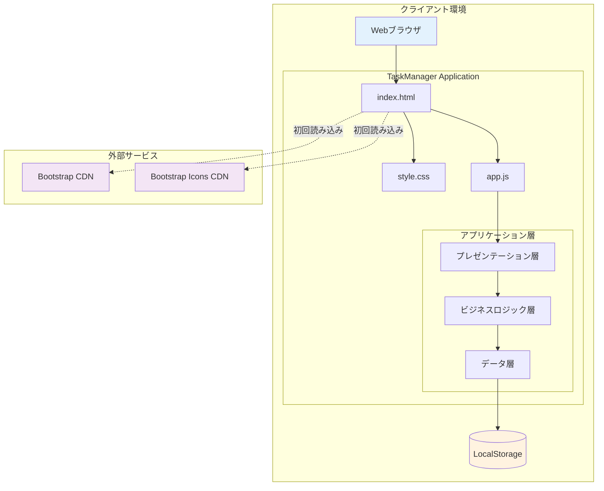
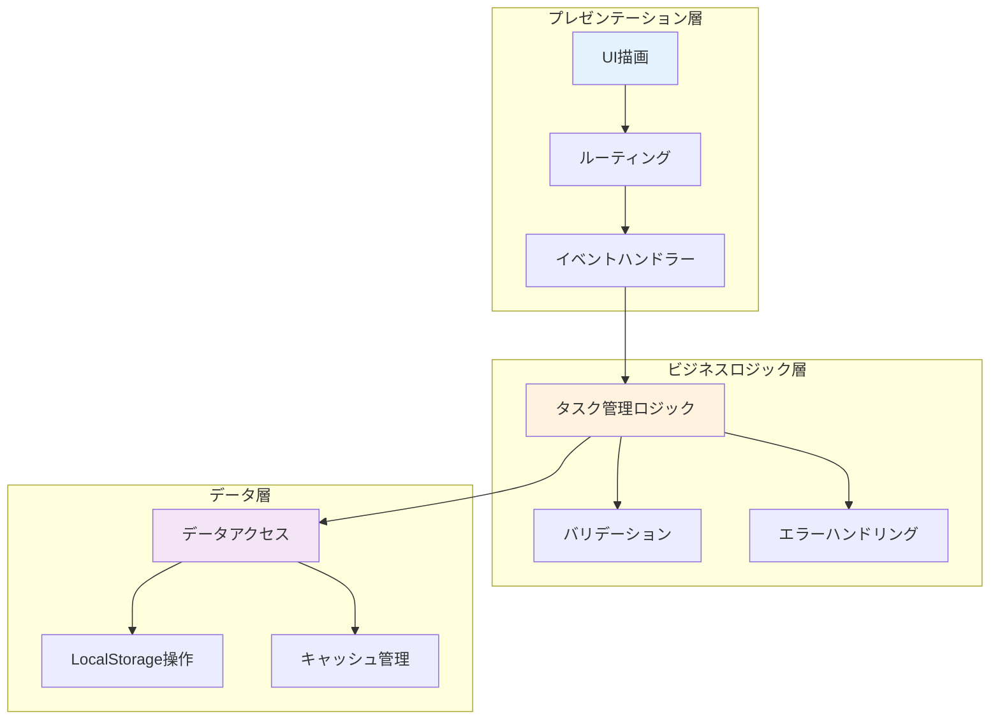
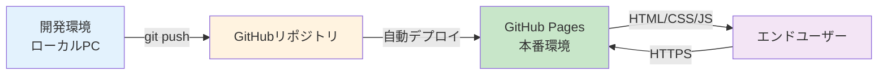
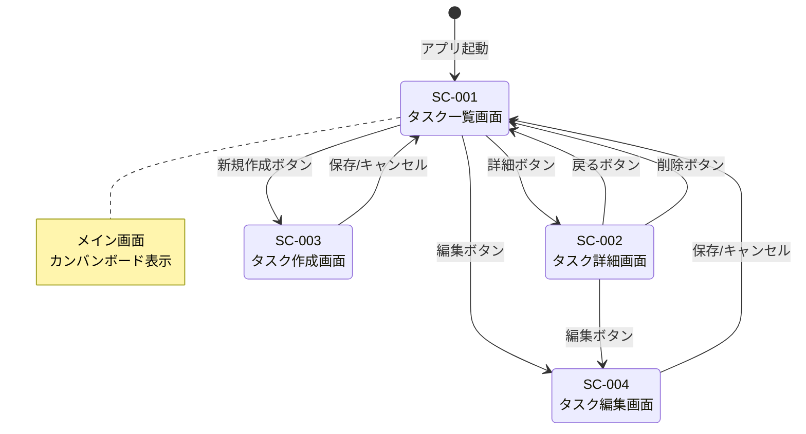
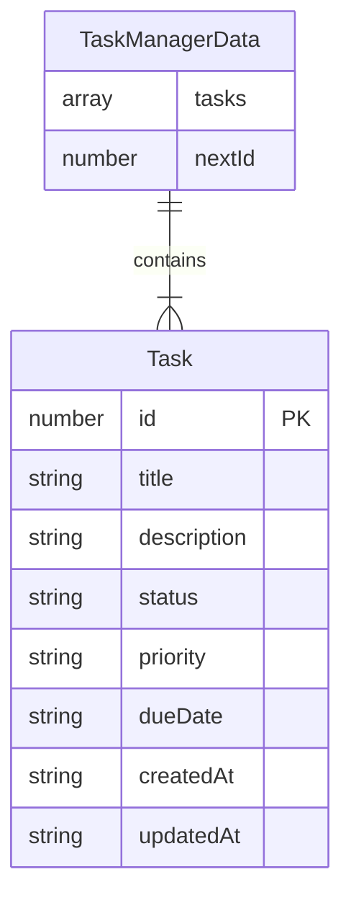
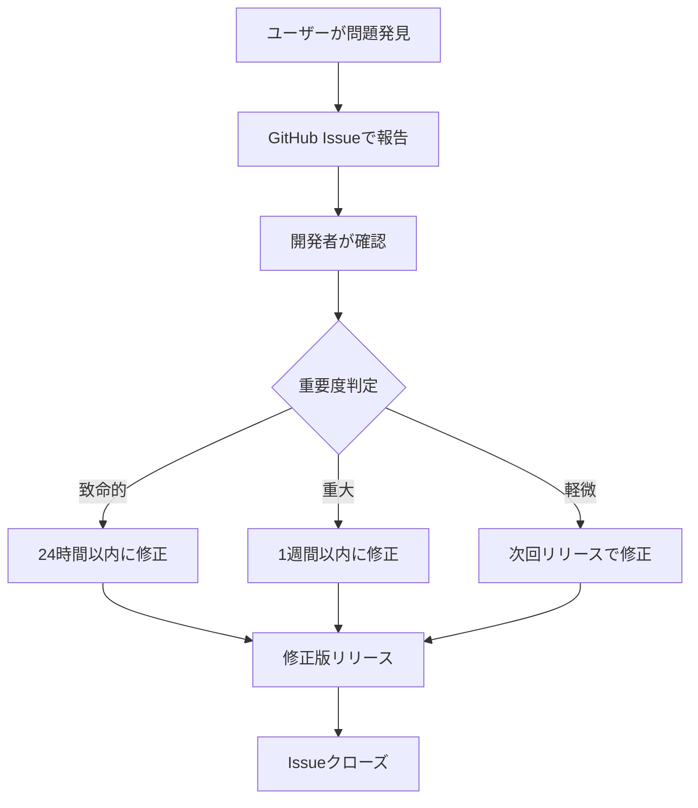

# 基本設計書

## ドキュメント管理情報

| 項目 | 内容 |
|------|------|
| プロジェクト名 | TaskManager |
| システム名 | タスク管理Webアプリケーション |
| バージョン | 1.0 |
| 作成日 | 2026-05-29 |
| 最終更新日 | 2026-05-29 |
| 作成者 | Bob |
| 承認者 | - |
| ステータス | 草案 |

## 変更履歴

| 日付 | バージョン | 変更内容 | 変更者 |
|------|------------|----------|--------|
| 2026-05-29 | 1.0 | 初版作成 | Bob |

---

## 1. 概要

### 1.1 目的

本基本設計書は、TaskManager（タスク管理Webアプリケーション）のシステムアーキテクチャ、機能設計、画面設計、データベース設計などの基本的な設計方針と仕様を定義することを目的とする。

**対象読者**
- システム開発者
- プロジェクトマネージャー
- 品質保証担当者
- 保守担当者

### 1.2 スコープ

本設計書は以下の範囲を対象とする：

**対象範囲**
- システムアーキテクチャ設計
- 機能設計
- 画面設計
- データ構造設計
- セキュリティ設計
- 非機能要件設計

**対象外**
- 詳細なコード実装（詳細設計書で定義）
- テストケース詳細（テスト仕様書で定義）
- 運用手順詳細（運用マニュアルで定義）

### 1.3 前提条件

- **要件定義書のバージョン**: 1.0（2026-05-29）
- **参照ドキュメント**: 
  - 要件定義書（requirements.md）
  - Bootstrap 5.3 Documentation
  - Web Storage API Specification

- **開発環境**: 
  - OS: Windows/macOS/Linux
  - エディタ: Visual Studio Code
  - ブラウザ: Chrome/Firefox/Safari/Edge（最新版）
  - バージョン管理: Git

- **対象プラットフォーム**: 
  - Webブラウザ（Chrome 90+, Firefox 88+, Safari 14+, Edge 90+）
  - デバイス: PC、タブレット、スマートフォン

### 1.4 用語定義

| 用語 | 定義 |
|------|------|
| SPA | Single Page Application - 単一のHTMLページで動作するWebアプリケーション |
| LocalStorage | ブラウザに内蔵されたキー・バリュー型のデータ保存領域 |
| CDN | Content Delivery Network - コンテンツ配信ネットワーク |
| レスポンシブデザイン | 画面サイズに応じて表示を最適化するデザイン手法 |
| カンバンボード | タスクをステータス別の列に配置して視覚化する表示方式 |
| CRUD | Create/Read/Update/Delete - データ操作の基本4機能 |
| XSS | Cross-Site Scripting - クロスサイトスクリプティング攻撃 |
| 3層アーキテクチャ | プレゼンテーション層、ビジネスロジック層、データ層の3層構造 |

---

## 2. システムアーキテクチャ

### 2.1 システム構成図



**構成要素の説明**

| 要素 | 説明 | 技術 |
|------|------|------|
| Webブラウザ | アプリケーションの実行環境 | Chrome/Firefox/Safari/Edge |
| index.html | アプリケーションのエントリーポイント | HTML5 |
| style.css | カスタムスタイル定義 | CSS3 |
| app.js | アプリケーションロジック | JavaScript (ES6+) |
| LocalStorage | データ永続化層 | Web Storage API |
| Bootstrap CDN | UIフレームワーク | Bootstrap 5.3.0 |
| Bootstrap Icons CDN | アイコンライブラリ | Bootstrap Icons 1.10.0 |

### 2.2 技術スタック

| レイヤー | 技術 | バージョン | 選定理由 |
|----------|------|------------|----------|
| **フロントエンド** | HTML5 | - | 標準的なマークアップ言語 |
| | CSS3 | - | スタイリング |
| | JavaScript | ES6+ | モダンな言語機能 |
| | Bootstrap | 5.3.0 | レスポンシブUIフレームワーク |
| | Bootstrap Icons | 1.10.0 | 豊富なアイコンセット |
| **データ層** | LocalStorage | - | ブラウザ標準API、サーバー不要 |
| **インフラ** | GitHub Pages | - | 静的サイトホスティング（無料） |
| **開発ツール** | Git | - | バージョン管理 |
| | Visual Studio Code | - | コードエディタ |

### 2.3 アーキテクチャパターン

**採用パターン**: 3層アーキテクチャ（レイヤードアーキテクチャ）



**選定理由**
1. **関心の分離**: 各層が明確な責務を持つ
2. **保守性**: 変更の影響範囲を局所化
3. **テスト容易性**: 各層を独立してテスト可能
4. **拡張性**: 新機能の追加が容易

**各層の責務**

| 層 | 責務 | 主な機能 |
|-----|------|----------|
| プレゼンテーション層 | UI表示とユーザー操作の受付 | - HTML生成<br>- イベント処理<br>- 画面遷移<br>- メッセージ表示 |
| ビジネスロジック層 | 業務ロジックの実装 | - タスクCRUD操作<br>- バリデーション<br>- ビジネスルール適用<br>- エラーハンドリング |
| データ層 | データの永続化と取得 | - LocalStorage操作<br>- データキャッシュ<br>- データ変換 |

### 2.4 ディレクトリ構成（概要）

```
html-task-manager-app/
├── index.html              # メインHTMLファイル
├── css/
│   └── style.css          # カスタムスタイル
├── js/
│   └── app.js             # アプリケーションロジック
└── README.md              # プロジェクト説明
```

**ファイル説明**

| ファイル | 役割 | サイズ目安 |
|----------|------|-----------|
| index.html | アプリケーションのエントリーポイント、DOM構造定義 | 2KB |
| css/style.css | カスタムスタイル、アニメーション定義 | 3KB |
| js/app.js | アプリケーション全体のロジック | 20KB |
| README.md | プロジェクトドキュメント | 5KB |

### 2.5 デプロイメント構成



**環境構成**

| 環境 | 用途 | URL | デプロイ方法 |
|------|------|-----|-------------|
| 開発環境 | 開発・テスト | file:///... | ローカルファイル |
| 本番環境 | エンドユーザー利用 | https://[username].github.io/[repo] | GitHub Pages自動デプロイ |

**デプロイフロー**
1. 開発者がローカルで開発・テスト
2. Gitでコミット・プッシュ
3. GitHub Pagesが自動的にデプロイ
4. ユーザーがブラウザでアクセス

---
## 3. 機能設計

### 3.1 機能一覧

| 機能ID | 機能名 | 概要 | 優先度 | 要件ID |
|--------|--------|------|--------|--------|
| F001 | タスク作成 | 新しいタスクを作成する | 高 | REQ-003 |
| F002 | タスク編集 | 既存タスクの情報を更新する | 高 | REQ-004 |
| F003 | タスク削除 | 不要なタスクを削除する | 高 | REQ-005 |
| F004 | タスク詳細表示 | タスクの全情報を表示する | 高 | REQ-006 |
| F005 | タスク一覧表示 | カンバンボード形式でタスクを表示 | 高 | REQ-007 |
| F006 | ステータス管理 | タスクのステータスを設定・変更 | 高 | REQ-008 |
| F007 | 優先度管理 | タスクの優先度を設定・変更 | 高 | REQ-009 |
| F008 | 期限管理 | タスクの期限を設定・変更 | 高 | REQ-010 |
| F009 | データ保存 | タスクデータをLocalStorageに保存 | 高 | REQ-014 |
| F010 | データ読み込み | LocalStorageからデータを読み込み | 高 | REQ-014 |
| F011 | 初期データ生成 | サンプルデータの自動生成 | 中 | - |
| F012 | バリデーション | 入力値の妥当性検証 | 高 | REQ-017 |
| F013 | メッセージ表示 | 操作結果のフィードバック表示 | 中 | - |
| F014 | 画面遷移 | 各画面間の遷移制御 | 高 | - |

### 3.2 機能構成図

```mermaid
graph TD
    System[TaskManager]
    
    System --> TaskMgmt[タスク管理機能群]
    System --> Display[表示機能群]
    System --> DataMgmt[データ管理機能群]
    System --> UICtrl[UI制御機能群]
    
    TaskMgmt --> F001[F001: タスク作成]
    TaskMgmt --> F002[F002: タスク編集]
    TaskMgmt --> F003[F003: タスク削除]
    TaskMgmt --> F004[F004: タスク詳細表示]
    
    Display --> F005[F005: タスク一覧表示]
    Display --> F006[F006: ステータス管理]
    Display --> F007[F007: 優先度管理]
    Display --> F008[F008: 期限管理]
    
    DataMgmt --> F009[F009: データ保存]
    DataMgmt --> F010[F010: データ読み込み]
    DataMgmt --> F011[F011: 初期データ生成]
    
    UICtrl --> F012[F012: バリデーション]
    UICtrl --> F013[F013: メッセージ表示]
    UICtrl --> F014[F014: 画面遷移]
    
    style TaskMgmt fill:#e3f2fd
    style Display fill:#fff3e0
    style DataMgmt fill:#f3e5f5
    style UICtrl fill:#c8e6c9
```



### 3.3 機能詳細

#### 3.3.1 F001: タスク作成

- **機能ID**: F001
- **概要**: 新しいタスクを作成し、システムに登録する
- **要件トレーサビリティ**: REQ-003

**入力**
- タイトル（必須、最大200文字）
- 説明（任意）
- ステータス（必須、デフォルト: TODO）
- 優先度（必須、デフォルト: MEDIUM）
- 期限（任意）

**処理**
1. 入力値のバリデーション実施
2. 一意なIDを自動採番（nextIdを使用）
3. 作成日時・更新日時を自動設定
4. タスクオブジェクトを生成
5. タスクリストに追加
6. LocalStorageに保存
7. 成功メッセージを表示
8. タスク一覧画面へ遷移

**出力**
- 作成されたタスク情報
- 成功メッセージ「タスクを作成しました」

**制約事項**
- タイトルは必須入力
- タイトルは200文字以内
- IDは自動採番のため重複なし

**エラー処理**
- タイトル未入力: 「タイトルは必須です」エラー表示
- タイトル超過: 「タイトルは200文字以内で入力してください」エラー表示
- 保存失敗: 「データの保存に失敗しました」エラー表示

#### 3.3.2 F002: タスク編集

- **機能ID**: F002
- **概要**: 既存タスクの情報を更新する
- **要件トレーサビリティ**: REQ-004

**入力**
- タスクID（必須）
- タイトル（必須、最大200文字）
- 説明（任意）
- ステータス（必須）
- 優先度（必須）
- 期限（任意）

**処理**
1. タスクIDでタスクを検索
2. タスクが存在しない場合はエラー
3. 入力値のバリデーション実施
4. 更新日時を自動更新
5. タスク情報を更新
6. LocalStorageに保存
7. 成功メッセージを表示
8. タスク一覧画面へ遷移

**出力**
- 更新されたタスク情報
- 成功メッセージ「タスクを更新しました」

**制約事項**
- タスクIDは変更不可
- 作成日時は変更不可
- タイトルは必須入力

**エラー処理**
- タスク不存在: 「タスクが見つかりません」エラー表示、一覧へ遷移
- タイトル未入力: 「タイトルは必須です」エラー表示
- 保存失敗: 「データの保存に失敗しました」エラー表示

#### 3.3.3 F003: タスク削除

- **機能ID**: F003
- **概要**: 指定されたタスクを削除する
- **要件トレーサビリティ**: REQ-005

**入力**
- タスクID（必須）

**処理**
1. タスクIDでタスクを検索
2. タスクが存在しない場合はエラー
3. 削除確認ダイアログを表示
4. ユーザーが確認した場合のみ削除実行
5. タスクリストから削除
6. LocalStorageに保存
7. 成功メッセージを表示
8. タスク一覧画面へ遷移

**出力**
- 削除完了メッセージ「タスクを削除しました」

**制約事項**
- 削除は取り消し不可
- 削除前に必ず確認ダイアログを表示

**エラー処理**
- タスク不存在: 「タスクが見つかりません」エラー表示
- ユーザーキャンセル: 処理を中断、画面はそのまま

#### 3.3.4 F004: タスク詳細表示

- **機能ID**: F004
- **概要**: タスクの全情報を詳細画面に表示する
- **要件トレーサビリティ**: REQ-006

**入力**
- タスクID（必須）

**処理**
1. タスクIDでタスクを検索
2. タスクが存在しない場合はエラー
3. タスク情報を整形
4. 詳細画面を描画

**出力**
- タスク詳細画面（全項目表示）
  - ID
  - タイトル
  - 説明
  - ステータス（バッジ表示）
  - 優先度（バッジ表示）
  - 期限
  - 作成日時
  - 更新日時

**制約事項**
- 読み取り専用表示
- 編集は編集ボタンから別画面で実施

**エラー処理**
- タスク不存在: 「タスクが見つかりません」エラー表示、一覧へ遷移

#### 3.3.5 F005: タスク一覧表示

- **機能ID**: F005
- **概要**: カンバンボード形式でタスクを表示する
- **要件トレーサビリティ**: REQ-007

**入力**
- なし（全タスクを表示）

**処理**
1. LocalStorageからデータ読み込み
2. ステータス別にタスクをグループ化
3. 各列（未着手/進行中/保留/完了）にタスクカードを描画
4. 優先度に応じた色分け表示
5. 各列のタスク数を表示

**出力**
- カンバンボード画面
  - 4列のステータス列
  - 各列にタスクカード
  - タスク数表示
  - 新規作成ボタン

**制約事項**
- 初回起動時はサンプルデータを表示
- タスクが0件の列は「タスクなし」表示

**エラー処理**
- データ読み込み失敗: 初期データを生成

#### 3.3.6 F009: データ保存

- **機能ID**: F009
- **概要**: タスクデータをLocalStorageに保存する
- **要件トレーサビリティ**: REQ-014

**入力**
- TaskManagerDataオブジェクト（tasks配列、nextId）

**処理**
1. データをJSON文字列に変換
2. LocalStorageに保存（キー: taskManagerData）
3. キャッシュを更新

**出力**
- 保存成功/失敗

**制約事項**
- LocalStorageの容量制限（約5-10MB）
- 同一オリジンポリシーに従う

**エラー処理**
- QuotaExceededError: 「ストレージの容量が不足しています」エラー表示
- その他エラー: 「データの保存に失敗しました」エラー表示

#### 3.3.7 F012: バリデーション

- **機能ID**: F012
- **概要**: 入力値の妥当性を検証する
- **要件トレーサビリティ**: REQ-017

**検証ルール**

| 項目 | ルール | エラーメッセージ |
|------|--------|------------------|
| タイトル | 必須 | タイトルは必須です |
| タイトル | 1文字以上 | タイトルを入力してください |
| タイトル | 200文字以内 | タイトルは200文字以内で入力してください |
| ステータス | 必須 | ステータスを選択してください |
| ステータス | 定義値のみ | 無効なステータスです |
| 優先度 | 必須 | 優先度を選択してください |
| 優先度 | 定義値のみ | 無効な優先度です |
| 期限 | 日付形式 | 正しい日付形式で入力してください |

**処理**
1. 各項目のバリデーションを実施
2. エラーがある場合はエラーメッセージを収集
3. エラーメッセージを表示
4. エラーがない場合は処理を継続

---
## 4. 画面設計

### 4.1 画面一覧

| 画面ID | 画面名 | 画面種別 | 機能ID | 備考 |
|--------|--------|----------|--------|------|
| SC-001 | タスク一覧画面 | 一覧 | F005 | カンバンボード形式 |
| SC-002 | タスク詳細画面 | 詳細 | F004 | 読み取り専用 |
| SC-003 | タスク作成画面 | 入力 | F001 | 新規作成フォーム |
| SC-004 | タスク編集画面 | 入力 | F002 | 編集フォーム |

### 4.2 画面遷移図



### 4.3 画面レイアウト

#### 4.3.1 SC-001: タスク一覧画面（カンバンボード）

- **画面ID**: SC-001
- **画面種別**: 一覧画面
- **アクセス権限**: なし（全ユーザー）
- **URL/パス**: / （ルート）

**画面構成**

```
┌─────────────────────────────────────────────────────────────┐
│ ナビゲーションバー                                            │
│ [TaskManager アイコン] TaskManager                            │
└─────────────────────────────────────────────────────────────┘
┌─────────────────────────────────────────────────────────────┐
│ [メッセージ表示エリア - 成功/エラーメッセージ]                 │
└─────────────────────────────────────────────────────────────┘
┌─────────────────────────────────────────────────────────────┐
│ タスク一覧                              [+ 新規作成]          │
├─────────────┬─────────────┬─────────────┬─────────────────┤
│ 未着手 (2)  │ 進行中 (1)  │ 保留 (1)    │ 完了 (1)        │
│ [secondary] │ [primary]   │ [warning]   │ [success]       │
├─────────────┼─────────────┼─────────────┼─────────────────┤
│┌───────────┐│┌───────────┐│┌───────────┐│┌───────────────┐│
││タスクA    │││タスクB    │││タスクC    │││タスクD        ││
││Spring Boot│││データベース│││画面デザイン│││データベース   ││
││の学習...  │││設計を...  │││UIのデザ... │││設計を行う     ││
││           │││           │││           │││               ││
││[高 danger]│││[高 danger]│││[中warning]│││[高 danger]    ││
││03/01      │││02/28      │││03/05      │││02/25          ││
││[詳細][編集]│││[詳細][編集]│││[詳細][編集]│││[詳細][編集]   ││
│└───────────┘│└───────────┘│└───────────┘│└───────────────┘│
│┌───────────┐│             │             │                 │
││タスクE    ││             │             │                 │
││テスト実施 ││             │             │                 │
││単体テスト ││             │             │                 │
││           ││             │             │                 │
││[中warning]││             │             │                 │
││03/10      ││             │             │                 │
││[詳細][編集]││             │             │                 │
│└───────────┘│             │             │                 │
└─────────────┴─────────────┴─────────────┴─────────────────┘
┌─────────────────────────────────────────────────────────────┐
│ フッター                                                      │
│ © 2026 TaskManager                                           │
└─────────────────────────────────────────────────────────────┘
```

**画面項目**

| 項目ID | 項目名 | 種別 | 必須 | 初期値 | 説明 |
|--------|--------|------|------|--------|------|
| NAV-001 | ナビゲーションバー | 表示 | - | - | アプリ名とロゴ表示 |
| MSG-001 | メッセージエリア | 表示 | - | 非表示 | 操作結果メッセージ |
| BTN-001 | 新規作成ボタン | ボタン | - | - | タスク作成画面へ遷移 |
| COL-001 | 未着手列 | 表示 | - | - | ステータスTODOのタスク |
| COL-002 | 進行中列 | 表示 | - | - | ステータスIN_PROGRESSのタスク |
| COL-003 | 保留列 | 表示 | - | - | ステータスON_HOLDのタスク |
| COL-004 | 完了列 | 表示 | - | - | ステータスDONEのタスク |
| CARD-001 | タスクカード | 表示 | - | - | 個別タスク情報 |

**タスクカード構成**

| 要素 | 説明 | 表示内容 |
|------|------|----------|
| タイトル | タスク名 | 最大60文字、超過時は「...」 |
| 説明 | タスク説明 | 最大60文字、超過時は「...」 |
| 優先度バッジ | 優先度表示 | 高（赤）/中（黄）/低（青） |
| 期限 | 期限日付 | MM/DD形式、未設定時は非表示 |
| 詳細ボタン | 詳細画面へ | タスク詳細画面へ遷移 |
| 編集ボタン | 編集画面へ | タスク編集画面へ遷移 |

**画面アクション**

| アクションID | アクション名 | トリガー | 処理内容 | 遷移先 |
|--------------|--------------|----------|----------|--------|
| ACT-001 | 新規作成 | 新規作成ボタンクリック | タスク作成画面を表示 | SC-003 |
| ACT-002 | 詳細表示 | 詳細ボタンクリック | タスク詳細画面を表示 | SC-002 |
| ACT-003 | 編集 | 編集ボタンクリック | タスク編集画面を表示 | SC-004 |
| ACT-004 | ホームへ戻る | ナビゲーションバークリック | タスク一覧画面を再表示 | SC-001 |

#### 4.3.2 SC-002: タスク詳細画面

- **画面ID**: SC-002
- **画面種別**: 詳細画面
- **アクセス権限**: なし（全ユーザー）
- **URL/パス**: /detail/:id

**画面構成**

```
┌─────────────────────────────────────────────────────────────┐
│ ナビゲーションバー                                            │
│ [TaskManager アイコン] TaskManager                            │
└─────────────────────────────────────────────────────────────┘
┌─────────────────────────────────────────────────────────────┐
│ タスク詳細                                                    │
├─────────────────────────────────────────────────────────────┤
│ ID                                                           │
│ 1                                                            │
│                                                              │
│ タイトル                                                      │
│ Spring Bootの学習                                            │
│                                                              │
│ 説明                                                          │
│ Spring Bootの基礎を学習する                                  │
│                                                              │
│ ステータス                                                    │
│ [進行中 primary]                                             │
│                                                              │
│ 優先度                                                        │
│ [高 danger]                                                  │
│                                                              │
│ 期限                                                          │
│ 2026-03-01                                                   │
│                                                              │
│ 作成日時                                                      │
│ 2026-02-20 10:30:00                                          │
│                                                              │
│ 更新日時                                                      │
│ 2026-02-25 15:45:00                                          │
│                                                              │
│ [← 一覧に戻る] [編集] [削除]                                  │
└─────────────────────────────────────────────────────────────┘
```

**画面項目**

| 項目ID | 項目名 | 種別 | 必須 | 説明 |
|--------|--------|------|------|------|
| DTL-001 | ID | 表示 | ○ | タスクID |
| DTL-002 | タイトル | 表示 | ○ | タスクタイトル |
| DTL-003 | 説明 | 表示 | - | タスク説明（未設定時は「（説明なし）」） |
| DTL-004 | ステータス | 表示 | ○ | ステータスバッジ |
| DTL-005 | 優先度 | 表示 | ○ | 優先度バッジ |
| DTL-006 | 期限 | 表示 | - | 期限日付（未設定時は「未設定」） |
| DTL-007 | 作成日時 | 表示 | ○ | 作成日時 |
| DTL-008 | 更新日時 | 表示 | ○ | 更新日時 |
| BTN-002 | 一覧に戻るボタン | ボタン | - | タスク一覧へ遷移 |
| BTN-003 | 編集ボタン | ボタン | - | タスク編集画面へ遷移 |
| BTN-004 | 削除ボタン | ボタン | - | 削除確認後、削除実行 |

**画面アクション**

| アクションID | アクション名 | トリガー | 処理内容 | 遷移先 |
|--------------|--------------|----------|----------|--------|
| ACT-005 | 一覧に戻る | 一覧に戻るボタンクリック | タスク一覧画面を表示 | SC-001 |
| ACT-006 | 編集 | 編集ボタンクリック | タスク編集画面を表示 | SC-004 |
| ACT-007 | 削除 | 削除ボタンクリック | 確認ダイアログ表示→削除実行 | SC-001 |

#### 4.3.3 SC-003: タスク作成画面

- **画面ID**: SC-003
- **画面種別**: 入力画面
- **アクセス権限**: なし（全ユーザー）
- **URL/パス**: /create

**画面構成**

```
┌─────────────────────────────────────────────────────────────┐
│ ナビゲーションバー                                            │
│ [TaskManager アイコン] TaskManager                            │
└─────────────────────────────────────────────────────────────┘
┌─────────────────────────────────────────────────────────────┐
│ タスク作成                                                    │
├─────────────────────────────────────────────────────────────┤
│ タイトル *                                                    │
│ [_____________________________] 最大200文字                  │
│                                                              │
│ 説明                                                          │
│ [_____________________________]                              │
│ [_____________________________]                              │
│ [_____________________________]                              │
│ [_____________________________]                              │
│                                                              │
│ ステータス *                                                  │
│ [未着手 ▼]                                                   │
│                                                              │
│ 優先度 *                                                      │
│ [中 ▼]                                                       │
│                                                              │
│ 期限                                                          │
│ [____-__-__] (日付選択)                                      │
│                                                              │
│ [保存] [キャンセル]                                           │
└─────────────────────────────────────────────────────────────┘
```

**画面項目**

| 項目ID | 項目名 | 種別 | 必須 | 初期値 | 検証ルール |
|--------|--------|------|------|--------|------------|
| INP-001 | タイトル | テキスト | ○ | 空 | 1-200文字 |
| INP-002 | 説明 | テキストエリア | - | 空 | 制限なし |
| INP-003 | ステータス | セレクト | ○ | TODO | 定義値のみ |
| INP-004 | 優先度 | セレクト | ○ | MEDIUM | 定義値のみ |
| INP-005 | 期限 | 日付 | - | 空 | 日付形式 |
| BTN-005 | 保存ボタン | ボタン | - | - | バリデーション後保存 |
| BTN-006 | キャンセルボタン | ボタン | - | - | 入力破棄 |

**画面アクション**

| アクションID | アクション名 | トリガー | 処理内容 | 遷移先 |
|--------------|--------------|----------|----------|--------|
| ACT-008 | 保存 | 保存ボタンクリック | バリデーション→タスク作成→保存 | SC-001 |
| ACT-009 | キャンセル | キャンセルボタンクリック | 入力内容を破棄 | SC-001 |

#### 4.3.4 SC-004: タスク編集画面

- **画面ID**: SC-004
- **画面種別**: 入力画面
- **アクセス権限**: なし（全ユーザー）
- **URL/パス**: /edit/:id

**画面構成**
- SC-003（タスク作成画面）と同様のレイアウト
- タイトルが「タスク編集」
- 各項目に既存データが初期値として設定済み

**画面項目**
- SC-003と同様（既存データが初期値）

**画面アクション**

| アクションID | アクション名 | トリガー | 処理内容 | 遷移先 |
|--------------|--------------|----------|----------|--------|
| ACT-010 | 保存 | 保存ボタンクリック | バリデーション→タスク更新→保存 | SC-001 |
| ACT-011 | キャンセル | キャンセルボタンクリック | 変更内容を破棄 | SC-001 |

### 4.4 UI/UX設計方針

#### 4.4.1 デザインシステム
- **UIフレームワーク**: Bootstrap 5.3.0
- **カラーパレット**: Bootstrap標準カラー
- **アイコン**: Bootstrap Icons 1.10.0
- **フォント**: システムフォント（-apple-system, BlinkMacSystemFont, "Segoe UI", Roboto）

#### 4.4.2 レスポンシブ対応
- **ブレークポイント**:
  - xs: <576px（スマートフォン）
  - sm: ≥576px（小型タブレット）
  - md: ≥768px（タブレット）
  - lg: ≥992px（デスクトップ）
  - xl: ≥1200px（大型デスクトップ）

- **レイアウト調整**:
  - デスクトップ: カンバンボード4列横並び
  - タブレット: カンバンボード2列×2行
  - スマートフォン: カンバンボード1列縦並び

#### 4.4.3 アクセシビリティ
- **キーボード操作**: Tab/Shift+Tab でフォーカス移動
- **フォーカス表示**: フォーカス時にアウトライン表示
- **カラーコントラスト**: WCAG 2.1 AA準拠
- **代替テキスト**: アイコンに適切なaria-label設定

#### 4.4.4 ブラウザ対応
- **対応ブラウザ**:
  - Chrome 90+
  - Firefox 88+
  - Safari 14+
  - Edge 90+
- **非対応**: Internet Explorer

---
## 5. API設計

### 5.1 API一覧

本システムは完全にクライアントサイドで動作するため、サーバーサイドAPIは存在しません。

**外部API利用**
| API | 提供元 | 用途 | 認証 |
|-----|--------|------|------|
| Bootstrap CSS | CDN | UIフレームワーク | 不要 |
| Bootstrap Icons | CDN | アイコンライブラリ | 不要 |
| Bootstrap JS | CDN | UIコンポーネント | 不要 |

### 5.2 ブラウザAPI利用

本システムで使用するブラウザ標準APIは以下の通り：

| API名 | 用途 | 対応状況 |
|-------|------|----------|
| Web Storage API (LocalStorage) | データ永続化 | 全対応ブラウザで利用可能 |
| DOM API | DOM操作 | 標準API |
| Event API | イベント処理 | 標準API |

### 5.3 内部関数インターフェース

アプリケーション内部の主要な関数インターフェースを定義：

#### 5.3.1 データ層関数

```javascript
// データ読み込み
function loadTasks(): TaskManagerData

// データ保存
function saveTasks(data: TaskManagerData): void

// 初期データ生成
function initializeData(): TaskManagerData
```

#### 5.3.2 ビジネスロジック層関数

```javascript
// タスク作成
function createTask(taskData: TaskInput): Task

// タスク更新
function updateTask(id: number, updates: TaskInput): Task

// タスク削除
function deleteTask(id: number): void

// タスク取得
function getTaskById(id: number): Task | null

// ステータス別タスク取得
function getTasksByStatus(): TasksByStatus
```

#### 5.3.3 プレゼンテーション層関数

```javascript
// タスク一覧描画
function renderTaskList(): void

// タスク詳細描画
function renderTaskDetail(id: number): void

// タスクフォーム描画
function renderTaskForm(mode: 'create' | 'edit', id?: number): void

// メッセージ表示
function showMessage(message: string, type: 'success' | 'danger'): void

// 画面遷移
function navigateTo(view: string, id?: number): void
```

---

## 6. データベース設計（論理設計）

### 6.1 データ構造

本システムはデータベースを使用せず、LocalStorageにJSON形式でデータを保存します。

#### 6.1.1 データ構造図



### 6.2 データ定義

#### 6.2.1 TaskManagerData（ルートオブジェクト）

| 項目 | 型 | 必須 | 説明 |
|------|-----|------|------|
| tasks | Task[] | ○ | タスクの配列 |
| nextId | number | ○ | 次に採番するID |

#### 6.2.2 Task（タスクオブジェクト）

| 項目 | 型 | 必須 | デフォルト値 | 制約 | 説明 |
|------|-----|------|--------------|------|------|
| id | number | ○ | 自動採番 | 一意 | タスクID |
| title | string | ○ | - | 1-200文字 | タスクタイトル |
| description | string | - | "" | - | タスク説明 |
| status | string | ○ | "TODO" | 定義値 | ステータス |
| priority | string | ○ | "MEDIUM" | 定義値 | 優先度 |
| dueDate | string | - | null | YYYY-MM-DD | 期限 |
| createdAt | string | ○ | 自動設定 | ISO 8601 | 作成日時 |
| updatedAt | string | ○ | 自動設定 | ISO 8601 | 更新日時 |

#### 6.2.3 ステータス定義値

| 値 | 表示名 | 説明 |
|----|--------|------|
| TODO | 未着手 | 作業未開始 |
| IN_PROGRESS | 進行中 | 作業中 |
| ON_HOLD | 保留 | 一時停止 |
| DONE | 完了 | 作業完了 |

#### 6.2.4 優先度定義値

| 値 | 表示名 | 説明 |
|----|--------|------|
| HIGH | 高 | 最優先 |
| MEDIUM | 中 | 通常 |
| LOW | 低 | 低優先 |

### 6.3 データ保存仕様

#### 6.3.1 LocalStorage仕様

| 項目 | 内容 |
|------|------|
| ストレージキー | taskManagerData |
| データ形式 | JSON文字列 |
| 文字コード | UTF-8 |
| 容量制限 | 約5-10MB（ブラウザ依存） |
| 有効期限 | なし（永続） |
| スコープ | 同一オリジン |

#### 6.3.2 データ例

```json
{
  "tasks": [
    {
      "id": 1,
      "title": "Spring Bootの学習",
      "description": "Spring Bootの基礎を学習する",
      "status": "IN_PROGRESS",
      "priority": "HIGH",
      "dueDate": "2026-03-01",
      "createdAt": "2026-02-20T01:30:00.000Z",
      "updatedAt": "2026-02-25T06:45:00.000Z"
    }
  ],
  "nextId": 2
}
```

### 6.4 データモデル設計方針

- **正規化レベル**: 非正規化（JSONドキュメント形式）
- **命名規則**: camelCase
- **文字コード**: UTF-8
- **日時形式**: ISO 8601（YYYY-MM-DDTHH:mm:ss.sssZ）
- **日付形式**: ISO 8601（YYYY-MM-DD）

---

## 7. 外部インターフェース設計

### 7.1 外部システム連携一覧

| IF ID | 連携先システム | 連携方式 | 方向 | 頻度 | データ形式 |
|-------|----------------|----------|------|------|------------|
| IF-001 | Bootstrap CDN | HTTP/HTTPS | 受信 | 初回読み込み | CSS |
| IF-002 | Bootstrap Icons CDN | HTTP/HTTPS | 受信 | 初回読み込み | CSS/Fonts |
| IF-003 | Bootstrap JS CDN | HTTP/HTTPS | 受信 | 初回読み込み | JavaScript |

### 7.2 外部インターフェース詳細

#### 7.2.1 IF-001: Bootstrap CSS読み込み

- **IF ID**: IF-001
- **連携先**: Bootstrap CDN (jsDelivr)
- **連携方式**: HTTP/HTTPS
- **プロトコル**: HTTPS
- **認証方式**: なし
- **データ形式**: CSS
- **連携タイミング**: ページ初回読み込み時
- **URL**: https://cdn.jsdelivr.net/npm/bootstrap@5.3.0/dist/css/bootstrap.min.css
- **エラー処理**: CDN障害時はスタイルが適用されないが、機能は動作
- **リトライ処理**: ブラウザの標準リトライ機構に依存

#### 7.2.2 IF-002: Bootstrap Icons読み込み

- **IF ID**: IF-002
- **連携先**: Bootstrap Icons CDN
- **連携方式**: HTTP/HTTPS
- **プロトコル**: HTTPS
- **認証方式**: なし
- **データ形式**: CSS/Webフォント
- **連携タイミング**: ページ初回読み込み時
- **URL**: https://cdn.jsdelivr.net/npm/bootstrap-icons@1.10.0/font/bootstrap-icons.css
- **エラー処理**: CDN障害時はアイコンが表示されないが、機能は動作
- **リトライ処理**: ブラウザの標準リトライ機構に依存

#### 7.2.3 IF-003: Bootstrap JavaScript読み込み

- **IF ID**: IF-003
- **連携先**: Bootstrap CDN (jsDelivr)
- **連携方式**: HTTP/HTTPS
- **プロトコル**: HTTPS
- **認証方式**: なし
- **データ形式**: JavaScript
- **連携タイミング**: ページ初回読み込み時
- **URL**: https://cdn.jsdelivr.net/npm/bootstrap@5.3.0/dist/js/bootstrap.bundle.min.js
- **エラー処理**: CDN障害時は一部UIコンポーネントが動作しない
- **リトライ処理**: ブラウザの標準リトライ機構に依存

### 7.3 CDN障害時の対応

**影響範囲**
- Bootstrap CSS: スタイルが適用されない（機能は動作）
- Bootstrap Icons: アイコンが表示されない（機能は動作）
- Bootstrap JS: モーダル、アラート等の一部機能が動作しない

**対応方針**
- 将来的にはローカルにファイルを配置することも検討
- 現状はCDNの高可用性に依存

---
## 8. セキュリティ設計

### 8.1 認証・認可

本システムは単一ユーザー向けのローカルアプリケーションのため、認証・認可機能は実装しません。

| 項目 | 内容 |
|------|------|
| 認証方式 | なし |
| 認可方式 | なし |
| セッション管理 | なし |
| パスワードポリシー | 該当なし |

**理由**: データはユーザーのブラウザのLocalStorageに保存され、同一オリジンポリシーにより保護されるため。

### 8.2 データ保護

#### 8.2.1 暗号化

| 項目 | 対応 | 内容 |
|------|------|------|
| 通信暗号化 | ○ | HTTPS使用（GitHub Pages） |
| 保存データ暗号化 | × | LocalStorageは平文保存 |
| 個人情報保護 | ○ | 個人情報は収集しない |
| 機密情報の取り扱い | ○ | 機密情報は扱わない |

**LocalStorage暗号化について**
- LocalStorageのデータは平文で保存される
- ブラウザの同一オリジンポリシーにより、他のサイトからはアクセス不可
- ユーザーのデバイスが物理的に保護されていることが前提

### 8.3 セキュリティ対策

| 脅威 | 対策 | 実装方法 |
|------|------|----------|
| XSS攻撃 | 入力値のエスケープ | `escapeHtml()`関数でHTMLエスケープ |
| SQLインジェクション | 該当なし | データベース未使用 |
| CSRF攻撃 | 該当なし | サーバー通信なし |
| 不正アクセス | 同一オリジンポリシー | ブラウザの標準機能 |
| データ改ざん | LocalStorage保護 | ブラウザの標準機能 |

#### 8.3.1 XSS対策詳細

**対策内容**
```javascript
function escapeHtml(text) {
    const div = document.createElement('div');
    div.textContent = text;
    return div.innerHTML;
}
```

**適用箇所**
- タスクタイトル表示時
- タスク説明表示時
- メッセージ表示時
- すべてのユーザー入力値の表示時

### 8.4 監査ログ

本システムでは監査ログ機能は実装しません。

**理由**
- 単一ユーザー向けアプリケーション
- ローカル環境での動作
- 監査要件なし

---

## 9. 非機能要件設計

### 9.1 性能設計

#### 9.1.1 性能目標

| 項目 | 目標値 | 測定方法 |
|------|--------|----------|
| 初回ページ読み込み | 3秒以内 | Chrome DevTools Performance |
| 2回目以降の読み込み | 1秒以内 | Chrome DevTools Performance |
| タスク一覧表示 | 0.5秒以内 | パフォーマンス計測 |
| タスク作成 | 0.5秒以内 | パフォーマンス計測 |
| タスク更新 | 0.5秒以内 | パフォーマンス計測 |
| タスク削除 | 0.3秒以内 | パフォーマンス計測 |
| 画面遷移 | 0.5秒以内 | ユーザー体感 |

#### 9.1.2 性能最適化施策

| 施策 | 内容 | 効果 |
|------|------|------|
| CDN利用 | Bootstrap等をCDNから読み込み | 初回読み込み高速化 |
| キャッシュ活用 | データをメモリキャッシュ | 読み込み高速化 |
| 最小限のDOM操作 | 必要な部分のみ更新 | 描画高速化 |
| アニメーション最適化 | CSS transitionを使用 | スムーズな動作 |

### 9.2 可用性設計

#### 9.2.1 可用性目標

| 項目 | 目標値 | 内容 |
|------|--------|------|
| 稼働率 | 99.9% | ブラウザが動作する限り利用可能 |
| オフライン動作 | 完全対応 | ネットワーク不要（初回読み込み後） |
| データ永続性 | 100% | LocalStorageによる永続化 |

#### 9.2.2 障害時の対応

| 障害種別 | 対応 |
|----------|------|
| CDN障害 | スタイル未適用だが機能は動作 |
| LocalStorage障害 | エラーメッセージ表示 |
| JavaScript エラー | グローバルエラーハンドラーで捕捉 |
| ブラウザクラッシュ | データはLocalStorageに保存済み |

### 9.3 拡張性設計

#### 9.3.1 スケーラビリティ

| 項目 | 現状 | 拡張方針 |
|------|------|----------|
| タスク数 | 1000件まで | LocalStorage容量内 |
| ユーザー数 | 単一ユーザー | 将来的にマルチユーザー対応検討 |
| 機能追加 | 容易 | 3層アーキテクチャで分離 |

#### 9.3.2 将来の拡張性

**検討中の機能**
- データエクスポート/インポート（JSON/CSV）
- クラウド同期機能
- タスクの検索・フィルタリング
- タスクのタグ付け
- サブタスク機能
- 添付ファイル機能

### 9.4 保守性設計

#### 9.4.1 ログ設計

| ログ種別 | 出力先 | 内容 |
|----------|--------|------|
| エラーログ | ブラウザコンソール | エラー情報、スタックトレース |
| デバッグログ | ブラウザコンソール | 開発時のデバッグ情報 |

#### 9.4.2 監視項目

本システムはクライアントサイドのみのため、サーバー監視は不要。

**ユーザー側での確認項目**
- ブラウザコンソールのエラー
- LocalStorageの使用量
- アプリケーションの動作状況

#### 9.4.3 バックアップ

| 項目 | 内容 |
|------|------|
| バックアップ対象 | LocalStorageのtaskManagerData |
| バックアップ方法 | ユーザー自身でブラウザの開発者ツールから取得 |
| バックアップ頻度 | ユーザー任意 |
| 保存期間 | ユーザー任意 |
| リストア方法 | 開発者ツールから手動で復元 |

**将来的な改善**
- エクスポート/インポート機能の実装
- 自動バックアップ機能

### 9.5 移植性設計

#### 9.5.1 環境依存性

| 項目 | 依存度 | 内容 |
|------|--------|------|
| OS | 低 | ブラウザが動作すれば利用可能 |
| ブラウザ | 中 | モダンブラウザが必要 |
| ネットワーク | 低 | 初回読み込み時のみ必要 |
| デバイス | 低 | レスポンシブ対応 |

#### 9.5.2 データ移行

**ブラウザ間のデータ移行**
1. 旧環境でLocalStorageのデータをエクスポート（手動）
2. 新環境でデータをインポート（手動）

**将来的な改善**
- JSON形式でのエクスポート/インポート機能
- クラウド同期機能

---

## 10. バッチ処理設計

本システムはバッチ処理を実装しません。

**理由**: すべての処理はユーザーの操作に応じてリアルタイムで実行されるため。

---

## 11. エラー処理設計

### 11.1 エラー分類

| エラーレベル | 説明 | 対応方針 |
|--------------|------|----------|
| FATAL | システム継続不可 | エラーメッセージ表示、ページリロード推奨 |
| ERROR | 処理失敗 | エラーメッセージ表示、ユーザーに再試行促す |
| WARNING | 警告 | コンソールログ記録 |
| INFO | 情報 | コンソールログ記録 |

### 11.2 エラーコード体系

| エラーコード | エラーメッセージ | 原因 | 対処方法 |
|--------------|------------------|------|----------|
| E001 | タイトルは必須です | タイトル未入力 | タイトルを入力 |
| E002 | タイトルは200文字以内で入力してください | タイトル超過 | 文字数を削減 |
| E003 | タスクが見つかりません | タスクID不正 | 一覧画面から再選択 |
| E004 | データの保存に失敗しました | LocalStorage保存失敗 | ブラウザ設定確認 |
| E005 | ストレージの容量が不足しています | LocalStorage容量超過 | 不要なタスクを削除 |
| E006 | 予期しないエラーが発生しました | 不明なエラー | ページリロード |

### 11.3 例外処理方針

#### 11.3.1 例外のキャッチ方針

```javascript
// グローバルエラーハンドラー
window.addEventListener('error', function(event) {
    console.error('エラーが発生しました:', event.error);
    showMessage('予期しないエラーが発生しました', 'danger');
});
```

#### 11.3.2 ログ出力方針

| 状況 | ログレベル | 出力内容 |
|------|-----------|----------|
| 正常処理 | INFO | 処理内容 |
| バリデーションエラー | WARNING | エラー内容 |
| 処理失敗 | ERROR | エラー内容、スタックトレース |
| システムエラー | FATAL | エラー内容、スタックトレース |

#### 11.3.3 ユーザーへの通知方針

| エラーレベル | 通知方法 | 表示時間 |
|--------------|----------|----------|
| ERROR | アラート（赤） | 5秒間 |
| WARNING | アラート（黄） | 5秒間 |
| INFO | アラート（青） | 5秒間 |
| SUCCESS | アラート（緑） | 5秒間 |

---

## 12. テスト設計（基本方針）

### 12.1 テスト戦略

| テストレベル | 実施者 | 実施タイミング | ツール |
|--------------|--------|----------------|--------|
| 単体テスト | 開発者 | 開発中 | QUnit |
| 結合テスト | 開発者 | 機能完成後 | 手動テスト |
| システムテスト | 開発者 | リリース前 | 手動テスト |
| 受入テスト | ユーザー | リリース後 | 実際の利用 |

### 12.2 テスト観点

| テスト種別 | 観点 | 実施タイミング |
|------------|------|----------------|
| 機能テスト | 全機能の動作確認 | 機能実装後 |
| 性能テスト | レスポンスタイム計測 | リリース前 |
| セキュリティテスト | XSS対策確認 | リリース前 |
| ユーザビリティテスト | 操作性確認 | リリース前 |
| 互換性テスト | ブラウザ・デバイス対応確認 | リリース前 |

### 12.3 テストデータ

#### 12.3.1 テストデータ作成方針

| データ種別 | 作成方法 | 用途 |
|------------|----------|------|
| 正常データ | 手動作成 | 正常系テスト |
| 異常データ | 手動作成 | 異常系テスト |
| 境界値データ | 手動作成 | 境界値テスト |
| 大量データ | スクリプト生成 | 性能テスト |

#### 12.3.2 本番データの使用

本番データの使用: **不可**

**理由**: LocalStorageに保存されたユーザーデータは個人のものであり、テストには使用しない。

---

## 13. 運用設計

### 13.1 監視項目

本システムはクライアントサイドのみのため、サーバー監視は不要。

| 監視項目 | 監視方法 | 閾値 | アラート通知先 |
|----------|----------|------|----------------|
| CDN可用性 | 外部監視サービス | 稼働率95%以下 | 開発者 |
| GitHub Pages可用性 | GitHub Status | ダウン時 | 開発者 |

### 13.2 バックアップ・リストア

#### 13.2.1 バックアップ

- **バックアップ対象**: LocalStorageのtaskManagerData
- **バックアップ頻度**: ユーザー任意
- **保存期間**: ユーザー任意
- **バックアップ方法**: 
  1. ブラウザの開発者ツールを開く
  2. Application > Local Storage > 該当ドメイン
  3. taskManagerDataの値をコピー
  4. テキストファイルとして保存

#### 13.2.2 リストア

- **リストア手順**:
  1. ブラウザの開発者ツールを開く
  2. Application > Local Storage > 該当ドメイン
  3. taskManagerDataキーを選択
  4. バックアップしたJSON文字列を貼り付け
  5. ページをリロード

### 13.3 障害対応

#### 13.3.1 障害検知方法

- ユーザーからの報告（GitHub Issues）
- ブラウザコンソールのエラーログ

#### 13.3.2 エスカレーションフロー



#### 13.3.3 復旧手順

| 障害種別 | 復旧手順 |
|----------|----------|
| アプリ起動不可 | ブラウザキャッシュクリア、ページリロード |
| データ破損 | バックアップからリストア |
| 機能不具合 | 最新版へ更新（ページリロード） |
| CDN障害 | CDN復旧を待つ、またはローカルファイル版を使用 |

---

## 14. 移行設計

### 14.1 移行方針

本システムは新規開発のため、既存システムからの移行は想定していません。

**想定される移行シナリオ**
- 紙のタスク管理からの移行: 手動入力
- 他のタスク管理ツールからの移行: 手動入力（将来的にインポート機能実装予定）

### 14.2 データ移行

データ移行機能は現時点では実装していません。

**将来的な実装予定**
- JSON形式でのインポート機能
- CSV形式でのインポート機能

---

## 15. 制約事項・前提条件

### 15.1 技術的制約

- LocalStorageの容量制限（約5-10MB）
- 単一ブラウザ・単一デバイスでの利用
- モダンブラウザが必要（IE非対応）
- JavaScriptが有効である必要がある
- LocalStorageが有効である必要がある

### 15.2 業務的制約

- 単一ユーザー向け（マルチユーザー非対応）
- リアルタイム同期なし
- デバイス間のデータ同期なし
- 監査ログなし

### 15.3 スケジュール制約

本ドキュメント作成時点での制約はありません。

---

## 16. 課題・リスク管理

### 16.1 課題一覧

| 課題ID | 課題内容 | 影響度 | 対応方針 | 担当者 | 期限 | ステータス |
|--------|----------|--------|----------|--------|------|------------|
| ISS-001 | LocalStorage容量制限 | 中 | エクスポート機能実装 | 開発者 | 将来 | Open |
| ISS-002 | デバイス間同期なし | 中 | クラウド同期機能検討 | 開発者 | 将来 | Open |
| ISS-003 | バックアップ機能なし | 低 | エクスポート機能実装 | 開発者 | 将来 | Open |

### 16.2 リスク一覧

| リスクID | リスク内容 | 発生確率 | 影響度 | 対策 | 担当者 |
|----------|------------|----------|--------|------|--------|
| RSK-001 | CDN障害 | 低 | 中 | ローカルファイル版の準備 | 開発者 |
| RSK-002 | ブラウザ仕様変更 | 低 | 高 | 標準APIの使用、定期的な動作確認 | 開発者 |
| RSK-003 | LocalStorageデータ消失 | 低 | 高 | バックアップ推奨、エクスポート機能実装 | 開発者 |

---

## 17. 付録

### 17.1 参考資料

- Bootstrap 5.3 Documentation: https://getbootstrap.com/docs/5.3/
- Bootstrap Icons: https://icons.getbootstrap.com/
- Web Storage API: https://developer.mozilla.org/ja/docs/Web/API/Web_Storage_API
- JavaScript Best Practices: https://developer.mozilla.org/ja/docs/Web/JavaScript
- 要件定義書: requirements.md

### 17.2 用語集

| 用語 | 説明 |
|------|------|
| SPA | Single Page Application |
| LocalStorage | ブラウザのキー・バリュー型ストレージ |
| CDN | Content Delivery Network |
| XSS | Cross-Site Scripting |
| CRUD | Create/Read/Update/Delete |
| カンバンボード | タスクを列で視覚化する表示方式 |

### 17.3 レビュー記録

| 日付 | レビュアー | 指摘事項 | 対応状況 |
|------|------------|----------|----------|
| 2026-05-29 | - | - | - |

---

**文書終了**