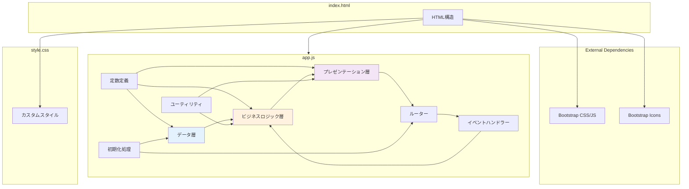
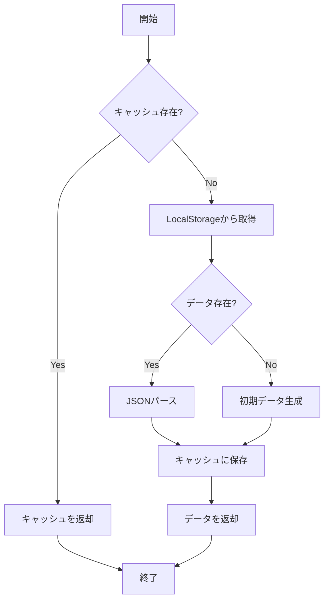
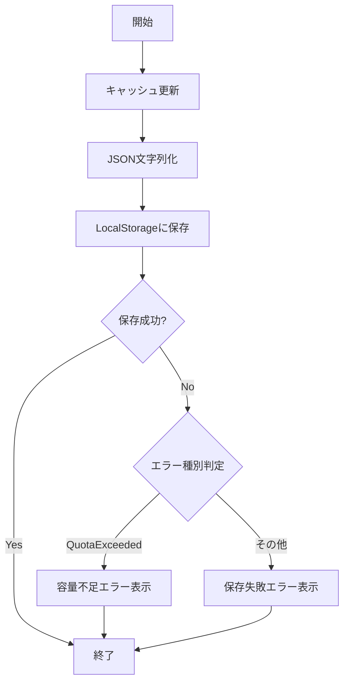
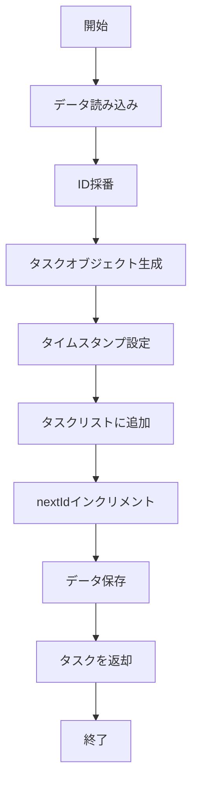
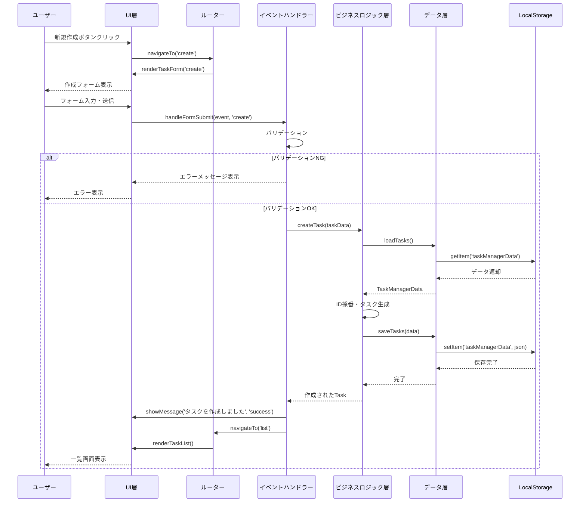
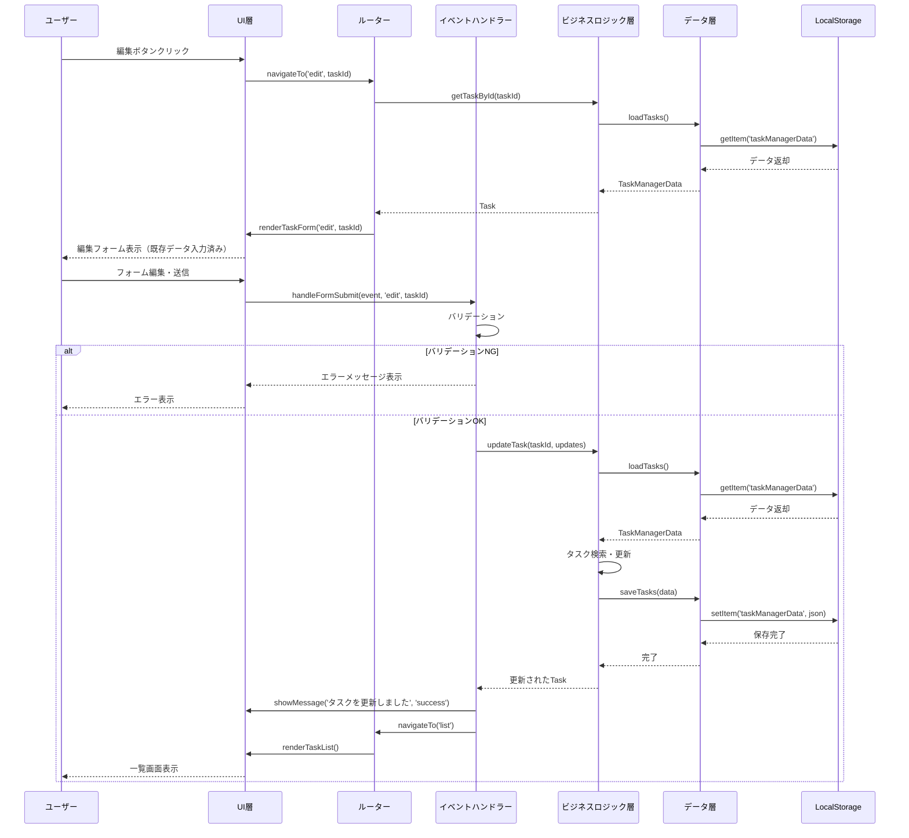
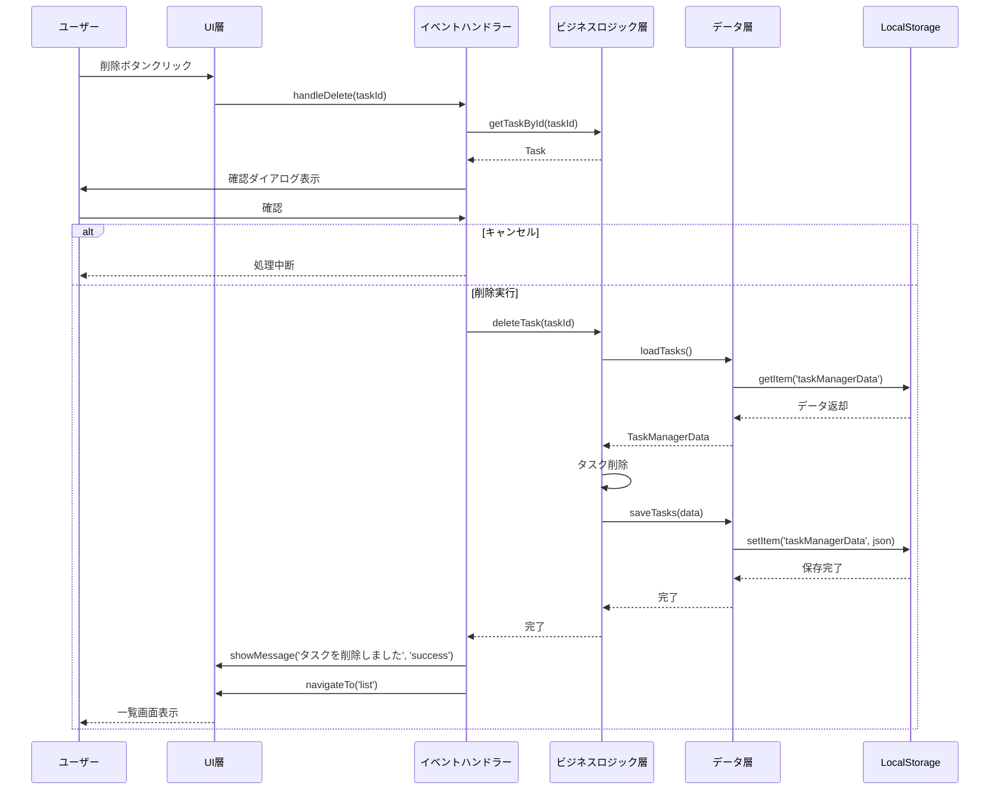
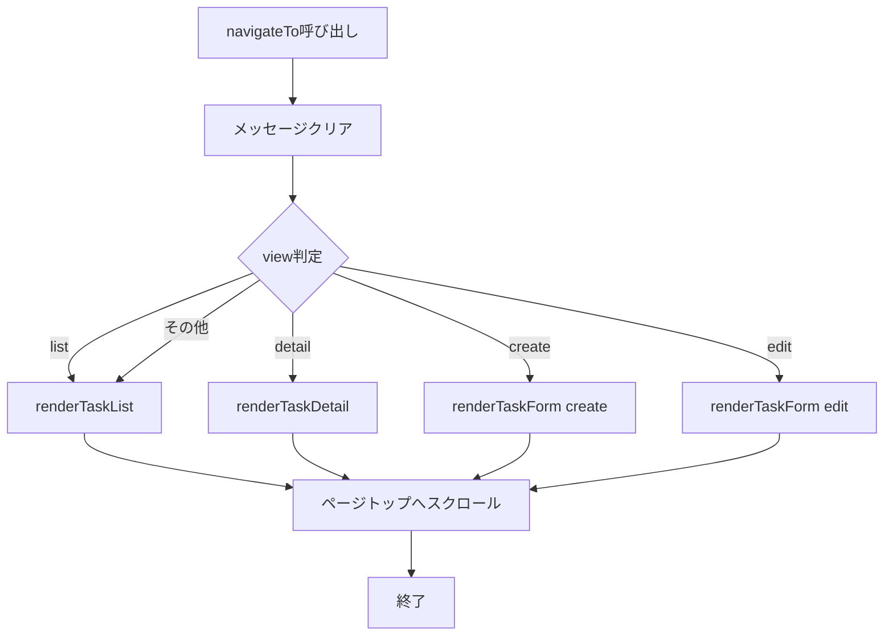

# 詳細設計書

## ドキュメント管理情報

| 項目 | 内容 |
|------|------|
| プロジェクト名 | TaskManager |
| システム名 | タスク管理Webアプリケーション |
| バージョン | 1.0 |
| 作成日 | 2026-05-29 |
| 最終更新日 | 2026-05-29 |
| 作成者 | Bob |
| 承認者 | - |
| ステータス | 草案 |

## 変更履歴

| 日付 | バージョン | 変更内容 | 変更者 |
|------|------------|----------|--------|
| 2026-05-29 | 1.0 | 初版作成 | Bob |

---

## 1. 概要

### 1.1 目的

本詳細設計書は、TaskManager（タスク管理Webアプリケーション）の実装レベルの詳細設計を定義することを目的とする。開発者が本書に基づいて実装できるよう、具体的なコード構造、関数仕様、データ構造などを記載する。

**対象読者**
- 実装担当開発者
- コードレビュアー
- 保守担当者
- テスト担当者

### 1.2 スコープ

本設計書は以下の範囲を対象とする：

**対象範囲**
- プロジェクト構成の詳細
- データベース物理設計（LocalStorage）
- クラス・関数の詳細設計
- 処理フローの詳細
- エラーハンドリングの実装
- テスト実装設計

**対象外**
- 要件定義（要件定義書で定義）
- 基本設計（基本設計書で定義）
- 運用手順（運用マニュアルで定義）

### 1.3 関連ドキュメント

- **要件定義書**: requirements.md（バージョン 1.0）
- **基本設計書**: basic_design.md（バージョン 1.0）
- **README**: html-task-manager-app/README.md

### 1.4 開発環境

| 項目 | 内容 |
|------|------|
| OS | Windows/macOS/Linux |
| 言語 | JavaScript (ES6+) |
| マークアップ | HTML5 |
| スタイル | CSS3 |
| フレームワーク | Bootstrap 5.3.0 |
| IDE | Visual Studio Code |
| バージョン管理 | Git |
| パッケージマネージャー | なし（CDN使用） |
| テストフレームワーク | QUnit（推奨） |

---

## 2. プロジェクト構成

### 2.1 ディレクトリ構成

```
html-task-manager-app/
├── index.html              # メインHTMLファイル（46行）
├── css/
│   └── style.css          # カスタムスタイル（112行）
├── js/
│   └── app.js             # アプリケーションロジック（648行）
└── README.md              # プロジェクト説明（196行）
```

### 2.2 ファイル命名規則

| 種別 | 命名規則 | 例 |
|------|----------|-----|
| HTMLファイル | kebab-case.html | index.html |
| CSSファイル | kebab-case.css | style.css |
| JavaScriptファイル | kebab-case.js | app.js |
| 定数 | UPPER_SNAKE_CASE | STORAGE_KEY |
| 関数 | camelCase | createTask |
| 変数 | camelCase | taskData |
| オブジェクト | PascalCase | TaskStatus |

### 2.3 モジュール依存関係図



### 2.4 コード構造

#### 2.4.1 app.js の構造

```javascript
// ========================================
// 定数定義
// ========================================
const STORAGE_KEY = 'taskManagerData';
const TaskStatus = { ... };
const TaskPriority = { ... };

// ========================================
// データ層（Data Layer）
// ========================================
let cachedData = null;
function loadTasks() { ... }
function saveTasks(data) { ... }
function initializeData() { ... }

// ========================================
// ビジネスロジック層（Business Logic Layer）
// ========================================
function createTask(taskData) { ... }
function updateTask(id, updates) { ... }
function deleteTask(id) { ... }
function getTaskById(id) { ... }
function getTasksByStatus() { ... }

// ========================================
// プレゼンテーション層（Presentation Layer）
// ========================================
function renderTaskList() { ... }
function renderTaskDetail(id) { ... }
function renderTaskForm(mode, id) { ... }
function showMessage(message, type) { ... }

// ========================================
// ルーター（Router）
// ========================================
function navigateTo(view, id) { ... }

// ========================================
// イベントハンドラー
// ========================================
function handleFormSubmit(event, mode, id) { ... }
function handleDelete(id) { ... }

// ========================================
// ユーティリティ関数
// ========================================
function escapeHtml(text) { ... }
function formatDateTime(isoString) { ... }

// ========================================
// 初期化処理
// ========================================
document.addEventListener('DOMContentLoaded', function() { ... });
window.addEventListener('error', function(event) { ... });
```

---
## 3. データベース物理設計

### 3.1 データベース構成

本システムはデータベースを使用せず、ブラウザのLocalStorageを使用します。

| 項目 | 内容 |
|------|------|
| ストレージ種別 | LocalStorage（Web Storage API） |
| データ形式 | JSON文字列 |
| 文字コード | UTF-8 |
| 容量制限 | 約5-10MB（ブラウザ依存） |
| 有効期限 | なし（永続） |
| スコープ | 同一オリジン |

### 3.2 LocalStorage物理設計

#### 3.2.1 ストレージキー定義

```javascript
const STORAGE_KEY = 'taskManagerData';
```

| キー名 | データ型 | 説明 | 例 |
|--------|----------|------|-----|
| taskManagerData | JSON文字列 | システム全体のデータ | `{"tasks":[...],"nextId":6}` |

#### 3.2.2 データ構造定義

**TaskManagerData構造**

```javascript
{
  "tasks": [
    {
      "id": 1,
      "title": "Spring Bootの学習",
      "description": "Spring Bootの基礎を学習する",
      "status": "IN_PROGRESS",
      "priority": "HIGH",
      "dueDate": "2026-03-01",
      "createdAt": "2026-02-20T01:30:00.000Z",
      "updatedAt": "2026-02-25T06:45:00.000Z"
    }
  ],
  "nextId": 2
}
```

**フィールド詳細**

| フィールド | 型 | NULL | デフォルト | 制約 | 説明 |
|------------|-----|------|------------|------|------|
| tasks | Array | NO | [] | - | タスクオブジェクトの配列 |
| nextId | Number | NO | 1 | >0 | 次に採番するID |

**Taskオブジェクト構造**

| フィールド | 型 | NULL | デフォルト | 制約 | 説明 |
|------------|-----|------|------------|------|------|
| id | Number | NO | 自動採番 | 一意、>0 | タスクID |
| title | String | NO | - | 1-200文字 | タスクタイトル |
| description | String | YES | "" | - | タスク説明 |
| status | String | NO | "TODO" | 定義値 | ステータス |
| priority | String | NO | "MEDIUM" | 定義値 | 優先度 |
| dueDate | String | YES | null | YYYY-MM-DD | 期限 |
| createdAt | String | NO | 自動設定 | ISO 8601 | 作成日時 |
| updatedAt | String | NO | 自動設定 | ISO 8601 | 更新日時 |

### 3.3 定数定義

#### 3.3.1 TaskStatus定義

```javascript
const TaskStatus = {
    TODO: { 
        value: 'TODO', 
        label: '未着手', 
        color: 'secondary', 
        icon: 'bi-list-task' 
    },
    IN_PROGRESS: { 
        value: 'IN_PROGRESS', 
        label: '進行中', 
        color: 'primary', 
        icon: 'bi-arrow-repeat' 
    },
    ON_HOLD: { 
        value: 'ON_HOLD', 
        label: '保留', 
        color: 'warning', 
        icon: 'bi-pause-circle' 
    },
    DONE: { 
        value: 'DONE', 
        label: '完了', 
        color: 'success', 
        icon: 'bi-check-circle' 
    }
};
```

| プロパティ | 型 | 説明 |
|------------|-----|------|
| value | String | 内部値（データ保存用） |
| label | String | 表示名（日本語） |
| color | String | Bootstrapカラークラス |
| icon | String | Bootstrap Iconsクラス |

#### 3.3.2 TaskPriority定義

```javascript
const TaskPriority = {
    HIGH: { 
        value: 'HIGH', 
        label: '高', 
        color: 'danger' 
    },
    MEDIUM: { 
        value: 'MEDIUM', 
        label: '中', 
        color: 'warning' 
    },
    LOW: { 
        value: 'LOW', 
        label: '低', 
        color: 'info' 
    }
};
```

| プロパティ | 型 | 説明 |
|------------|-----|------|
| value | String | 内部値（データ保存用） |
| label | String | 表示名（日本語） |
| color | String | Bootstrapカラークラス |

### 3.4 データアクセスパターン

#### 3.4.1 データ読み込み

```javascript
// LocalStorageから読み込み
const data = localStorage.getItem(STORAGE_KEY);
const parsedData = JSON.parse(data);
```

#### 3.4.2 データ保存

```javascript
// LocalStorageに保存
const jsonString = JSON.stringify(data);
localStorage.setItem(STORAGE_KEY, jsonString);
```

#### 3.4.3 データ削除

```javascript
// LocalStorageから削除（通常は使用しない）
localStorage.removeItem(STORAGE_KEY);
```

### 3.5 マイグレーション管理

本システムではマイグレーション機能は実装していません。

**将来的な対応**
- バージョン番号の追加
- データ構造変更時の自動マイグレーション
- 互換性チェック

---
## 4. 関数設計

### 4.1 関数一覧

| 層 | 関数名 | 説明 | 行数 |
|----|--------|------|------|
| データ層 | loadTasks | LocalStorageからデータ読み込み | 17 |
| データ層 | saveTasks | LocalStorageにデータ保存 | 13 |
| データ層 | initializeData | 初期データ生成 | 60 |
| ビジネスロジック層 | createTask | タスク作成 | 17 |
| ビジネスロジック層 | updateTask | タスク更新 | 16 |
| ビジネスロジック層 | deleteTask | タスク削除 | 4 |
| ビジネスロジック層 | getTaskById | ID指定タスク取得 | 3 |
| ビジネスロジック層 | getTasksByStatus | ステータス別タスク取得 | 8 |
| プレゼンテーション層 | renderTaskList | タスク一覧描画 | 22 |
| プレゼンテーション層 | renderStatusColumn | ステータス列描画 | 43 |
| プレゼンテーション層 | renderTaskCard | タスクカード描画 | 42 |
| プレゼンテーション層 | renderTaskDetail | タスク詳細描画 | 74 |
| プレゼンテーション層 | renderTaskForm | タスクフォーム描画 | 73 |
| プレゼンテーション層 | showMessage | メッセージ表示 | 19 |
| ルーター | navigateTo | 画面遷移 | 28 |
| イベントハンドラー | handleFormSubmit | フォーム送信処理 | 36 |
| イベントハンドラー | handleDelete | タスク削除処理 | 18 |
| ユーティリティ | escapeHtml | HTMLエスケープ | 4 |
| ユーティリティ | formatDateTime | 日時フォーマット | 9 |

### 4.2 データ層関数詳細

#### 4.2.1 loadTasks()

**責務**: LocalStorageからタスクデータを読み込む

**シグネチャ**
```javascript
function loadTasks(): TaskManagerData
```

**引数**: なし

**戻り値**
- 型: `TaskManagerData`
- 説明: タスクデータオブジェクト

**処理フロー**


**実装例**
```javascript
function loadTasks() {
    if (cachedData) {
        return cachedData;
    }
    
    try {
        const data = localStorage.getItem(STORAGE_KEY);
        if (data) {
            cachedData = JSON.parse(data);
            return cachedData;
        }
    } catch (error) {
        console.error('データの読み込みに失敗しました:', error);
    }
    
    return initializeData();
}
```

**エラー処理**
- JSON.parse失敗時: エラーログ出力、初期データ生成

#### 4.2.2 saveTasks(data)

**責務**: タスクデータをLocalStorageに保存する

**シグネチャ**
```javascript
function saveTasks(data: TaskManagerData): void
```

**引数**
- `data` (TaskManagerData): 保存するデータ

**戻り値**: なし

**処理フロー**


**実装例**
```javascript
function saveTasks(data) {
    try {
        cachedData = data;
        localStorage.setItem(STORAGE_KEY, JSON.stringify(data));
    } catch (error) {
        console.error('データの保存に失敗しました:', error);
        if (error.name === 'QuotaExceededError') {
            showMessage('ストレージの容量が不足しています', 'danger');
        } else {
            showMessage('データの保存に失敗しました', 'danger');
        }
    }
}
```

**エラー処理**
- QuotaExceededError: 容量不足メッセージ表示
- その他エラー: 保存失敗メッセージ表示

#### 4.2.3 initializeData()

**責務**: 初期サンプルデータを生成する

**シグネチャ**
```javascript
function initializeData(): TaskManagerData
```

**引数**: なし

**戻り値**
- 型: `TaskManagerData`
- 説明: 初期データオブジェクト（5件のサンプルタスク）

**実装例**
```javascript
function initializeData() {
    const now = new Date().toISOString();
    const initialData = {
        tasks: [
            {
                id: 1,
                title: 'Spring Bootの学習',
                description: 'Spring Bootの基礎を学習する',
                status: 'IN_PROGRESS',
                priority: 'HIGH',
                dueDate: '2026-03-01',
                createdAt: now,
                updatedAt: now
            },
            // ... 他のサンプルタスク
        ],
        nextId: 6
    };
    saveTasks(initialData);
    return initialData;
}
```

### 4.3 ビジネスロジック層関数詳細

#### 4.3.1 createTask(taskData)

**責務**: 新しいタスクを作成する

**シグネチャ**
```javascript
function createTask(taskData: TaskInput): Task
```

**引数**
- `taskData` (TaskInput): タスク入力データ
  - `title` (string): タイトル
  - `description` (string, optional): 説明
  - `status` (string, optional): ステータス
  - `priority` (string, optional): 優先度
  - `dueDate` (string, optional): 期限

**戻り値**
- 型: `Task`
- 説明: 作成されたタスクオブジェクト

**処理フロー**


**実装例**
```javascript
function createTask(taskData) {
    const data = loadTasks();
    const newTask = {
        id: data.nextId,
        title: taskData.title.trim(),
        description: taskData.description ? taskData.description.trim() : '',
        status: taskData.status || 'TODO',
        priority: taskData.priority || 'MEDIUM',
        dueDate: taskData.dueDate || null,
        createdAt: new Date().toISOString(),
        updatedAt: new Date().toISOString()
    };
    data.tasks.push(newTask);
    data.nextId++;
    saveTasks(data);
    return newTask;
}
```

#### 4.3.2 updateTask(id, updates)

**責務**: 既存タスクを更新する

**シグネチャ**
```javascript
function updateTask(id: number, updates: TaskInput): Task
```

**引数**
- `id` (number): タスクID
- `updates` (TaskInput): 更新データ

**戻り値**
- 型: `Task`
- 説明: 更新されたタスクオブジェクト

**例外**
- タスクが見つからない場合: `Error('タスクが見つかりません')`

**実装例**
```javascript
function updateTask(id, updates) {
    const data = loadTasks();
    const taskIndex = data.tasks.findIndex(t => t.id === id);
    if (taskIndex === -1) {
        throw new Error('タスクが見つかりません');
    }
    data.tasks[taskIndex] = {
        ...data.tasks[taskIndex],
        title: updates.title.trim(),
        description: updates.description ? updates.description.trim() : '',
        status: updates.status,
        priority: updates.priority,
        dueDate: updates.dueDate || null,
        updatedAt: new Date().toISOString()
    };
    saveTasks(data);
    return data.tasks[taskIndex];
}
```

#### 4.3.3 deleteTask(id)

**責務**: タスクを削除する

**シグネチャ**
```javascript
function deleteTask(id: number): void
```

**引数**
- `id` (number): タスクID

**戻り値**: なし

**実装例**
```javascript
function deleteTask(id) {
    const data = loadTasks();
    data.tasks = data.tasks.filter(t => t.id !== id);
    saveTasks(data);
}
```

#### 4.3.4 getTaskById(id)

**責務**: IDでタスクを取得する

**シグネチャ**
```javascript
function getTaskById(id: number): Task | null
```

**引数**
- `id` (number): タスクID

**戻り値**
- 型: `Task | null`
- 説明: タスクオブジェクト、見つからない場合はnull

**実装例**
```javascript
function getTaskById(id) {
    const data = loadTasks();
    return data.tasks.find(t => t.id === id) || null;
}
```

#### 4.3.5 getTasksByStatus()

**責務**: ステータス別にタスクをグループ化する

**シグネチャ**
```javascript
function getTasksByStatus(): TasksByStatus
```

**引数**: なし

**戻り値**
- 型: `TasksByStatus`
- 説明: ステータスをキーとしたタスク配列のオブジェクト

**実装例**
```javascript
function getTasksByStatus() {
    const data = loadTasks();
    return {
        TODO: data.tasks.filter(t => t.status === 'TODO'),
        IN_PROGRESS: data.tasks.filter(t => t.status === 'IN_PROGRESS'),
        ON_HOLD: data.tasks.filter(t => t.status === 'ON_HOLD'),
        DONE: data.tasks.filter(t => t.status === 'DONE')
    };
}
```

### 4.4 プレゼンテーション層関数詳細

#### 4.4.1 renderTaskList()

**責務**: タスク一覧（カンバンボード）を描画する

**シグネチャ**
```javascript
function renderTaskList(): void
```

**引数**: なし

**戻り値**: なし

**処理フロー**
1. ステータス別にタスクを取得
2. HTMLヘッダー部分を生成
3. 各ステータス列を生成（renderStatusColumn呼び出し）
4. HTMLをDOMに挿入

**実装のポイント**
- 各ステータス列を動的に生成
- タスク数をバッジで表示
- 新規作成ボタンを配置

#### 4.4.2 renderTaskCard(task)

**責務**: 個別のタスクカードを描画する

**シグネチャ**
```javascript
function renderTaskCard(task: Task): string
```

**引数**
- `task` (Task): タスクオブジェクト

**戻り値**
- 型: `string`
- 説明: タスクカードのHTML文字列

**実装のポイント**
- タイトル・説明は60文字で切り詰め
- 優先度に応じたバッジ色
- 期限は MM/DD 形式で表示
- HTMLエスケープ処理を適用

#### 4.4.3 showMessage(message, type)

**責務**: 操作結果のメッセージを表示する

**シグネチャ**
```javascript
function showMessage(message: string, type: string): void
```

**引数**
- `message` (string): メッセージ内容
- `type` (string): メッセージタイプ（'success' | 'danger' | 'warning' | 'info'）

**戻り値**: なし

**実装のポイント**
- Bootstrapのalertコンポーネントを使用
- 5秒後に自動で消える
- 閉じるボタン付き

### 4.5 ユーティリティ関数詳細

#### 4.5.1 escapeHtml(text)

**責務**: HTMLエスケープ処理（XSS対策）

**シグネチャ**
```javascript
function escapeHtml(text: string): string
```

**引数**
- `text` (string): エスケープ対象文字列

**戻り値**
- 型: `string`
- 説明: エスケープされた文字列

**実装例**
```javascript
function escapeHtml(text) {
    const div = document.createElement('div');
    div.textContent = text;
    return div.innerHTML;
}
```

**変換例**
- `<script>` → `&lt;script&gt;`
- `"test"` → `&quot;test&quot;`
- `'test'` → `&#39;test&#39;`

#### 4.5.2 formatDateTime(isoString)

**責務**: ISO 8601形式の日時を読みやすい形式に変換

**シグネチャ**
```javascript
function formatDateTime(isoString: string): string
```

**引数**
- `isoString` (string): ISO 8601形式の日時文字列

**戻り値**
- 型: `string`
- 説明: `YYYY-MM-DD HH:mm:ss` 形式の文字列

**実装例**
```javascript
function formatDateTime(isoString) {
    const date = new Date(isoString);
    const year = date.getFullYear();
    const month = String(date.getMonth() + 1).padStart(2, '0');
    const day = String(date.getDate()).padStart(2, '0');
    const hours = String(date.getHours()).padStart(2, '0');
    const minutes = String(date.getMinutes()).padStart(2, '0');
    const seconds = String(date.getSeconds()).padStart(2, '0');
    return `${year}-${month}-${day} ${hours}:${minutes}:${seconds}`;
}
```

---
## 5. 処理フロー設計

### 5.1 タスク作成処理フロー



### 5.2 タスク更新処理フロー



### 5.3 タスク削除処理フロー



### 5.4 画面遷移処理フロー



---

## 6. エラーハンドリング実装

### 6.1 エラー処理方針

| エラー種別 | 処理方法 | ユーザー通知 |
|------------|----------|--------------|
| バリデーションエラー | 処理中断、エラーメッセージ表示 | アラート（赤） |
| データ保存エラー | エラーログ、エラーメッセージ表示 | アラート（赤） |
| データ読み込みエラー | 初期データ生成 | なし |
| タスク不存在エラー | エラーメッセージ、一覧へ遷移 | アラート（赤） |
| 予期しないエラー | エラーログ、エラーメッセージ表示 | アラート（赤） |

### 6.2 グローバルエラーハンドラー

```javascript
window.addEventListener('error', function(event) {
    console.error('エラーが発生しました:', event.error);
    showMessage('予期しないエラーが発生しました', 'danger');
});
```

**処理内容**
1. エラー情報をコンソールに出力
2. ユーザーにエラーメッセージを表示
3. アプリケーションは継続動作

### 6.3 try-catch実装パターン

#### 6.3.1 データ保存時

```javascript
try {
    cachedData = data;
    localStorage.setItem(STORAGE_KEY, JSON.stringify(data));
} catch (error) {
    console.error('データの保存に失敗しました:', error);
    if (error.name === 'QuotaExceededError') {
        showMessage('ストレージの容量が不足しています', 'danger');
    } else {
        showMessage('データの保存に失敗しました', 'danger');
    }
}
```

#### 6.3.2 データ読み込み時

```javascript
try {
    const data = localStorage.getItem(STORAGE_KEY);
    if (data) {
        cachedData = JSON.parse(data);
        return cachedData;
    }
} catch (error) {
    console.error('データの読み込みに失敗しました:', error);
}
return initializeData();
```

#### 6.3.3 タスク操作時

```javascript
try {
    if (mode === 'create') {
        createTask(taskData);
        showMessage('タスクを作成しました', 'success');
    } else if (mode === 'edit') {
        updateTask(id, taskData);
        showMessage('タスクを更新しました', 'success');
    }
    navigateTo('list');
} catch (error) {
    console.error('エラーが発生しました:', error);
    showMessage('エラーが発生しました: ' + error.message, 'danger');
}
```

---

## 7. テスト実装設計

### 7.1 単体テスト設計

#### 7.1.1 テストフレームワーク

**推奨**: QUnit

**理由**
- HTML/CSS/JavaScriptアプリケーションに適している
- シンプルで学習コストが低い
- ブラウザで直接実行可能

#### 7.1.2 テストファイル構成

```
tests/
├── index.html              # QUnitテストランナー
├── tests.js                # テストコード
└── README.md              # テスト実行方法
```

#### 7.1.3 テストケース例

**データ層のテスト**

```javascript
QUnit.module('データ層', function() {
    QUnit.test('loadTasks: 初回読み込み時は初期データを返す', function(assert) {
        localStorage.removeItem(STORAGE_KEY);
        const data = loadTasks();
        assert.ok(data.tasks.length > 0, 'タスクが存在する');
        assert.equal(typeof data.nextId, 'number', 'nextIdは数値');
    });
    
    QUnit.test('saveTasks: データを保存できる', function(assert) {
        const testData = {
            tasks: [],
            nextId: 1
        };
        saveTasks(testData);
        const saved = localStorage.getItem(STORAGE_KEY);
        assert.ok(saved !== null, 'データが保存された');
    });
});
```

**ビジネスロジック層のテスト**

```javascript
QUnit.module('ビジネスロジック層', function() {
    QUnit.test('createTask: タスクを作成できる', function(assert) {
        const taskData = {
            title: 'テストタスク',
            description: 'テスト説明',
            status: 'TODO',
            priority: 'HIGH',
            dueDate: '2026-12-31'
        };
        const task = createTask(taskData);
        assert.equal(task.title, 'テストタスク', 'タイトルが正しい');
        assert.ok(task.id > 0, 'IDが採番されている');
    });
    
    QUnit.test('updateTask: タスクを更新できる', function(assert) {
        const task = createTask({ title: '元のタイトル' });
        const updated = updateTask(task.id, { 
            title: '更新後のタイトル',
            status: 'DONE',
            priority: 'LOW'
        });
        assert.equal(updated.title, '更新後のタイトル', 'タイトルが更新された');
        assert.equal(updated.status, 'DONE', 'ステータスが更新された');
    });
    
    QUnit.test('deleteTask: タスクを削除できる', function(assert) {
        const task = createTask({ title: '削除対象' });
        deleteTask(task.id);
        const found = getTaskById(task.id);
        assert.equal(found, null, 'タスクが削除された');
    });
});
```

**ユーティリティ関数のテスト**

```javascript
QUnit.module('ユーティリティ', function() {
    QUnit.test('escapeHtml: HTMLをエスケープする', function(assert) {
        const input = '<script>alert("XSS")</script>';
        const output = escapeHtml(input);
        assert.ok(output.includes('&lt;'), '<がエスケープされた');
        assert.ok(output.includes('&gt;'), '>がエスケープされた');
    });
    
    QUnit.test('formatDateTime: 日時をフォーマットする', function(assert) {
        const iso = '2026-05-29T06:30:00.000Z';
        const formatted = formatDateTime(iso);
        assert.ok(formatted.match(/\d{4}-\d{2}-\d{2} \d{2}:\d{2}:\d{2}/), '正しい形式');
    });
});
```

### 7.2 結合テスト設計

#### 7.2.1 テストシナリオ

**シナリオ1: タスク作成から削除まで**

1. アプリケーション起動
2. 新規作成ボタンクリック
3. タスク情報入力
4. 保存ボタンクリック
5. 一覧画面でタスク確認
6. 詳細ボタンクリック
7. 詳細画面で情報確認
8. 編集ボタンクリック
9. 情報変更
10. 保存ボタンクリック
11. 一覧画面で変更確認
12. 削除ボタンクリック
13. 確認ダイアログでOK
14. 一覧画面でタスク消失確認

**シナリオ2: バリデーションエラー**

1. 新規作成ボタンクリック
2. タイトル未入力で保存
3. エラーメッセージ確認
4. タイトル入力（201文字）
5. 保存ボタンクリック
6. エラーメッセージ確認

### 7.3 E2Eテスト設計

#### 7.3.1 テストツール

**推奨**: Playwright または Cypress

#### 7.3.2 テストケース

```javascript
// Playwright例
test('タスクのCRUD操作', async ({ page }) => {
    // アプリケーション起動
    await page.goto('http://localhost:8000/index.html');
    
    // タスク作成
    await page.click('text=新規作成');
    await page.fill('#title', 'E2Eテストタスク');
    await page.fill('#description', 'E2Eテストの説明');
    await page.selectOption('#status', 'TODO');
    await page.selectOption('#priority', 'HIGH');
    await page.click('button:has-text("保存")');
    
    // 作成確認
    await expect(page.locator('text=E2Eテストタスク')).toBeVisible();
    
    // タスク編集
    await page.click('button:has-text("編集")');
    await page.fill('#title', 'E2Eテストタスク（更新）');
    await page.click('button:has-text("保存")');
    
    // 更新確認
    await expect(page.locator('text=E2Eテストタスク（更新）')).toBeVisible();
    
    // タスク削除
    await page.click('button:has-text("削除")');
    await page.click('button:has-text("OK")');
    
    // 削除確認
    await expect(page.locator('text=E2Eテストタスク（更新）')).not.toBeVisible();
});
```

---

## 8. パフォーマンス最適化

### 8.1 実装済み最適化

| 最適化項目 | 実装内容 | 効果 |
|------------|----------|------|
| データキャッシュ | cachedData変数でメモリキャッシュ | LocalStorage読み込み回数削減 |
| CDN利用 | Bootstrap等をCDNから読み込み | 初回読み込み高速化 |
| 最小限のDOM操作 | innerHTML一括更新 | 描画パフォーマンス向上 |
| CSS transition | アニメーションにCSS使用 | スムーズな動作 |

### 8.2 キャッシュ戦略

```javascript
let cachedData = null;

function loadTasks() {
    // キャッシュがあれば即座に返却
    if (cachedData) {
        return cachedData;
    }
    // キャッシュがなければLocalStorageから読み込み
    // ...
}

function saveTasks(data) {
    // 保存時にキャッシュも更新
    cachedData = data;
    localStorage.setItem(STORAGE_KEY, JSON.stringify(data));
}
```

### 8.3 DOM操作の最適化

**良い例**: 一括更新
```javascript
function renderTaskList() {
    let html = '...';
    // 複数のタスクカードを文字列として生成
    tasks.forEach(task => {
        html += renderTaskCard(task);
    });
    // 一度だけDOM更新
    document.getElementById('main-content').innerHTML = html;
}
```

**悪い例**: 個別更新
```javascript
// 避けるべきパターン
tasks.forEach(task => {
    const card = renderTaskCard(task);
    document.getElementById('main-content').innerHTML += card; // 毎回DOM更新
});
```

---

## 9. セキュリティ実装

### 9.1 XSS対策実装

#### 9.1.1 HTMLエスケープ関数

```javascript
function escapeHtml(text) {
    const div = document.createElement('div');
    div.textContent = text;
    return div.innerHTML;
}
```

**動作原理**
1. 一時的なdiv要素を作成
2. textContentに文字列を設定（自動エスケープ）
3. innerHTMLでエスケープ済み文字列を取得

#### 9.1.2 適用箇所

すべてのユーザー入力値の表示時に適用：

```javascript
// タスクカード描画時
<h6 class="card-title mb-2">${escapeHtml(task.title)}</h6>
<p class="card-text small text-muted mb-2">${escapeHtml(description)}</p>

// タスク詳細表示時
<p class="mb-0">${escapeHtml(task.title)}</p>
<p class="mb-0">${escapeHtml(task.description) || '（説明なし）'}</p>

// メッセージ表示時
${escapeHtml(message)}
```

### 9.2 入力バリデーション

```javascript
function handleFormSubmit(event, mode, id) {
    event.preventDefault();
    
    const formData = new FormData(event.target);
    const taskData = {
        title: formData.get('title'),
        description: formData.get('description'),
        status: formData.get('status'),
        priority: formData.get('priority'),
        dueDate: formData.get('dueDate')
    };
    
    // バリデーション
    if (!taskData.title || taskData.title.trim() === '') {
        showMessage('タイトルは必須です', 'danger');
        return;
    }
    if (taskData.title.length > 200) {
        showMessage('タイトルは200文字以内で入力してください', 'danger');
        return;
    }
    
    // 処理続行...
}
```

---

## 10. 環境設定

### 10.1 開発環境セットアップ

#### 10.1.1 必要なツール

- Webブラウザ（Chrome/Firefox/Safari/Edge）
- テキストエディタ（Visual Studio Code推奨）
- ローカルWebサーバー（オプション）

#### 10.1.2 ローカルサーバー起動方法

**Python 3の場合**
```bash
cd html-task-manager-app
python -m http.server 8000
```

**Node.jsの場合**
```bash
cd html-task-manager-app
npx http-server -p 8000
```

**VS Code Live Serverの場合**
1. Live Server拡張機能をインストール
2. index.htmlを右クリック
3. "Open with Live Server"を選択

### 10.2 デバッグ方法

#### 10.2.1 ブラウザ開発者ツール

**Chrome DevTools**
- F12キーで開く
- Console: エラーログ確認
- Application > Local Storage: データ確認
- Network: CDN読み込み確認

#### 10.2.2 LocalStorageデータ確認

```javascript
// コンソールで実行
localStorage.getItem('taskManagerData')

// 整形して表示
JSON.parse(localStorage.getItem('taskManagerData'))
```

#### 10.2.3 デバッグログ追加

```javascript
function createTask(taskData) {
    console.log('createTask called:', taskData);
    const data = loadTasks();
    console.log('Current data:', data);
    // ...
}
```

---

## 11. デプロイメント

### 11.1 GitHub Pagesへのデプロイ

#### 11.1.1 手順

1. GitHubリポジトリを作成
2. コードをプッシュ
3. Settings > Pages
4. Source: main branch
5. Save

#### 11.1.2 URL

`https://[username].github.io/[repository-name]/`

### 11.2 その他のホスティング

- **Netlify**: ドラッグ&ドロップでデプロイ
- **Vercel**: Git連携で自動デプロイ
- **Firebase Hosting**: CLIでデプロイ

---

## 12. 付録

### 12.1 コーディング規約

#### 12.1.1 命名規則

- 定数: `UPPER_SNAKE_CASE`
- 関数: `camelCase`
- 変数: `camelCase`
- オブジェクト: `PascalCase`

#### 12.1.2 コメント規約

```javascript
/**
 * 関数の説明
 * @param {type} paramName - パラメータの説明
 * @returns {type} 戻り値の説明
 */
function functionName(paramName) {
    // 処理の説明
}
```

#### 12.1.3 インデント

- スペース4つ
- タブは使用しない

### 12.2 参考資料

- JavaScript MDN: https://developer.mozilla.org/ja/docs/Web/JavaScript
- Bootstrap Documentation: https://getbootstrap.com/docs/5.3/
- Web Storage API: https://developer.mozilla.org/ja/docs/Web/API/Web_Storage_API
- QUnit Documentation: https://qunitjs.com/

### 12.3 レビュー記録

| 日付 | レビュアー | 指摘事項 | 対応状況 |
|------|------------|----------|----------|
| 2026-05-29 | - | - | - |

---

**文書終了**