# 要件定義書

## ドキュメント管理情報

| 項目 | 内容 |
|------|------|
| プロジェクト名 | TaskManager |
| システム名 | タスク管理Webアプリケーション |
| バージョン | 1.0 |
| 作成日 | 2026-05-29 |
| 最終更新日 | 2026-05-29 |
| 作成者 | Bob |
| 承認者 | - |
| ステータス | 草案 |

## 変更履歴

| 日付 | バージョン | 変更内容 | 変更者 |
|------|------------|----------|--------|
| 2026-05-29 | 1.0 | 初版作成 | Bob |

---

## 1. ビジネスコンセプト

### 1.1 ビジネスコンセプト確認書

#### 背景
現代のビジネス環境において、個人やチームが効率的にタスクを管理することは生産性向上の鍵となっています。しかし、既存のタスク管理ツールは以下の課題を抱えています：
- 複雑な機能により学習コストが高い
- サーバー依存のため、オフライン環境で使用できない
- 個人情報の外部保存に対するセキュリティ懸念
- 高額な利用料金

#### 目的
シンプルで直感的なタスク管理Webアプリケーションを提供し、個人およびチームの生産性向上を支援する。

#### ビジョン
「誰でも簡単に使える、シンプルで効果的なタスク管理ツール」を実現し、ユーザーが本来の業務に集中できる環境を提供する。

#### 提供価値
1. **シンプルさ**: 必要最小限の機能に絞り、直感的な操作を実現
2. **即時性**: インストール不要、ブラウザで即座に利用開始
3. **プライバシー**: データはローカルストレージに保存、外部送信なし
4. **無料**: 完全無料で利用可能
5. **可視化**: カンバンボード形式でタスクの進捗を一目で把握

#### 想定利用者
- **個人ユーザー**: 日々のタスクを管理したい個人
- **小規模チーム**: 簡易的なタスク管理が必要なチーム
- **学生**: 学習計画や課題管理を行いたい学生
- **フリーランサー**: プロジェクトやタスクを管理したいフリーランサー

#### 制約条件
- ブラウザのLocalStorageを使用するため、データ容量に制限あり（約5-10MB）
- 単一ブラウザ・単一デバイスでの利用が前提
- リアルタイムの複数ユーザー間での同期機能なし
- オフライン環境でも動作するが、デバイス間のデータ同期は不可

#### 競合・代替手段
- **Trello**: 高機能だが複雑、サーバー依存
- **Asana**: チーム向け、個人利用には過剰機能
- **Todoist**: 有料プランが必要な機能が多い
- **紙のメモ**: シンプルだが検索・整理が困難

#### SWOT分析

**強み（Strengths）**
- インストール不要で即座に利用開始可能
- データがローカルに保存されるためプライバシー保護
- シンプルで直感的なUI
- 完全無料
- オフラインでも動作

**弱み（Weaknesses）**
- デバイス間のデータ同期機能なし
- 複数ユーザーでのリアルタイム共同編集不可
- データ容量の制限
- バックアップ機能の制限

**機会（Opportunities）**
- リモートワークの普及によるタスク管理ツールの需要増加
- プライバシー意識の高まり
- シンプルなツールへの回帰トレンド
- 教育現場でのデジタルツール活用の増加

**脅威（Threats）**
- 大手企業による無料タスク管理ツールの提供
- ブラウザの仕様変更によるLocalStorage制限
- より高機能なツールへのユーザー流出

#### バランススコアカード

| 視点 | 目標 | 指標 | 目標値 |
|------|------|------|--------|
| 顧客 | ユーザー満足度向上 | ユーザー満足度スコア | 4.0/5.0以上 |
| 顧客 | 利用継続率向上 | 月次アクティブユーザー率 | 60%以上 |
| 業務プロセス | 操作の簡便性 | タスク作成完了時間 | 30秒以内 |
| 業務プロセス | システム安定性 | エラー発生率 | 1%未満 |
| 学習と成長 | 機能拡張性 | 新機能追加サイクル | 四半期ごと |
| 学習と成長 | コード品質 | テストカバレッジ | 80%以上 |

#### ビジネスモデルキャンバス

**顧客セグメント**
- 個人のタスク管理を必要とするユーザー
- 小規模チーム
- 学生・教育機関
- フリーランサー

**価値提案**
- シンプルで直感的なタスク管理
- プライバシー保護（ローカルストレージ）
- 無料で即座に利用開始可能
- カンバンボード形式での可視化

**チャネル**
- Webブラウザ（直接アクセス）
- GitHub Pages（ホスティング）
- 口コミ・SNS

**顧客との関係**
- セルフサービス
- コミュニティサポート（GitHub Issues）

**収益の流れ**
- 現時点では収益化なし（オープンソースプロジェクト）
- 将来的な可能性：
  - 寄付
  - プレミアム機能（クラウド同期など）

**リソース**
- 開発者リソース
- ホスティング環境（GitHub Pages）
- オープンソースコミュニティ

**主要活動**
- アプリケーション開発・保守
- バグ修正
- ユーザーサポート
- ドキュメント作成

**パートナー**
- オープンソースコミュニティ
- CDN提供者（Bootstrap、アイコンライブラリ）

**コスト構造**
- 開発時間（人件費）
- ホスティングコスト（最小限）
- ドメイン費用（オプション）

---
## 2. ステークホルダー

### 2.1 ステークホルダー関連図

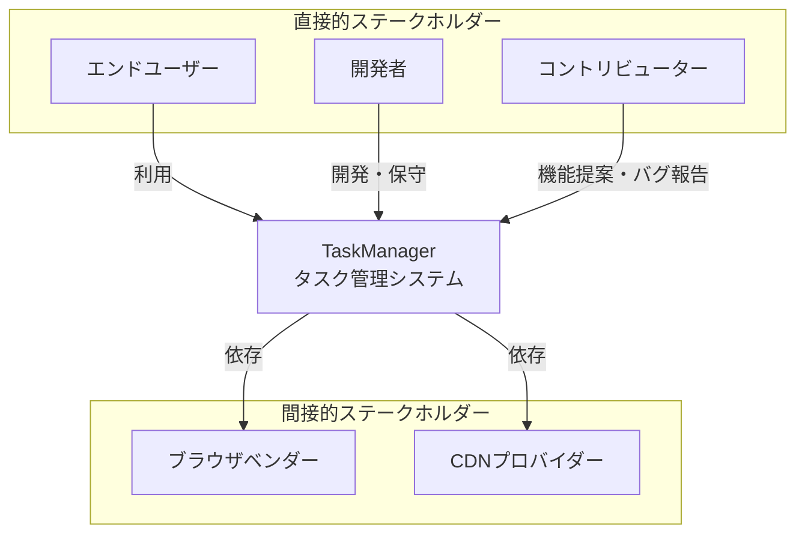

### 2.2 ステークホルダー一覧

| ステークホルダー | 役割 | 権限 | 関与範囲 | 利害 |
|------------------|------|------|-----------|-------|
| エンドユーザー | アプリケーションの利用者 | タスクの作成・編集・削除 | 日常的な利用 | シンプルで使いやすいツールの提供を期待 |
| 開発者 | システムの設計・開発・保守 | 全機能の実装・変更 | 全体 | 保守性の高いコード、技術的な学習機会 |
| コントリビューター | 機能提案、バグ報告、コード貢献 | Issue作成、Pull Request | 部分的 | オープンソースへの貢献、コミュニティ参加 |
| ブラウザベンダー | ブラウザの提供・仕様策定 | Web標準の実装 | 実行環境 | Web標準への準拠 |
| CDNプロバイダー | Bootstrap等のライブラリ提供 | ライブラリの配信 | UIフレームワーク | サービスの安定提供 |

### 2.3 リッチピクチャ

```
┌─────────────────────────────────────────────────────────────────┐
│                     TaskManager エコシステム                      │
│                                                                   │
│  ┌──────────┐                                                    │
│  │エンドユーザー│ "タスクを管理したい"                              │
│  └─────┬────┘                                                    │
│        │                                                          │
│        ↓ ブラウザでアクセス                                        │
│  ┌─────────────────────────────────────┐                        │
│  │   TaskManager Web Application       │                        │
│  │  ┌──────────────────────────────┐  │                        │
│  │  │  カンバンボード表示           │  │                        │
│  │  │  ┌────┬────┬────┬────┐    │  │                        │
│  │  │  │未着手│進行中│保留│完了│    │  │                        │
│  │  │  └────┴────┴────┴────┘    │  │                        │
│  │  └──────────────────────────────┘  │                        │
│  │  ┌──────────────────────────────┐  │                        │
│  │  │  LocalStorage (データ保存)    │  │                        │
│  │  │  - タスク情報                 │  │                        │
│  │  │  - ユーザー設定               │  │                        │
│  │  └──────────────────────────────┘  │                        │
│  └─────────────────────────────────────┘                        │
│        ↑                                                          │
│        │ 依存                                                     │
│  ┌─────┴──────┐    ┌──────────────┐                           │
│  │ Bootstrap  │    │ Browser APIs  │                           │
│  │ (CDN)      │    │ - LocalStorage│                           │
│  └────────────┘    │ - DOM         │                           │
│                     └──────────────┘                           │
│                                                                   │
│  ┌──────────┐                                                    │
│  │開発者     │ "保守しやすいコードを書きたい"                      │
│  └─────┬────┘                                                    │
│        │                                                          │
│        ↓ GitHub                                                  │
│  ┌─────────────────┐                                            │
│  │ ソースコード管理  │                                            │
│  │ - HTML/CSS/JS   │                                            │
│  │ - ドキュメント   │                                            │
│  └─────────────────┘                                            │
│                                                                   │
└─────────────────────────────────────────────────────────────────┘
```

---
## 3. 要求分析

### 3.1 問題・ニーズ・課題一覧

| ID | 種別 | 内容 | 背景 | 課題度 |
|----|------|------|-------|---------|
| P001 | 問題 | タスクの管理が煩雑で忘れやすい | 紙やメモアプリでは整理が困難 | 高 |
| P002 | 問題 | タスクの進捗状況が把握しにくい | 一覧形式では視覚的な把握が困難 | 高 |
| P003 | 問題 | 既存ツールは機能が多すぎて複雑 | 学習コストが高く、使いこなせない | 中 |
| N001 | ニーズ | シンプルで直感的な操作性 | すぐに使い始められるツールが必要 | 高 |
| N002 | ニーズ | データのプライバシー保護 | 外部サーバーにデータを保存したくない | 中 |
| N003 | ニーズ | オフラインでの利用 | インターネット接続なしでも使いたい | 中 |
| C001 | 課題 | タスクの優先順位付けが必要 | 重要なタスクを見失いやすい | 高 |
| C002 | 課題 | 期限管理が必要 | 締め切りを忘れてしまう | 高 |
| C003 | 課題 | タスクの詳細情報の記録 | メモや説明を残したい | 中 |

### 3.2 問題原因分析図

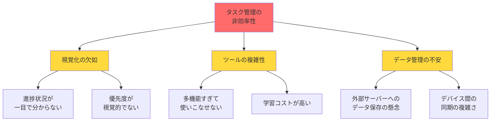

### 3.3 要求構造図

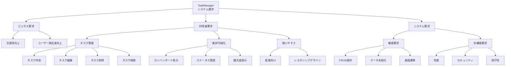

### 3.4 要求一覧

| 要求ID | 要求種別 | 内容 | 優先度 | 出典 | 受入条件 |
|--------|----------|------|--------|------|----------|
| REQ-001 | ビジネス | 個人の生産性を向上させる | 高 | ビジネスコンセプト | タスク管理時間が50%削減される |
| REQ-002 | ビジネス | ユーザー満足度4.0以上を達成 | 高 | バランススコアカード | ユーザー調査で4.0/5.0以上 |
| REQ-003 | 利用者 | タスクを作成できる | 高 | ユーザーニーズ | 30秒以内にタスク作成完了 |
| REQ-004 | 利用者 | タスクを編集できる | 高 | ユーザーニーズ | 既存タスクの情報を変更可能 |
| REQ-005 | 利用者 | タスクを削除できる | 高 | ユーザーニーズ | 確認後にタスクを削除可能 |
| REQ-006 | 利用者 | タスクの詳細を閲覧できる | 高 | ユーザーニーズ | 全ての情報を表示可能 |
| REQ-007 | 利用者 | カンバンボード形式で表示 | 高 | P002 | 4つのステータス列で表示 |
| REQ-008 | 利用者 | タスクにステータスを設定 | 高 | C001 | 未着手/進行中/保留/完了 |
| REQ-009 | 利用者 | タスクに優先度を設定 | 高 | C001 | 高/中/低の3段階 |
| REQ-010 | 利用者 | タスクに期限を設定 | 高 | C002 | 日付形式で期限設定可能 |
| REQ-011 | 利用者 | タスクに説明を追加 | 中 | C003 | 自由記述の説明欄 |
| REQ-012 | 利用者 | 直感的に操作できる | 高 | N001 | 説明なしで基本操作可能 |
| REQ-013 | 利用者 | レスポンシブデザイン | 中 | N001 | PC/タブレット/スマホ対応 |
| REQ-014 | システム | データをローカルに保存 | 高 | N002 | LocalStorageに保存 |
| REQ-015 | システム | オフラインで動作 | 中 | N003 | ネット接続不要で動作 |
| REQ-016 | システム | ページ読み込み時間3秒以内 | 中 | 性能要求 | 初回読み込み3秒以内 |
| REQ-017 | システム | XSS攻撃への対策 | 高 | セキュリティ | 入力値のエスケープ処理 |
| REQ-018 | システム | コードの保守性確保 | 中 | 保守性 | 3層アーキテクチャ採用 |

---
## 4. データモデル

### 4.1 管理対象分類図

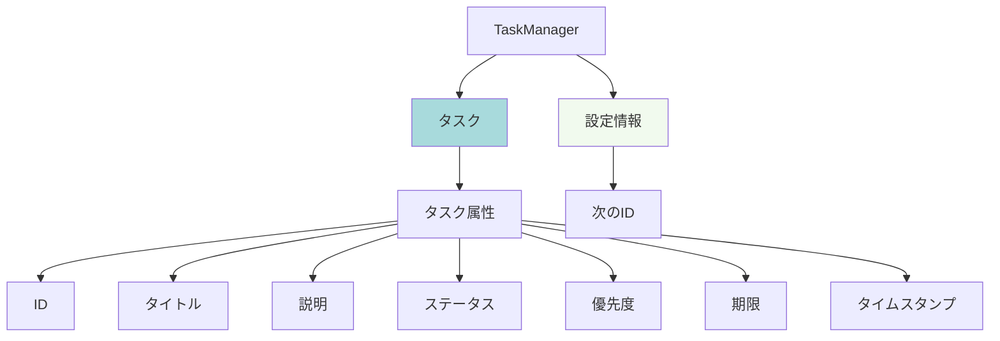

### 4.2 概念データモデル（ER図）

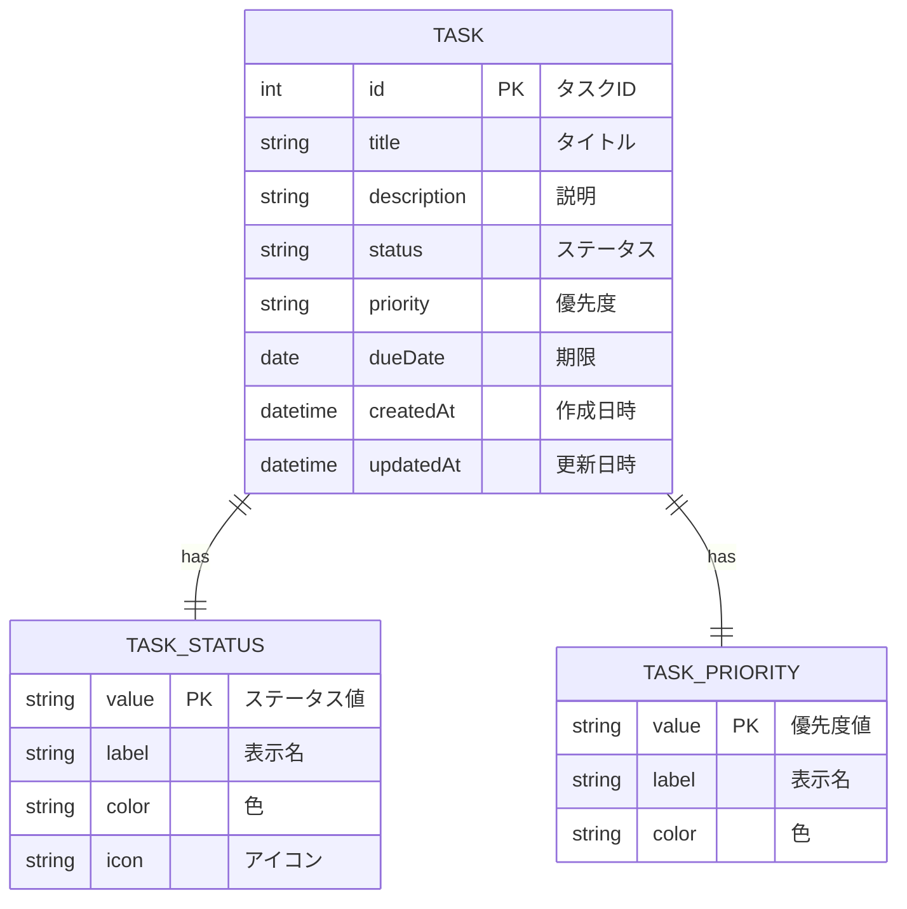

**エンティティ説明**

**TASK（タスク）**
- システムの中心となるエンティティ
- ユーザーが管理する個々のタスク情報を保持
- ステータスと優先度は参照データとして定義

**TASK_STATUS（タスクステータス）**
- タスクの進捗状態を表すマスタデータ
- 値：TODO（未着手）、IN_PROGRESS（進行中）、ON_HOLD（保留）、DONE（完了）

**TASK_PRIORITY（タスク優先度）**
- タスクの重要度を表すマスタデータ
- 値：HIGH（高）、MEDIUM（中）、LOW（低）

---
## 5. ビジネスプロセスモデル

### 5.1 ビジネスプロセス関連図

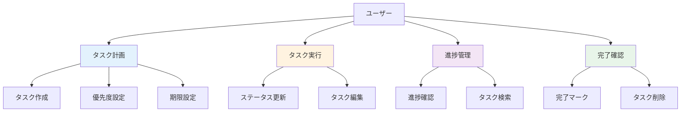

### 5.2 業務機能構成表

| 機能カテゴリ | 機能名 | 機能説明 |
|--------------|---------|-----------|
| タスク管理 | タスク作成 | 新しいタスクを作成する |
| タスク管理 | タスク編集 | 既存タスクの情報を更新する |
| タスク管理 | タスク削除 | 不要なタスクを削除する |
| タスク管理 | タスク詳細表示 | タスクの全情報を表示する |
| 表示・検索 | カンバンボード表示 | ステータス別にタスクを表示する |
| 表示・検索 | タスク一覧表示 | 全タスクを一覧表示する |
| データ管理 | データ保存 | タスクデータをLocalStorageに保存 |
| データ管理 | データ読み込み | LocalStorageからデータを読み込み |
| データ管理 | 初期データ生成 | サンプルデータの生成 |
| UI制御 | 画面遷移 | 各画面間の遷移制御 |
| UI制御 | メッセージ表示 | 操作結果のフィードバック表示 |
| UI制御 | バリデーション | 入力値の検証 |

### 5.3 ビジネスプロセスフロー（現行業務フロー）

**現状：紙やメモアプリでのタスク管理**

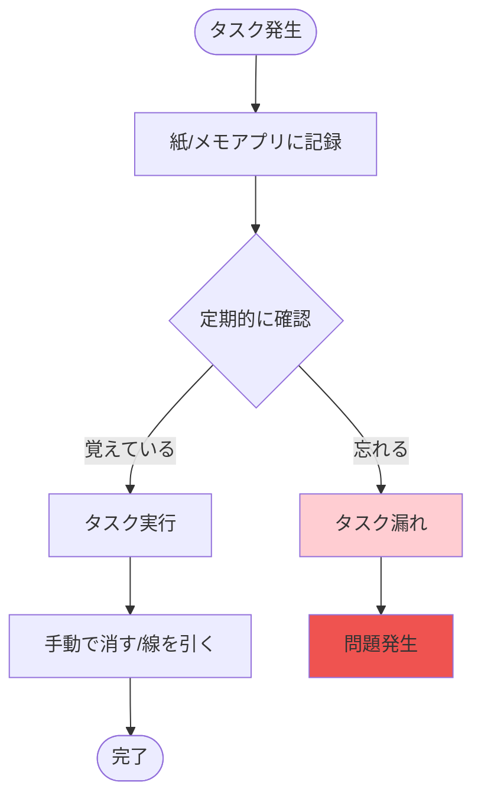

**課題**
- タスクの見落としが発生しやすい
- 進捗状況が把握しにくい
- 優先順位の管理が困難
- 検索や整理が難しい

### 5.4 システム化業務フロー

**改善後：TaskManagerでのタスク管理**

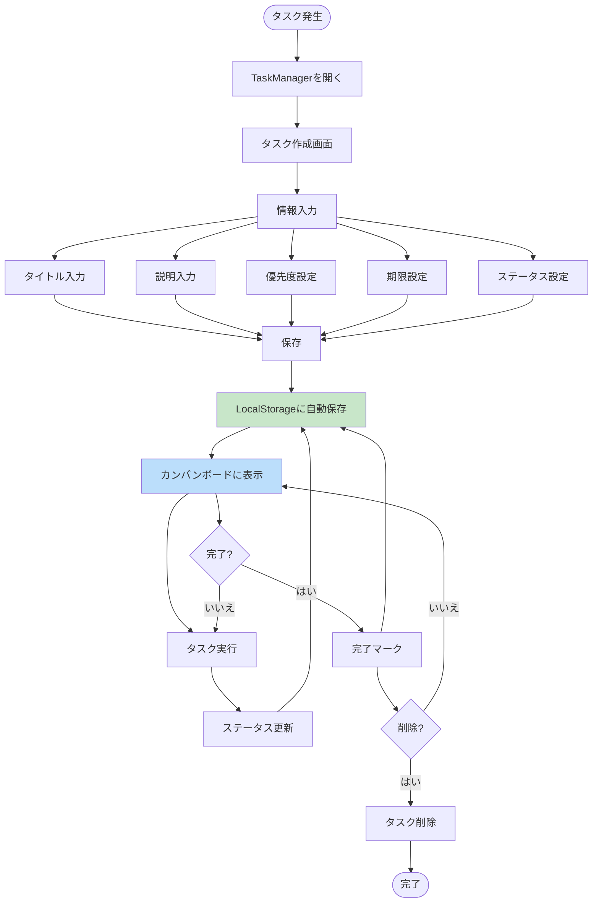

**改善点**
- タスクの一元管理により見落とし防止
- カンバンボードで進捗を視覚的に把握
- 優先度と期限で重要タスクを明確化
- 自動保存でデータ損失を防止

### 5.5 業務処理定義書

#### 5.5.1 タスク作成処理

| 項目 | 内容 |
|------|------|
| 処理ID | BP-001 |
| 概要 | 新しいタスクを作成し、システムに登録する |
| 入力 | タイトル、説明、ステータス、優先度、期限 |
| 処理 | 1. 入力値のバリデーション<br>2. 一意なIDの生成<br>3. タイムスタンプの付与<br>4. LocalStorageへの保存<br>5. 画面への反映 |
| 出力 | 作成されたタスク情報、成功メッセージ |
| 参照データ | 次のID番号 |
| 例外処理 | - タイトル未入力：エラーメッセージ表示<br>- 保存失敗：エラーメッセージ表示 |

#### 5.5.2 タスク更新処理

| 項目 | 内容 |
|------|------|
| 処理ID | BP-002 |
| 概要 | 既存タスクの情報を更新する |
| 入力 | タスクID、更新する項目（タイトル、説明、ステータス、優先度、期限） |
| 処理 | 1. タスクIDでタスクを検索<br>2. 入力値のバリデーション<br>3. 更新日時の更新<br>4. LocalStorageへの保存<br>5. 画面への反映 |
| 出力 | 更新されたタスク情報、成功メッセージ |
| 参照データ | 既存タスクデータ |
| 例外処理 | - タスクが存在しない：エラーメッセージ表示<br>- タイトル未入力：エラーメッセージ表示<br>- 保存失敗：エラーメッセージ表示 |

#### 5.5.3 タスク削除処理

| 項目 | 内容 |
|------|------|
| 処理ID | BP-003 |
| 概要 | 指定されたタスクを削除する |
| 入力 | タスクID |
| 処理 | 1. 削除確認ダイアログ表示<br>2. ユーザー確認<br>3. タスクリストから削除<br>4. LocalStorageへの保存<br>5. 画面への反映 |
| 出力 | 削除完了メッセージ |
| 参照データ | 既存タスクデータ |
| 例外処理 | - タスクが存在しない：エラーメッセージ表示<br>- ユーザーがキャンセル：処理中断 |

#### 5.5.4 タスク一覧表示処理

| 項目 | 内容 |
|------|------|
| 処理ID | BP-004 |
| 概要 | カンバンボード形式でタスクを表示する |
| 入力 | なし |
| 処理 | 1. LocalStorageからデータ読み込み<br>2. ステータス別にタスクをグループ化<br>3. 各列にタスクカードを描画<br>4. 優先度に応じた色分け表示 |
| 出力 | カンバンボード画面 |
| 参照データ | 全タスクデータ、ステータス定義、優先度定義 |
| 例外処理 | - データ読み込み失敗：初期データ生成<br>- データが空：空の列を表示 |

#### 5.5.5 タスク詳細表示処理

| 項目 | 内容 |
|------|------|
| 処理ID | BP-005 |
| 概要 | 指定されたタスクの詳細情報を表示する |
| 入力 | タスクID |
| 処理 | 1. タスクIDでタスクを検索<br>2. タスク情報の整形<br>3. 詳細画面の描画 |
| 出力 | タスク詳細画面 |
| 参照データ | 既存タスクデータ、ステータス定義、優先度定義 |
| 例外処理 | - タスクが存在しない：エラーメッセージ表示、一覧画面へ遷移 |

---
## 6. 相互作用モデル

### 6.1 状態遷移図

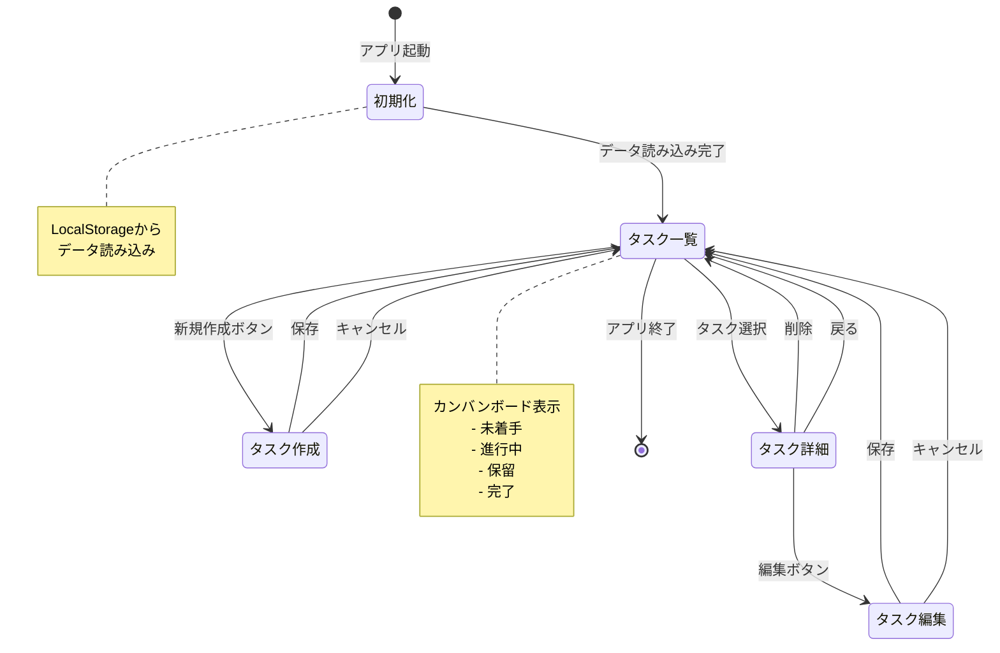

### 6.2 タスクステータス遷移図

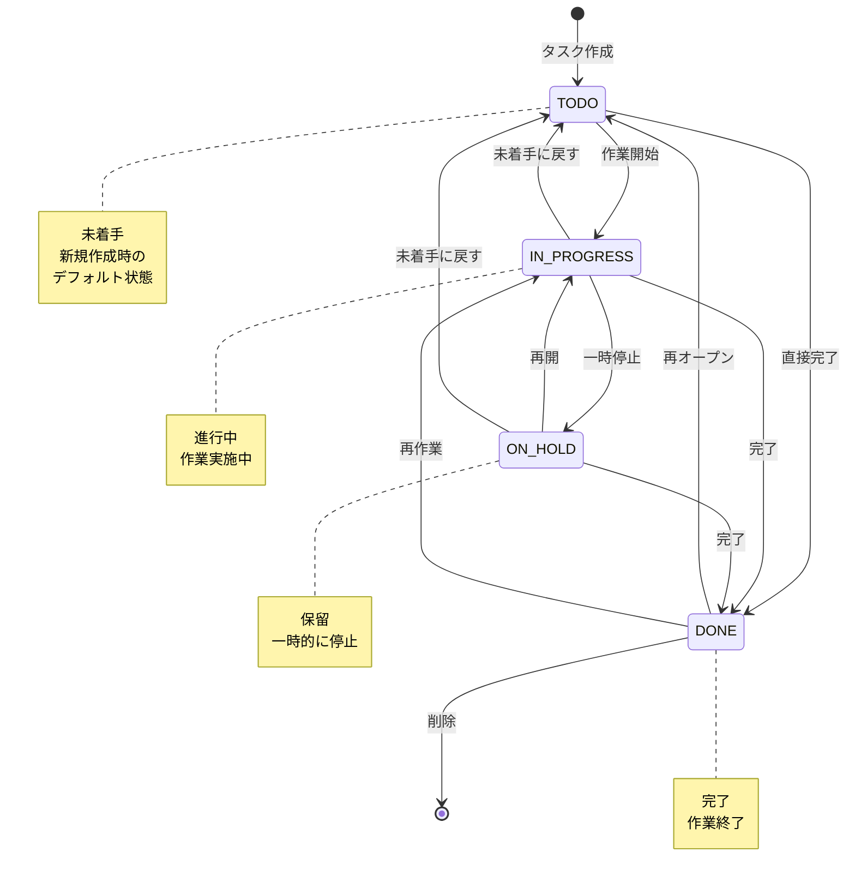

### 6.3 ユーザーインタラクション図

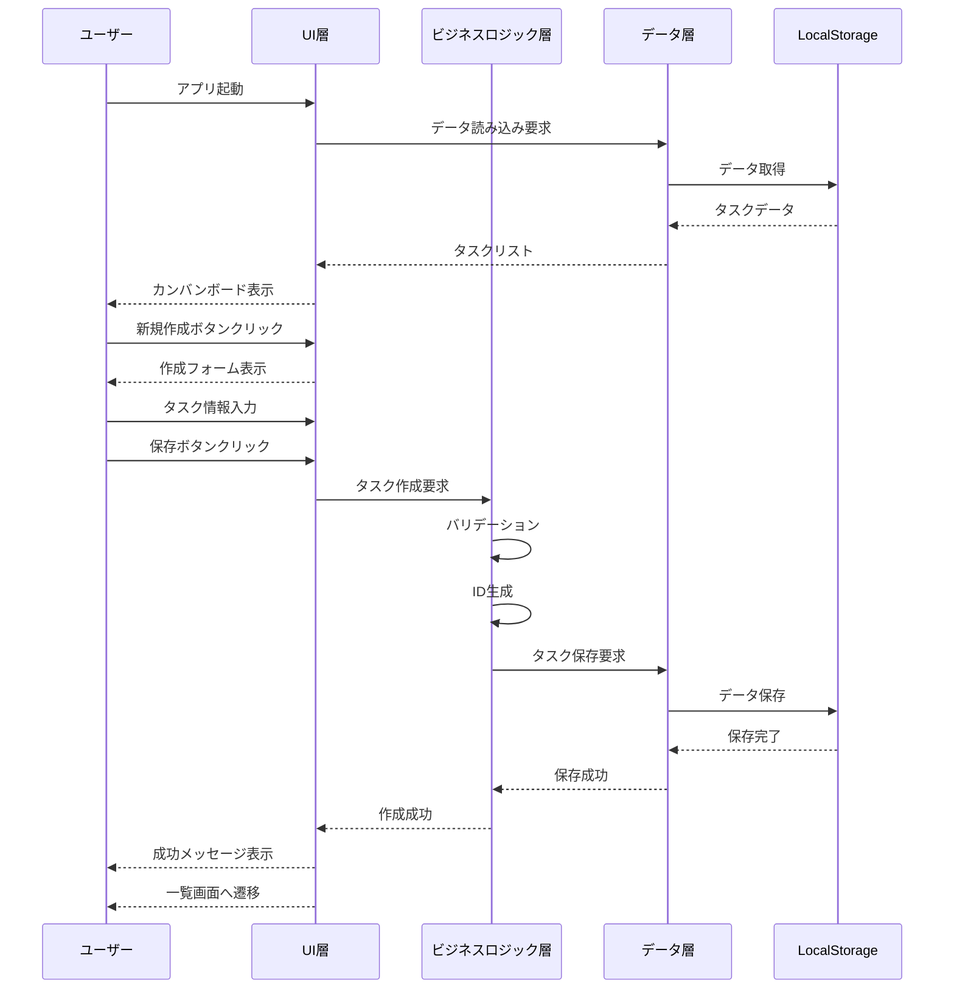

---
## 7. コミュニケーション

### 7.1 業務用語定義

| 用語 | 定義 | 備考 |
|------|--------|------|
| タスク | 実行すべき作業や活動の単位 | システムの中心概念 |
| カンバンボード | タスクをステータス別の列に配置して視覚化する表示方式 | アジャイル開発手法から派生 |
| ステータス | タスクの進捗状態 | 未着手/進行中/保留/完了の4種類 |
| 優先度 | タスクの重要度・緊急度 | 高/中/低の3段階 |
| 期限 | タスクを完了すべき日付 | 任意設定 |
| LocalStorage | ブラウザに内蔵されたデータ保存領域 | 約5-10MBの容量制限 |
| CRUD | Create/Read/Update/Deleteの略 | データ操作の基本4機能 |
| レスポンシブデザイン | 画面サイズに応じて表示を最適化するデザイン手法 | PC/タブレット/スマホ対応 |
| バリデーション | 入力値の妥当性を検証する処理 | データ品質保証 |
| エスケープ処理 | 特殊文字を無害化する処理 | XSS攻撃対策 |

### 7.2 ビフォーアフター図

| 項目 | 現状（Before） | 改善後（After） |
|-------|----------------|------------------|
| **タスク管理方法** | 紙のメモ、付箋、メモアプリに分散 | 一元管理されたWebアプリ |
| **進捗把握** | 手動で確認、見落としが発生 | カンバンボードで一目で把握 |
| **優先順位** | 頭の中で管理、曖昧 | 3段階の優先度で明確化 |
| **期限管理** | 手帳やカレンダーで別管理 | タスクと一緒に管理 |
| **検索性** | 紙をめくって探す、時間がかかる | 即座に全タスクを表示 |
| **データ保存** | 紙の紛失リスク、バックアップ困難 | 自動保存、ブラウザに永続化 |
| **アクセス性** | 紙を持ち歩く必要あり | ブラウザがあればどこでも |
| **操作性** | 手書き、消しゴムで修正 | クリック・タップで簡単操作 |
| **可視化** | リスト形式のみ | カンバンボードで視覚的 |
| **学習コスト** | なし（紙） / 高い（複雑なツール） | 低い（直感的なUI） |

### 7.3 用語の関連図

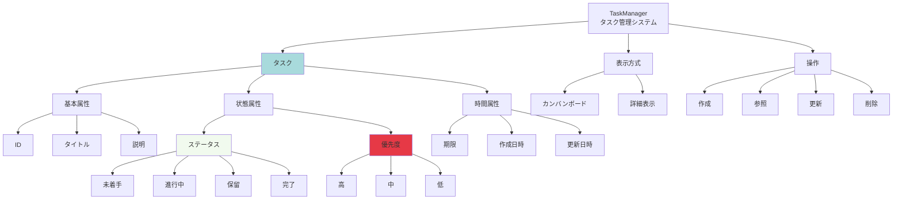

---
## 8. 各種一覧

### 8.1 システム化業務一覧

| 業務 | 区分 | システム化可否 | 説明 |
|-------|--------|-------------------|---------|
| タスク作成 | 基本機能 | ○ | 新規タスクの登録 |
| タスク編集 | 基本機能 | ○ | 既存タスクの情報更新 |
| タスク削除 | 基本機能 | ○ | 不要タスクの削除 |
| タスク詳細表示 | 基本機能 | ○ | タスク情報の詳細表示 |
| カンバンボード表示 | 表示機能 | ○ | ステータス別のタスク表示 |
| ステータス変更 | 更新機能 | ○ | タスクの進捗状態変更 |
| 優先度設定 | 更新機能 | ○ | タスクの重要度設定 |
| 期限設定 | 更新機能 | ○ | タスクの期限設定 |
| データ保存 | データ管理 | ○ | LocalStorageへの保存 |
| データ読み込み | データ管理 | ○ | LocalStorageからの読み込み |
| 初期データ生成 | データ管理 | ○ | サンプルデータの自動生成 |
| バリデーション | 入力制御 | ○ | 入力値の妥当性検証 |
| エラー表示 | UI制御 | ○ | エラーメッセージの表示 |
| 成功メッセージ表示 | UI制御 | ○ | 操作成功の通知 |

### 8.2 画面一覧

| 画面ID | 画面名 | 概要 |
|--------|----------|--------|
| SC-001 | タスク一覧画面（カンバンボード） | ステータス別にタスクを表示するメイン画面 |
| SC-002 | タスク詳細画面 | 選択したタスクの全情報を表示 |
| SC-003 | タスク作成画面 | 新規タスクの情報を入力 |
| SC-004 | タスク編集画面 | 既存タスクの情報を編集 |

### 8.3 帳票一覧

| 帳票ID | 帳票名 | 概要 |
|--------|----------|--------|
| - | - | 本システムでは帳票出力機能は提供しない |

**備考**: 将来的な拡張として、以下の帳票が検討可能
- タスク一覧レポート（PDF出力）
- 完了タスクサマリー
- 進捗レポート

### 8.4 外部インターフェース一覧

| IF ID | 接続先 | 入出力 | 頻度 | 方式 | 備考 |
|--------|-----------|----------|--------|--------|--------|
| IF-001 | Bootstrap CDN | 入力 | 初回読み込み時 | HTTP/HTTPS | CSSフレームワーク |
| IF-002 | Bootstrap Icons CDN | 入力 | 初回読み込み時 | HTTP/HTTPS | アイコンライブラリ |
| IF-003 | Bootstrap JS CDN | 入力 | 初回読み込み時 | HTTP/HTTPS | JavaScriptライブラリ |
| IF-004 | LocalStorage API | 入出力 | 随時 | Browser API | データ永続化 |

### 8.5 エンティティ一覧

| エンティティ | 説明 |
|---------------|--------|
| Task | タスク情報を管理するメインエンティティ |
| TaskStatus | タスクのステータス定義（マスタデータ） |
| TaskPriority | タスクの優先度定義（マスタデータ） |
| TaskManagerData | システム全体のデータ構造（タスクリスト + 次のID） |

---
## 9. インターフェース

### 9.1 システム化要求仕様

| 項目 | 内容 |
|------|--------|
| システム名 | TaskManager |
| システム種別 | Webアプリケーション（SPA） |
| 対応ブラウザ | Chrome 90+, Firefox 88+, Safari 14+, Edge 90+ |
| 対応デバイス | PC、タブレット、スマートフォン |
| 画面解像度 | 320px以上（レスポンシブ対応） |
| 必須機能 | LocalStorage API対応 |
| 推奨環境 | JavaScript有効、Cookie有効 |
| ネットワーク | 初回読み込み時のみ必要（CDN読み込み） |
| データ容量 | LocalStorage 5-10MB以内 |

### 9.2 UI標準

#### 9.2.1 デザインシステム
- **UIフレームワーク**: Bootstrap 5.3.0
- **アイコン**: Bootstrap Icons 1.10.0
- **カラースキーム**: Bootstrap標準カラー
  - Primary: #0d6efd（青）
  - Success: #198754（緑）
  - Warning: #ffc107（黄）
  - Danger: #dc3545（赤）
  - Secondary: #6c757d（グレー）
  - Info: #0dcaf0（水色）

#### 9.2.2 タイポグラフィ
- **フォントファミリー**: システムフォント（-apple-system, BlinkMacSystemFont, "Segoe UI", Roboto）
- **基本フォントサイズ**: 16px
- **見出し**: h1-h6（Bootstrap標準）
- **行間**: 1.5

#### 9.2.3 レイアウト
- **コンテナ幅**: 最大1140px（Bootstrap container）
- **グリッドシステム**: Bootstrap 12カラムグリッド
- **余白**: Bootstrap spacing utilities（m-*, p-*）
- **レスポンシブブレークポイント**:
  - xs: <576px（スマートフォン）
  - sm: ≥576px（小型タブレット）
  - md: ≥768px（タブレット）
  - lg: ≥992px（デスクトップ）
  - xl: ≥1200px（大型デスクトップ）

#### 9.2.4 コンポーネント
- **ボタン**: Bootstrap btn クラス
- **フォーム**: Bootstrap form-control クラス
- **カード**: Bootstrap card コンポーネント
- **バッジ**: Bootstrap badge コンポーネント
- **アラート**: Bootstrap alert コンポーネント

#### 9.2.5 アニメーション
- **トランジション**: 0.2-0.3秒
- **イージング**: ease-out
- **ホバー効果**: transform: translateY(-5px)
- **フェードイン**: opacity 0→1

### 9.3 画面遷移図

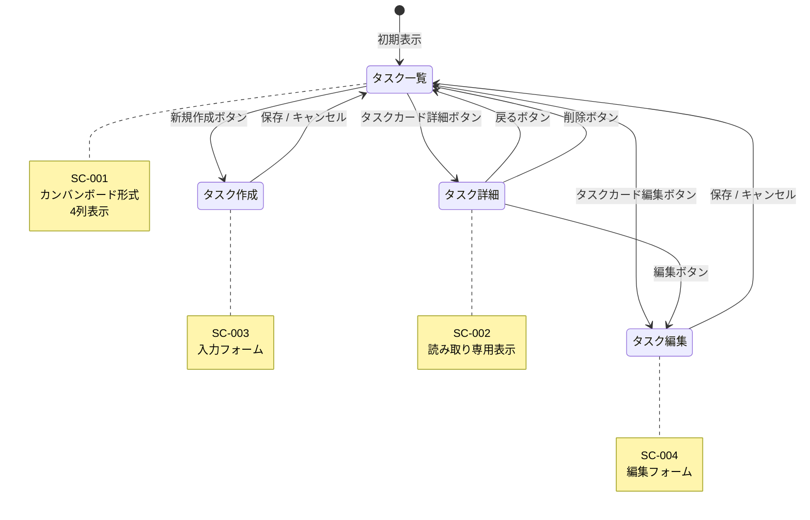

### 9.4 画面 / 帳票レイアウト

#### 9.4.1 SC-001: タスク一覧画面（カンバンボード）

**ワイヤーフレーム**
```
┌─────────────────────────────────────────────────────────────┐
│ ナビゲーションバー                                            │
│ [TaskManager]                                                │
└─────────────────────────────────────────────────────────────┘
┌─────────────────────────────────────────────────────────────┐
│ [メッセージ表示エリア]                                        │
└─────────────────────────────────────────────────────────────┘
┌─────────────────────────────────────────────────────────────┐
│ タスク一覧                              [+ 新規作成]          │
├─────────────┬─────────────┬─────────────┬─────────────────┤
│ 未着手 (2)  │ 進行中 (1)  │ 保留 (1)    │ 完了 (1)        │
├─────────────┼─────────────┼─────────────┼─────────────────┤
│┌───────────┐│┌───────────┐│┌───────────┐│┌───────────────┐│
││タスクA    │││タスクB    │││タスクC    │││タスクD        ││
││[高]       │││[高]       │││[中]       │││[低]           ││
││03/01      │││02/28      │││03/05      │││02/25          ││
││[詳細][編集]│││[詳細][編集]│││[詳細][編集]│││[詳細][編集]   ││
│└───────────┘│└───────────┘│└───────────┘│└───────────────┘│
│┌───────────┐│             │             │                 │
││タスクE    ││             │             │                 │
││[中]       ││             │             │                 │
││03/10      ││             │             │                 │
││[詳細][編集]││             │             │                 │
│└───────────┘│             │             │                 │
└─────────────┴─────────────┴─────────────┴─────────────────┘
┌─────────────────────────────────────────────────────────────┐
│ フッター                                                      │
│ © 2026 TaskManager                                           │
└─────────────────────────────────────────────────────────────┘
```

**画面要素**
- ナビゲーションバー: アプリ名表示、ホームリンク
- メッセージエリア: 操作結果のフィードバック表示
- 新規作成ボタン: タスク作成画面へ遷移
- カンバン列（4列）: 各ステータスのタスクを表示
- タスクカード: タイトル、優先度、期限、アクションボタン

#### 9.4.2 SC-002: タスク詳細画面

**ワイヤーフレーム**
```
┌─────────────────────────────────────────────────────────────┐
│ ナビゲーションバー                                            │
│ [TaskManager]                                                │
└─────────────────────────────────────────────────────────────┘
┌─────────────────────────────────────────────────────────────┐
│ タスク詳細                                                    │
├─────────────────────────────────────────────────────────────┤
│ ID: 1                                                        │
│                                                              │
│ タイトル                                                      │
│ Spring Bootの学習                                            │
│                                                              │
│ 説明                                                          │
│ Spring Bootの基礎を学習する                                  │
│                                                              │
│ ステータス                                                    │
│ [進行中]                                                      │
│                                                              │
│ 優先度                                                        │
│ [高]                                                          │
│                                                              │
│ 期限                                                          │
│ 2026-03-01                                                   │
│                                                              │
│ 作成日時                                                      │
│ 2026-02-20 10:30:00                                          │
│                                                              │
│ 更新日時                                                      │
│ 2026-02-25 15:45:00                                          │
│                                                              │
│ [← 一覧に戻る] [編集] [削除]                                  │
└─────────────────────────────────────────────────────────────┘
```

**画面要素**
- 全タスク情報の表示（読み取り専用）
- 一覧に戻るボタン: タスク一覧へ遷移
- 編集ボタン: タスク編集画面へ遷移
- 削除ボタン: 確認ダイアログ後、削除実行

#### 9.4.3 SC-003: タスク作成画面

**ワイヤーフレーム**
```
┌─────────────────────────────────────────────────────────────┐
│ ナビゲーションバー                                            │
│ [TaskManager]                                                │
└─────────────────────────────────────────────────────────────┘
┌─────────────────────────────────────────────────────────────┐
│ タスク作成                                                    │
├─────────────────────────────────────────────────────────────┤
│ タイトル *                                                    │
│ [_____________________________] 最大200文字                  │
│                                                              │
│ 説明                                                          │
│ [_____________________________]                              │
│ [_____________________________]                              │
│ [_____________________________]                              │
│ [_____________________________]                              │
│                                                              │
│ ステータス *                                                  │
│ [未着手 ▼]                                                   │
│                                                              │
│ 優先度 *                                                      │
│ [中 ▼]                                                       │
│                                                              │
│ 期限                                                          │
│ [____-__-__] (日付選択)                                      │
│                                                              │
│ [保存] [キャンセル]                                           │
└─────────────────────────────────────────────────────────────┘
```

**画面要素**
- タイトル入力欄: 必須、最大200文字
- 説明入力欄: 任意、複数行テキスト
- ステータス選択: 必須、ドロップダウン
- 優先度選択: 必須、ドロップダウン
- 期限入力: 任意、日付ピッカー
- 保存ボタン: バリデーション後、保存実行
- キャンセルボタン: 一覧画面へ戻る

#### 9.4.4 SC-004: タスク編集画面

**ワイヤーフレーム**
```
┌─────────────────────────────────────────────────────────────┐
│ ナビゲーションバー                                            │
│ [TaskManager]                                                │
└─────────────────────────────────────────────────────────────┘
┌─────────────────────────────────────────────────────────────┐
│ タスク編集                                                    │
├─────────────────────────────────────────────────────────────┤
│ タイトル *                                                    │
│ [Spring Bootの学習_______] 最大200文字                       │
│                                                              │
│ 説明                                                          │
│ [Spring Bootの基礎を学習する]                                │
│ [_____________________________]                              │
│ [_____________________________]                              │
│ [_____________________________]                              │
│                                                              │
│ ステータス *                                                  │
│ [進行中 ▼]                                                   │
│                                                              │
│ 優先度 *                                                      │
│ [高 ▼]                                                       │
│                                                              │
│ 期限                                                          │
│ [2026-03-01] (日付選択)                                      │
│                                                              │
│ [保存] [キャンセル]                                           │
└─────────────────────────────────────────────────────────────┘
```

**画面要素**
- 作成画面と同様の入力フォーム
- 既存データが初期値として設定済み
- 保存ボタン: バリデーション後、更新実行
- キャンセルボタン: 一覧画面へ戻る

---
## 10. データ定義

### 10.1 エンティティ定義書 / データ項目定義書

#### 10.1.1 Task（タスク）エンティティ

| 項目 | 型 | 桁 | 制約 | 説明 |
|------|-----|------|---------|--------|
| id | number | - | NOT NULL, UNIQUE | タスクの一意識別子、自動採番 |
| title | string | 200 | NOT NULL | タスクのタイトル |
| description | string | - | NULL可 | タスクの詳細説明 |
| status | string | - | NOT NULL | タスクのステータス（TODO/IN_PROGRESS/ON_HOLD/DONE） |
| priority | string | - | NOT NULL | タスクの優先度（HIGH/MEDIUM/LOW） |
| dueDate | string | 10 | NULL可 | 期限（YYYY-MM-DD形式） |
| createdAt | string | - | NOT NULL | 作成日時（ISO 8601形式） |
| updatedAt | string | - | NOT NULL | 更新日時（ISO 8601形式） |

#### 10.1.2 TaskManagerData（システムデータ）構造

| 項目 | 型 | 制約 | 説明 |
|------|-----|---------|--------|
| tasks | Task[] | NOT NULL | タスクの配列 |
| nextId | number | NOT NULL | 次に採番するID |

#### 10.1.3 TaskStatus（ステータス定義）

| 項目 | 型 | 説明 |
|------|-----|--------|
| value | string | ステータス値（内部値） |
| label | string | 表示名（日本語） |
| color | string | Bootstrap カラークラス |
| icon | string | Bootstrap Icons クラス |

**定義値**
| value | label | color | icon |
|-------|-------|-------|------|
| TODO | 未着手 | secondary | bi-list-task |
| IN_PROGRESS | 進行中 | primary | bi-arrow-repeat |
| ON_HOLD | 保留 | warning | bi-pause-circle |
| DONE | 完了 | success | bi-check-circle |

#### 10.1.4 TaskPriority（優先度定義）

| 項目 | 型 | 説明 |
|------|-----|--------|
| value | string | 優先度値（内部値） |
| label | string | 表示名（日本語） |
| color | string | Bootstrap カラークラス |

**定義値**
| value | label | color |
|-------|-------|-------|
| HIGH | 高 | danger |
| MEDIUM | 中 | warning |
| LOW | 低 | info |

### 10.2 ドメイン定義書

| ドメイン名 | 型 | 桁 | 備考 |
|-------------|------|-------|--------|
| ID | number | - | 正の整数、1から開始 |
| タイトル | string | 200 | 必須入力、空白不可 |
| 説明 | string | - | 任意入力、複数行可 |
| ステータス値 | string | - | 列挙型（TODO/IN_PROGRESS/ON_HOLD/DONE） |
| 優先度値 | string | - | 列挙型（HIGH/MEDIUM/LOW） |
| 日付 | string | 10 | YYYY-MM-DD形式、ISO 8601準拠 |
| 日時 | string | - | ISO 8601形式（YYYY-MM-DDTHH:mm:ss.sssZ） |
| カラー | string | - | Bootstrap カラークラス名 |
| アイコン | string | - | Bootstrap Icons クラス名 |

### 10.3 コード体系定義書 / コード内容定義書

#### 10.3.1 ステータスコード

| コード区分 | コード値 | 名称 | 説明 |
|-------------|-------------|--------|--------|
| TaskStatus | TODO | 未着手 | タスクが作成されたが、まだ作業を開始していない状態 |
| TaskStatus | IN_PROGRESS | 進行中 | タスクの作業を実施中の状態 |
| TaskStatus | ON_HOLD | 保留 | タスクの作業を一時的に停止している状態 |
| TaskStatus | DONE | 完了 | タスクの作業が完了した状態 |

#### 10.3.2 優先度コード

| コード区分 | コード値 | 名称 | 説明 |
|-------------|-------------|--------|--------|
| TaskPriority | HIGH | 高 | 最優先で対応すべきタスク |
| TaskPriority | MEDIUM | 中 | 通常の優先度のタスク |
| TaskPriority | LOW | 低 | 時間があるときに対応するタスク |

#### 10.3.3 LocalStorageキー

| キー名 | 説明 | データ型 |
|--------|------|----------|
| taskManagerData | システム全体のデータ | JSON文字列（TaskManagerData） |

### 10.4 データ構造例

#### 10.4.1 LocalStorageに保存されるJSON構造

```json
{
  "tasks": [
    {
      "id": 1,
      "title": "Spring Bootの学習",
      "description": "Spring Bootの基礎を学習する",
      "status": "IN_PROGRESS",
      "priority": "HIGH",
      "dueDate": "2026-03-01",
      "createdAt": "2026-02-20T01:30:00.000Z",
      "updatedAt": "2026-02-25T06:45:00.000Z"
    },
    {
      "id": 2,
      "title": "データベース設計",
      "description": "タスク管理アプリのDB設計を行う",
      "status": "DONE",
      "priority": "HIGH",
      "dueDate": "2026-02-25",
      "createdAt": "2026-02-20T01:30:00.000Z",
      "updatedAt": "2026-02-25T06:45:00.000Z"
    }
  ],
  "nextId": 3
}
```

---
## 11. 機能・データ整合性検証

### 11.1 CRUD図

| エンティティ / 機能 | タスク作成 | タスク編集 | タスク削除 | タスク詳細表示 | タスク一覧表示 | データ初期化 |
|---------------------|-----------|-----------|-----------|---------------|---------------|-------------|
| **Task** | C | U | D | R | R | C |
| **TaskManagerData** | U | U | U | R | R | C |
| **TaskStatus（参照）** | R | R | - | R | R | - |
| **TaskPriority（参照）** | R | R | - | R | R | - |

**凡例**
- C (Create): 作成
- R (Read): 参照
- U (Update): 更新
- D (Delete): 削除

### 11.2 機能とデータの整合性分析

#### 11.2.1 データ完全性チェック

| チェック項目 | 検証内容 | 結果 |
|-------------|----------|------|
| 全エンティティの作成 | すべてのエンティティに作成機能が存在するか | ✓ Task: タスク作成機能で作成 |
| 全エンティティの参照 | すべてのエンティティに参照機能が存在するか | ✓ すべてのエンティティが参照可能 |
| 全エンティティの更新 | 更新が必要なエンティティに更新機能が存在するか | ✓ Task: タスク編集機能で更新 |
| 全エンティティの削除 | 削除が必要なエンティティに削除機能が存在するか | ✓ Task: タスク削除機能で削除 |
| マスタデータの管理 | マスタデータが適切に定義されているか | ✓ TaskStatus, TaskPriorityは定数として定義 |

#### 11.2.2 データ依存関係チェック

| 依存関係 | 検証内容 | 結果 |
|----------|----------|------|
| Task → TaskStatus | タスクのステータスが有効な値か | ✓ 定数で定義された値のみ使用 |
| Task → TaskPriority | タスクの優先度が有効な値か | ✓ 定数で定義された値のみ使用 |
| TaskManagerData → Task | nextIdが適切に管理されているか | ✓ タスク作成時に自動インクリメント |

#### 11.2.3 機能網羅性チェック

| 要求 | 対応機能 | データ操作 | 検証結果 |
|------|----------|-----------|----------|
| REQ-003: タスク作成 | タスク作成機能 | Task: C, TaskManagerData: U | ✓ |
| REQ-004: タスク編集 | タスク編集機能 | Task: U, TaskManagerData: U | ✓ |
| REQ-005: タスク削除 | タスク削除機能 | Task: D, TaskManagerData: U | ✓ |
| REQ-006: タスク詳細閲覧 | タスク詳細表示機能 | Task: R | ✓ |
| REQ-007: カンバンボード表示 | タスク一覧表示機能 | Task: R, TaskStatus: R | ✓ |
| REQ-008: ステータス設定 | タスク作成/編集機能 | Task: C/U, TaskStatus: R | ✓ |
| REQ-009: 優先度設定 | タスク作成/編集機能 | Task: C/U, TaskPriority: R | ✓ |
| REQ-010: 期限設定 | タスク作成/編集機能 | Task: C/U | ✓ |
| REQ-011: 説明追加 | タスク作成/編集機能 | Task: C/U | ✓ |
| REQ-014: ローカル保存 | データ保存機能 | TaskManagerData: U | ✓ |

### 11.3 データフロー検証

#### 11.3.1 タスク作成フロー

```mermaid
flowchart LR
    User[ユーザー入力] --> Validate[バリデーション]
    Validate --> Create[Task作成]
    Create --> NextID[nextId取得]
    NextID --> Assign[ID割り当て]
    Assign --> Timestamp[タイムスタンプ付与]
    Timestamp --> AddList[tasksリストに追加]
    AddList --> IncID[nextIdインクリメント]
    IncID --> Save[LocalStorage保存]
    Save --> Display[画面表示]
```

**データ整合性**
- ✓ IDの一意性: nextIdで管理
- ✓ 必須項目: バリデーションで検証
- ✓ タイムスタンプ: 自動付与
- ✓ データ永続化: LocalStorageに保存

#### 11.3.2 タスク更新フロー

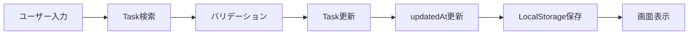

**データ整合性**
- ✓ タスク存在確認: ID検索で確認
- ✓ 必須項目: バリデーションで検証
- ✓ 更新日時: 自動更新
- ✓ データ永続化: LocalStorageに保存

#### 11.3.3 タスク削除フロー


**データ整合性**
- ✓ タスク存在確認: ID検索で確認
- ✓ ユーザー確認: 確認ダイアログで実施
- ✓ データ永続化: LocalStorageに保存
- ✓ 参照整合性: 削除後は参照不可

---
## 12. 非機能要求

### 12.1 非機能要件書

| 分類 | 要件 | 内容 | 目標値 | 測定方法 |
|--------|--------|--------|---------|----------|
| **可用性** | システム稼働率 | ブラウザが動作する限り利用可能 | 99.9% | ブラウザの稼働率に依存 |
| **可用性** | オフライン動作 | ネットワーク接続なしで動作 | 完全対応 | オフライン環境でのテスト |
| **可用性** | データ永続性 | ブラウザを閉じてもデータ保持 | 100% | LocalStorage使用 |
| **性能** | 初回読み込み時間 | アプリケーション起動時間 | 3秒以内 | ブラウザDevToolsで計測 |
| **性能** | 画面遷移時間 | 画面切り替え応答時間 | 0.5秒以内 | ユーザー体感 |
| **性能** | データ保存時間 | LocalStorageへの保存時間 | 0.1秒以内 | パフォーマンス計測 |
| **性能** | 同時タスク数 | 管理可能なタスク数 | 1000件以上 | 負荷テスト |
| **拡張性** | データ容量 | LocalStorage使用量 | 5MB以内 | ストレージ使用量監視 |
| **拡張性** | 機能追加容易性 | 新機能追加の工数 | 1機能/1週間以内 | 開発実績 |
| **拡張性** | コードの保守性 | コード変更の影響範囲 | 局所的 | アーキテクチャ設計 |
| **セキュリティ** | XSS対策 | クロスサイトスクリプティング対策 | 完全対応 | セキュリティテスト |
| **セキュリティ** | データ保護 | ローカルデータの保護 | ブラウザ依存 | LocalStorage使用 |
| **セキュリティ** | 入力検証 | 不正入力の防止 | 完全対応 | バリデーション実装 |
| **ユーザビリティ** | 学習容易性 | 初回利用時の理解時間 | 5分以内 | ユーザーテスト |
| **ユーザビリティ** | 操作効率 | タスク作成完了時間 | 30秒以内 | ユーザーテスト |
| **ユーザビリティ** | エラー回復 | エラー発生時の復旧 | 即座 | エラーハンドリング |
| **ユーザビリティ** | アクセシビリティ | キーボード操作対応 | 基本対応 | アクセシビリティテスト |
| **互換性** | ブラウザ対応 | 主要ブラウザでの動作 | Chrome/Firefox/Safari/Edge | 互換性テスト |
| **互換性** | デバイス対応 | レスポンシブデザイン | PC/タブレット/スマホ | 各デバイスでのテスト |
| **互換性** | 画面解像度 | 最小対応解像度 | 320px以上 | 各解像度でのテスト |
| **保守性** | コード可読性 | コードの理解容易性 | 高 | コードレビュー |
| **保守性** | ドキュメント | 設計書・コメントの充実度 | 充実 | ドキュメント整備 |
| **保守性** | テスト容易性 | 単体テストの実施容易性 | 高 | テスト実装 |

### 12.2 性能要件詳細

#### 12.2.1 レスポンスタイム

| 操作 | 目標値 | 許容値 | 測定条件 |
|------|--------|--------|----------|
| 初回ページ読み込み | 2秒 | 3秒 | キャッシュなし、CDN経由 |
| 2回目以降のページ読み込み | 0.5秒 | 1秒 | ブラウザキャッシュあり |
| タスク一覧表示 | 0.3秒 | 0.5秒 | 100件のタスク |
| タスク作成 | 0.2秒 | 0.5秒 | バリデーション含む |
| タスク更新 | 0.2秒 | 0.5秒 | バリデーション含む |
| タスク削除 | 0.1秒 | 0.3秒 | 確認ダイアログ含む |
| 画面遷移 | 0.3秒 | 0.5秒 | アニメーション含む |

#### 12.2.2 スループット

| 項目 | 目標値 | 備考 |
|------|--------|------|
| 同時操作数 | 1操作/秒 | 単一ユーザーの想定 |
| データ保存頻度 | 制限なし | LocalStorageの制約内 |
| 画面更新頻度 | 制限なし | ユーザー操作に応じて |

#### 12.2.3 リソース使用量

| リソース | 目標値 | 許容値 | 備考 |
|----------|--------|--------|------|
| メモリ使用量 | 50MB | 100MB | ブラウザタブあたり |
| LocalStorage使用量 | 1MB | 5MB | タスク1000件想定 |
| CPU使用率 | 5% | 10% | アイドル時 |
| ネットワーク転送量 | 500KB | 1MB | 初回読み込み時 |

### 12.3 セキュリティ要件詳細

#### 12.3.1 脅威と対策

| 脅威 | リスクレベル | 対策 | 実装状況 |
|------|-------------|------|----------|
| XSS攻撃 | 高 | HTMLエスケープ処理 | 実装済み |
| データ改ざん | 中 | LocalStorageの適切な使用 | 実装済み |
| 不正入力 | 中 | バリデーション実装 | 実装済み |
| データ漏洩 | 低 | ローカル保存のみ | 設計上対応 |
| CSRF攻撃 | なし | サーバー通信なし | 該当なし |
| SQLインジェクション | なし | データベース未使用 | 該当なし |

#### 12.3.2 データ保護

| 項目 | 要件 | 実装方法 |
|------|------|----------|
| データ保存場所 | ローカルのみ | LocalStorage使用 |
| データ暗号化 | 不要 | ローカル保存のため |
| アクセス制御 | ブラウザレベル | 同一オリジンポリシー |
| データバックアップ | ユーザー責任 | エクスポート機能（将来実装） |

### 12.4 ユーザビリティ要件詳細

#### 12.4.1 操作性

| 項目 | 要件 | 実装方法 |
|------|------|----------|
| 直感的な操作 | マニュアル不要で操作可能 | 標準的なUIパターン使用 |
| フィードバック | 操作結果を即座に表示 | メッセージ表示機能 |
| エラー防止 | 誤操作の防止 | 確認ダイアログ、バリデーション |
| 操作の取り消し | 削除時の確認 | 確認ダイアログ実装 |

#### 12.4.2 アクセシビリティ

| 項目 | 要件 | 実装方法 |
|------|------|----------|
| キーボード操作 | 基本操作をキーボードで実行可能 | フォーカス管理 |
| 色覚対応 | 色だけに依存しない情報提示 | アイコンとテキストの併用 |
| フォントサイズ | 読みやすいフォントサイズ | 16px以上 |
| コントラスト | 十分なコントラスト比 | WCAG 2.1 AA準拠 |

### 12.5 互換性要件詳細

#### 12.5.1 ブラウザ対応

| ブラウザ | 最小バージョン | 対応状況 | 備考 |
|----------|---------------|----------|------|
| Google Chrome | 90+ | 完全対応 | 推奨ブラウザ |
| Mozilla Firefox | 88+ | 完全対応 | 推奨ブラウザ |
| Safari | 14+ | 完全対応 | macOS/iOS |
| Microsoft Edge | 90+ | 完全対応 | Chromiumベース |
| Internet Explorer | - | 非対応 | サポート終了 |

#### 12.5.2 デバイス対応

| デバイス | 画面サイズ | 対応状況 | 備考 |
|----------|-----------|----------|------|
| デスクトップPC | 1920x1080以上 | 完全対応 | 最適表示 |
| ノートPC | 1366x768以上 | 完全対応 | 最適表示 |
| タブレット | 768x1024 | 完全対応 | レスポンシブ |
| スマートフォン | 375x667以上 | 完全対応 | レスポンシブ |
| 小型スマートフォン | 320x568 | 基本対応 | 最小対応 |

### 12.6 保守性要件詳細

#### 12.6.1 コード品質

| 項目 | 目標値 | 測定方法 |
|------|--------|----------|
| コードカバレッジ | 80%以上 | テストツール |
| 循環的複雑度 | 10以下 | 静的解析ツール |
| コード重複率 | 5%以下 | 静的解析ツール |
| コメント率 | 20%以上 | 行数カウント |

#### 12.6.2 ドキュメント

| ドキュメント種別 | 必須度 | 更新頻度 |
|------------------|--------|----------|
| 要件定義書 | 必須 | 要件変更時 |
| 基本設計書 | 必須 | 設計変更時 |
| 詳細設計書 | 必須 | 実装変更時 |
| README | 必須 | 随時 |
| API仕様書 | 推奨 | 機能追加時 |
| テスト仕様書 | 推奨 | テスト追加時 |

---
## 13. 運用・移行・総合テスト

### 13.1 運用要件書

#### 13.1.1 運用管理手順

**日常運用**
- 本システムは完全にクライアントサイドで動作するため、サーバー側の日常運用は不要
- ユーザーは各自のブラウザでアプリケーションを利用
- データはユーザーのブラウザのLocalStorageに保存

**監視項目**
| 監視項目 | 監視方法 | 頻度 | 対応 |
|----------|----------|------|------|
| ブラウザ互換性 | 定期的な動作確認 | 月次 | 問題発生時に修正 |
| CDN可用性 | 外部サービス監視 | 随時 | 代替CDNへの切り替え |
| LocalStorage容量 | ユーザーフィードバック | 随時 | 容量最適化 |
| エラー発生 | ブラウザコンソール | 随時 | バグ修正 |

**運用体制**
- 開発者: バグ修正、機能追加
- コミュニティ: Issue報告、Pull Request
- ユーザー: 自己管理（データバックアップ等）

#### 13.1.2 バックアップ・リストア

**データバックアップ**
- ユーザー責任でブラウザのLocalStorageをバックアップ
- 将来的な機能拡張として、エクスポート/インポート機能を検討

**リストア手順**
1. ブラウザの開発者ツールを開く
2. Application > Local Storage > 該当ドメインを選択
3. taskManagerDataキーの値をコピー
4. 新しい環境で同様の手順で値を貼り付け

**データ移行**
- ブラウザ間のデータ移行は手動で実施
- 将来的にはJSON形式でのエクスポート/インポート機能を実装予定

#### 13.1.3 障害対応

**障害分類**
| レベル | 定義 | 対応時間 | 対応方法 |
|--------|------|----------|----------|
| 致命的 | アプリが起動しない | 24時間以内 | 緊急修正リリース |
| 重大 | 主要機能が使用不可 | 1週間以内 | 修正リリース |
| 軽微 | 一部機能に問題 | 1ヶ月以内 | 次回リリースで修正 |
| 改善要望 | 機能改善の提案 | 随時 | 優先度に応じて対応 |

**エスカレーションフロー**
1. ユーザーがGitHub Issueで報告
2. 開発者が問題を確認・分類
3. 優先度に応じて修正対応
4. 修正版をリリース
5. Issue をクローズ

**復旧手順**
- ブラウザのキャッシュクリア
- LocalStorageのデータ確認
- 最新版へのアップデート（ページリロード）
- データのバックアップからリストア

### 13.2 全体移行計画書

#### 13.2.1 移行対象

本システムは新規開発のため、既存システムからの移行は想定していない。
ただし、以下のような移行シナリオが考えられる：

**想定移行シナリオ**
1. 紙のタスク管理からの移行
   - 手動でタスクを入力
   - 優先度と期限を設定
   
2. 他のタスク管理ツールからの移行
   - 既存ツールからタスク情報をエクスポート
   - 手動またはスクリプトでインポート（将来機能）

#### 13.2.2 移行手順

**Phase 1: 準備（1週間）**
1. 既存のタスク情報を整理
2. TaskManagerの使い方を学習
3. テストデータで動作確認

**Phase 2: 試行（2週間）**
1. 新規タスクをTaskManagerで管理開始
2. 既存タスクを徐々に移行
3. 使い勝手を確認

**Phase 3: 本格運用（継続）**
1. すべてのタスクをTaskManagerで管理
2. 既存の管理方法を廃止
3. 継続的な改善

#### 13.2.3 移行データ

**移行が必要なデータ**
- タスクタイトル
- タスク説明
- ステータス（未着手/進行中/保留/完了）
- 優先度（高/中/低）
- 期限

**データ変換ルール**
| 移行元 | 移行先 | 変換ルール |
|--------|--------|-----------|
| タスク名 | title | そのまま移行（最大200文字） |
| メモ | description | そのまま移行 |
| 状態 | status | マッピング変換 |
| 重要度 | priority | マッピング変換 |
| 締切 | dueDate | 日付形式に変換 |

#### 13.2.4 リハーサル手順

1. テスト環境でサンプルデータを作成
2. 全機能の動作確認
3. データの保存・読み込み確認
4. 問題点の洗い出し
5. 改善実施

#### 13.2.5 ロールバック手順

本システムはクライアントサイドのみで動作するため、ロールバックは容易：
1. 旧バージョンのHTMLファイルに戻す
2. LocalStorageのデータは保持される
3. 必要に応じてデータをバックアップから復元

### 13.3 統合テスト計画書

#### 13.3.1 テスト範囲

**機能テスト**
- タスクのCRUD操作
- 画面遷移
- データ永続化
- バリデーション
- エラーハンドリング

**非機能テスト**
- 性能テスト（レスポンスタイム）
- 互換性テスト（ブラウザ、デバイス）
- ユーザビリティテスト
- セキュリティテスト（XSS対策）

#### 13.3.2 テスト項目

| テストID | テスト項目 | テスト内容 | 期待結果 | 優先度 |
|----------|-----------|-----------|----------|--------|
| IT-001 | タスク作成 | 必須項目を入力してタスク作成 | タスクが作成され一覧に表示される | 高 |
| IT-002 | タスク編集 | 既存タスクの情報を変更 | 変更が保存され反映される | 高 |
| IT-003 | タスク削除 | タスクを削除 | 確認後に削除され一覧から消える | 高 |
| IT-004 | タスク詳細表示 | タスクの詳細を表示 | 全情報が正しく表示される | 高 |
| IT-005 | カンバンボード表示 | ステータス別に表示 | 4列に正しく分類表示される | 高 |
| IT-006 | バリデーション | タイトル未入力で保存 | エラーメッセージが表示される | 高 |
| IT-007 | データ永続化 | ブラウザを閉じて再度開く | データが保持されている | 高 |
| IT-008 | 画面遷移 | 各画面間の遷移 | スムーズに遷移する | 中 |
| IT-009 | レスポンシブ | 各デバイスでの表示 | 適切にレイアウトされる | 中 |
| IT-010 | XSS対策 | HTMLタグを含む入力 | エスケープされて表示される | 高 |

#### 13.3.3 テスト体制・役割

| 役割 | 担当者 | 責任範囲 |
|------|--------|----------|
| テストリーダー | 開発者 | テスト計画、実施、報告 |
| テスター | 開発者、コントリビューター | テスト実施 |
| レビュアー | コミュニティ | テスト結果レビュー |

#### 13.3.4 テスト環境

**ブラウザ環境**
- Chrome 最新版（Windows/Mac/Linux）
- Firefox 最新版（Windows/Mac/Linux）
- Safari 最新版（Mac/iOS）
- Edge 最新版（Windows）

**デバイス環境**
- デスクトップPC（1920x1080）
- ノートPC（1366x768）
- タブレット（768x1024）
- スマートフォン（375x667）

**テストデータ**
- 初期サンプルデータ（5件）
- 大量データ（100件、500件、1000件）
- 境界値データ（最大文字数、特殊文字）

#### 13.3.5 テストスケジュール

| フェーズ | 期間 | 内容 |
|----------|------|------|
| テスト準備 | 1週間 | テスト環境構築、テストデータ作成 |
| 機能テスト | 2週間 | 全機能の動作確認 |
| 非機能テスト | 1週間 | 性能、互換性、セキュリティテスト |
| 不具合修正 | 1週間 | 発見された問題の修正 |
| 再テスト | 3日 | 修正内容の確認 |
| 最終確認 | 2日 | リリース判定 |

#### 13.3.6 合格基準

**必須条件**
- 致命的バグ: 0件
- 重大バグ: 0件
- 主要機能の動作確認: 100%完了
- 対応ブラウザでの動作確認: 100%完了

**推奨条件**
- 軽微なバグ: 5件以下
- 性能要件: 90%以上達成
- ユーザビリティテスト: 満足度4.0以上

---

## 付録

### A. 参考資料
- Bootstrap 5.3 Documentation: https://getbootstrap.com/docs/5.3/
- Bootstrap Icons: https://icons.getbootstrap.com/
- Web Storage API: https://developer.mozilla.org/ja/docs/Web/API/Web_Storage_API
- JavaScript Best Practices: https://developer.mozilla.org/ja/docs/Web/JavaScript

### B. 改訂履歴
| 版数 | 日付 | 改訂内容 | 作成者 |
|------|------|----------|--------|
| 1.0 | 2026-05-29 | 初版作成 | Bob |

### C. 承認
| 役割 | 氏名 | 承認日 | 署名 |
|------|------|--------|------|
| 作成者 | Bob | 2026-05-29 | |
| レビュアー | | | |
| 承認者 | | | |

---

**文書終了**