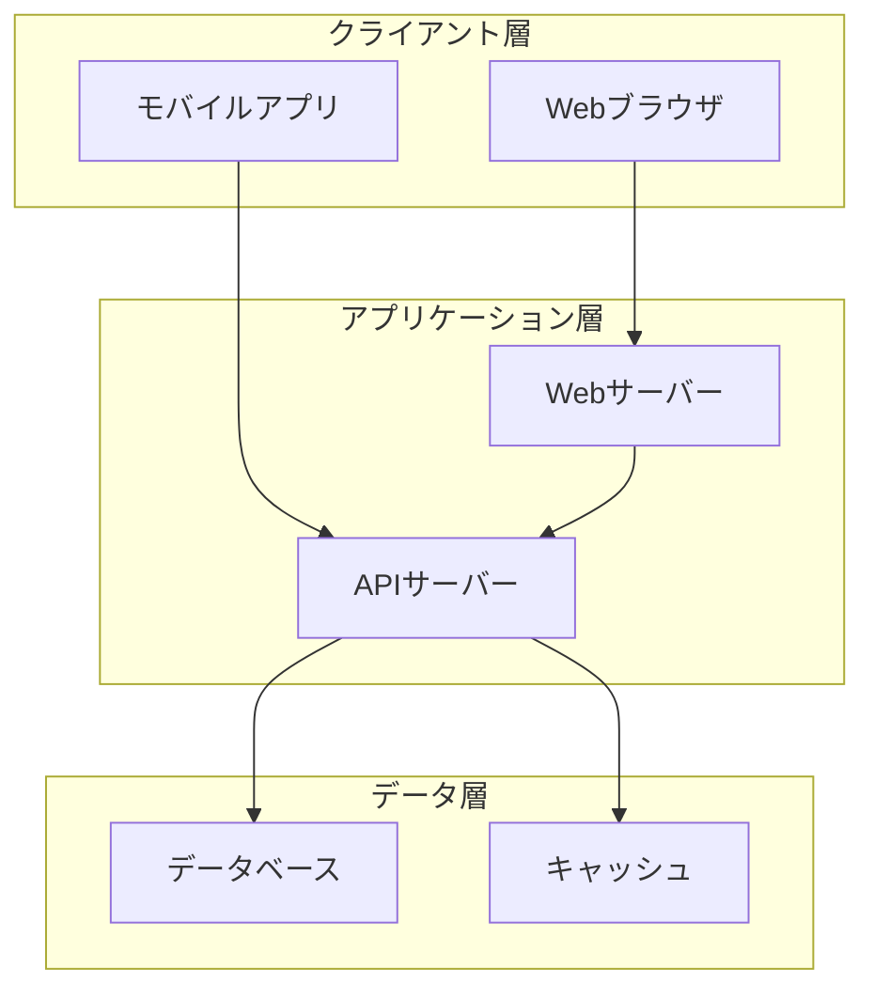
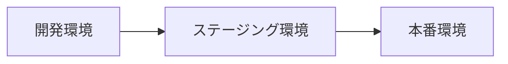
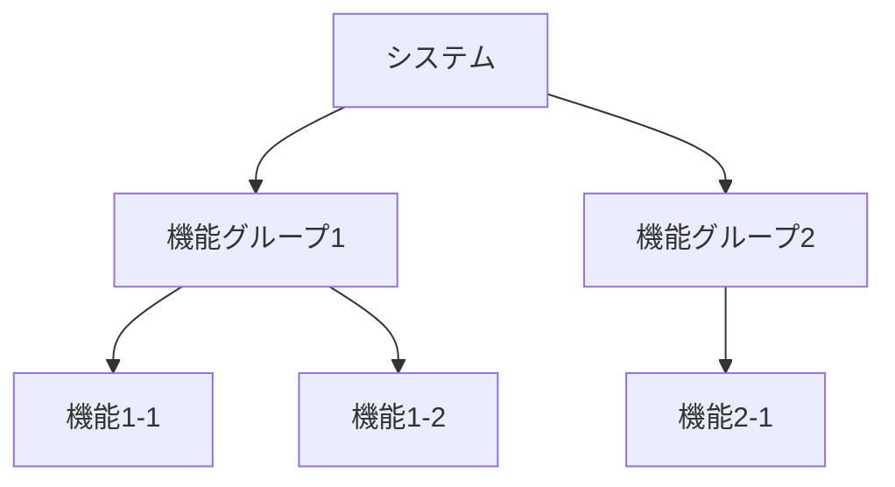
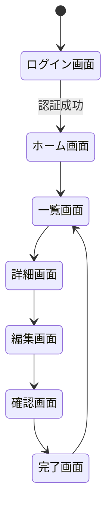
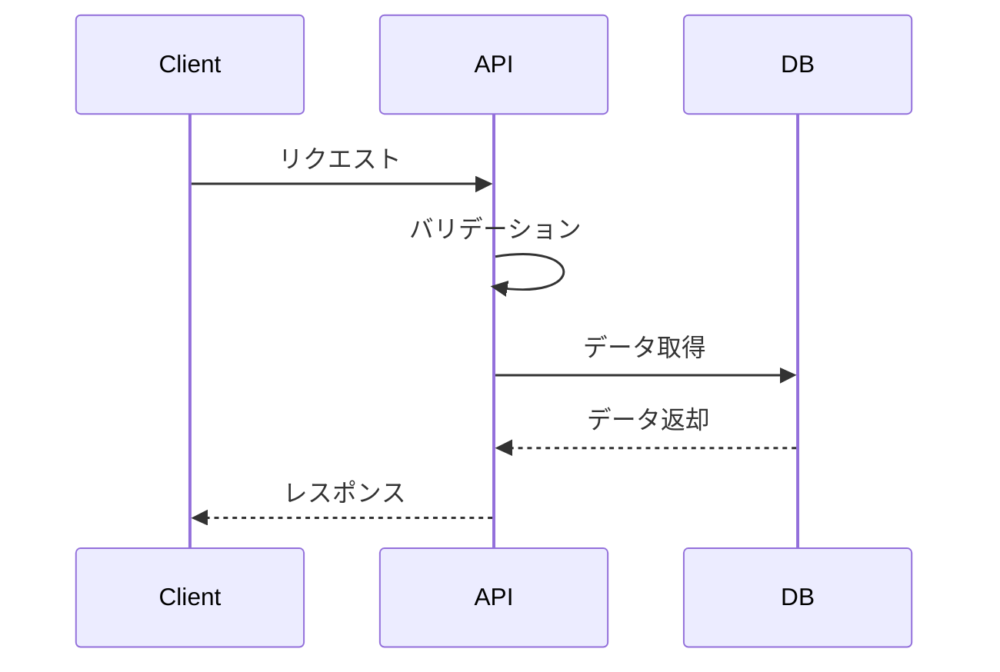
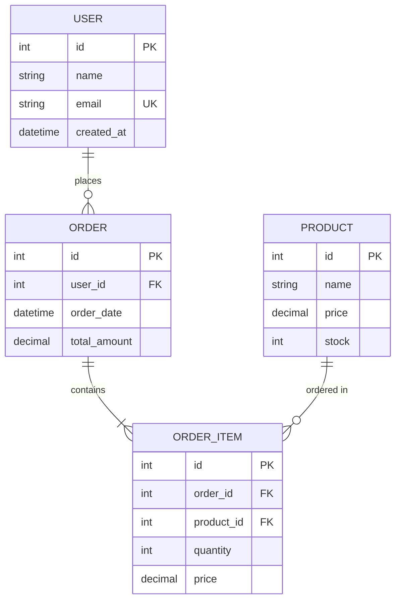

# 基本設計書

## ドキュメント管理情報
| 項目 | 内容 |
|------|------|
| プロジェクト名 | |
| システム名 | |
| バージョン | |
| 作成日 | |
| 最終更新日 | |
| 作成者 | |
| 承認者 | |
| ステータス | 草案 / レビュー中 / 承認済み |

## 変更履歴
| 日付 | バージョン | 変更内容 | 変更者 |
|------|------------|----------|--------|
| | | | |

---

## 1. 概要

### 1.1 目的
本設計書の目的と対象読者を記載

### 1.2 スコープ
本設計書が対象とする範囲を記載

### 1.3 前提条件
- 要件定義書のバージョン: 
- 参照ドキュメント: 
- 開発環境: 
- 対象プラットフォーム: 

### 1.4 用語定義
| 用語 | 定義 |
|------|------|
| | |

---

## 2. システムアーキテクチャ

### 2.1 システム構成図


### 2.2 技術スタック
| レイヤー | 技術 | バージョン | 選定理由 |
|----------|------|------------|----------|
| フロントエンド | | | |
| バックエンド | | | |
| データベース | | | |
| インフラ | | | |
| その他 | | | |

### 2.3 アーキテクチャパターン
採用するアーキテクチャパターン（MVC、レイヤードアーキテクチャ、マイクロサービスなど）とその理由を記載

### 2.4 ディレクトリ構成（概要）
```
project-root/
├── src/
│   ├── frontend/
│   ├── backend/
│   └── shared/
├── tests/
├── docs/
└── config/
```

### 2.5 デプロイメント構成


---

## 3. 機能設計

### 3.1 機能一覧
| 機能ID | 機能名 | 概要 | 優先度 | 要件ID |
|--------|--------|------|--------|--------|
| F001 | | | 高/中/低 | REQ-xxx |

### 3.2 機能構成図


### 3.3 機能詳細

#### 3.3.1 [機能名]
- **機能ID**: F001
- **概要**: 
- **要件トレーサビリティ**: REQ-xxx
- **入力**: 
- **処理**: 
- **出力**: 
- **制約事項**: 
- **エラー処理**: 

---

## 4. 画面設計

### 4.1 画面一覧
| 画面ID | 画面名 | 画面種別 | 機能ID | 備考 |
|--------|--------|----------|--------|------|
| SC001 | | 一覧/詳細/入力/確認 | F001 | |

### 4.2 画面遷移図


### 4.3 画面レイアウト

#### 4.3.1 [画面名]
- **画面ID**: SC001
- **画面種別**: 
- **アクセス権限**: 
- **URL/パス**: 

**ワイヤーフレーム**
```
+----------------------------------+
|  ヘッダー                         |
+----------------------------------+
|  ナビゲーション                   |
+----------------------------------+
|                                  |
|  メインコンテンツ                 |
|                                  |
+----------------------------------+
|  フッター                         |
+----------------------------------+
```

**画面項目**
| 項目ID | 項目名 | 種別 | 必須 | 初期値 | 検証ルール |
|--------|--------|------|------|--------|------------|
| | | テキスト/選択/ボタン等 | ○/× | | |

**画面アクション**
| アクションID | アクション名 | トリガー | 処理内容 | 遷移先 |
|--------------|--------------|----------|----------|--------|
| | | ボタンクリック等 | | |

### 4.4 UI/UX設計方針
- デザインシステム: 
- レスポンシブ対応: 
- アクセシビリティ: 
- ブラウザ対応: 

---

## 5. API設計

### 5.1 API一覧
| API ID | エンドポイント | メソッド | 概要 | 認証 | 機能ID |
|--------|----------------|----------|------|------|--------|
| API001 | /api/v1/users | GET | ユーザー一覧取得 | 必要 | F001 |

### 5.2 API詳細仕様

#### 5.2.1 [API名]
- **API ID**: API001
- **エンドポイント**: `/api/v1/resource`
- **HTTPメソッド**: GET / POST / PUT / DELETE
- **概要**: 
- **認証**: 必要 / 不要
- **認可**: 必要な権限

**リクエスト**
- **ヘッダー**
```json
{
  "Content-Type": "application/json",
  "Authorization": "Bearer {token}"
}
```

- **パスパラメータ**
| パラメータ名 | 型 | 必須 | 説明 |
|--------------|-----|------|------|
| | | ○/× | |

- **クエリパラメータ**
| パラメータ名 | 型 | 必須 | デフォルト値 | 説明 |
|--------------|-----|------|--------------|------|
| | | ○/× | | |

- **リクエストボディ**
```json
{
  "field1": "value1",
  "field2": "value2"
}
```

**レスポンス**
- **成功時（200 OK）**
```json
{
  "status": "success",
  "data": {
    "id": 1,
    "name": "example"
  }
}
```

- **エラー時**
| ステータスコード | 説明 | レスポンス例 |
|------------------|------|--------------|
| 400 | Bad Request | `{"status": "error", "message": "Invalid parameter"}` |
| 401 | Unauthorized | `{"status": "error", "message": "Authentication required"}` |
| 404 | Not Found | `{"status": "error", "message": "Resource not found"}` |
| 500 | Internal Server Error | `{"status": "error", "message": "Internal server error"}` |

**シーケンス図**


### 5.3 API共通仕様
- **ベースURL**: 
- **認証方式**: JWT / OAuth2.0 / API Key
- **レート制限**: 
- **バージョニング**: 
- **エラーレスポンス形式**: 

---

## 6. データベース設計（論理設計）

### 6.1 ER図


### 6.2 テーブル定義

#### 6.2.1 [テーブル名]
- **テーブル物理名**: table_name
- **テーブル論理名**: テーブル名
- **概要**: 

| # | カラム物理名 | カラム論理名 | データ型 | 桁数 | NULL | デフォルト値 | 制約 | 説明 |
|---|--------------|--------------|----------|------|------|--------------|------|------|
| 1 | id | ID | INT | - | × | - | PK, AUTO_INCREMENT | 主キー |
| 2 | name | 名前 | VARCHAR | 100 | × | - | | |
| 3 | created_at | 作成日時 | DATETIME | - | × | CURRENT_TIMESTAMP | | |

**インデックス**
| インデックス名 | 種別 | カラム | 説明 |
|----------------|------|--------|------|
| idx_name | INDEX | name | 名前検索用 |

**外部キー制約**
| 制約名 | 参照先テーブル | 参照先カラム | ON DELETE | ON UPDATE |
|--------|----------------|--------------|-----------|-----------|
| | | | CASCADE/RESTRICT | CASCADE/RESTRICT |

### 6.3 データモデル設計方針
- 正規化レベル: 
- 命名規則: 
- 文字コード: 
- 照合順序: 

---

## 7. 外部インターフェース設計

### 7.1 外部システム連携一覧
| IF ID | 連携先システム | 連携方式 | 方向 | 頻度 | データ形式 |
|-------|----------------|----------|------|------|------------|
| IF001 | | REST API / SOAP / ファイル連携 | 送信/受信/双方向 | リアルタイム/バッチ | JSON/XML/CSV |

### 7.2 外部インターフェース詳細

#### 7.2.1 [インターフェース名]
- **IF ID**: IF001
- **連携先**: 
- **連携方式**: 
- **プロトコル**: 
- **認証方式**: 
- **データ形式**: 
- **連携タイミング**: 
- **エラー処理**: 
- **リトライ処理**: 

**データ仕様**
| 項目名 | 型 | 桁数 | 必須 | 説明 |
|--------|-----|------|------|------|
| | | | ○/× | |

---

## 8. セキュリティ設計

### 8.1 認証・認可
- **認証方式**: 
- **認可方式**: 
- **セッション管理**: 
- **パスワードポリシー**: 

### 8.2 データ保護
- **暗号化**: 
  - 通信: TLS 1.2以上
  - 保存データ: 
- **個人情報保護**: 
- **機密情報の取り扱い**: 

### 8.3 セキュリティ対策
| 脅威 | 対策 |
|------|------|
| SQLインジェクション | プリペアドステートメント使用 |
| XSS | 入力値のサニタイジング |
| CSRF | CSRFトークン使用 |
| 不正アクセス | 認証・認可の実装 |

### 8.4 監査ログ
- **記録対象**: 
- **保存期間**: 
- **アクセス制限**: 

---

## 9. 非機能要件設計

### 9.1 性能設計
| 項目 | 目標値 | 測定方法 |
|------|--------|----------|
| レスポンスタイム | | |
| スループット | | |
| 同時接続数 | | |

### 9.2 可用性設計
- **稼働率目標**: 
- **冗長化構成**: 
- **障害時の対応**: 

### 9.3 拡張性設計
- **スケーラビリティ**: 
- **将来の拡張性**: 

### 9.4 保守性設計
- **ログ設計**: 
- **監視項目**: 
- **バックアップ**: 

### 9.5 移植性設計
- **環境依存性**: 
- **データ移行**: 

---

## 10. バッチ処理設計

### 10.1 バッチ処理一覧
| バッチID | バッチ名 | 実行タイミング | 処理概要 | 想定処理時間 |
|----------|----------|----------------|----------|--------------|
| BAT001 | | 日次/週次/月次 | | |

### 10.2 バッチ処理詳細

#### 10.2.1 [バッチ名]
- **バッチID**: BAT001
- **実行タイミング**: 
- **実行条件**: 
- **入力**: 
- **処理内容**: 
- **出力**: 
- **エラー処理**: 
- **リカバリ方法**: 

---

## 11. エラー処理設計

### 11.1 エラー分類
| エラーレベル | 説明 | 対応方針 |
|--------------|------|----------|
| FATAL | システム継続不可 | システム停止、管理者通知 |
| ERROR | 処理失敗 | エラーログ記録、ユーザー通知 |
| WARNING | 警告 | ログ記録 |
| INFO | 情報 | ログ記録 |

### 11.2 エラーコード体系
| エラーコード | エラーメッセージ | 原因 | 対処方法 |
|--------------|------------------|------|----------|
| E001 | | | |

### 11.3 例外処理方針
- **例外のキャッチ方針**: 
- **ログ出力方針**: 
- **ユーザーへの通知方針**: 

---

## 12. テスト設計（基本方針）

### 12.1 テスト戦略
- **テストレベル**: 単体テスト、結合テスト、システムテスト、受入テスト
- **テスト手法**: 
- **テストツール**: 

### 12.2 テスト観点
| テスト種別 | 観点 | 実施タイミング |
|------------|------|----------------|
| 機能テスト | | |
| 性能テスト | | |
| セキュリティテスト | | |
| ユーザビリティテスト | | |

### 12.3 テストデータ
- **テストデータ作成方針**: 
- **本番データの使用**: 可/不可

---

## 13. 運用設計

### 13.1 監視項目
| 監視項目 | 監視方法 | 閾値 | アラート通知先 |
|----------|----------|------|----------------|
| | | | |

### 13.2 バックアップ・リストア
- **バックアップ対象**: 
- **バックアップ頻度**: 
- **保存期間**: 
- **リストア手順**: 

### 13.3 障害対応
- **障害検知方法**: 
- **エスカレーションフロー**: 
- **復旧手順**: 

---

## 14. 移行設計

### 14.1 移行方針
- **移行方式**: 一括移行 / 段階移行
- **移行タイミング**: 
- **ロールバック方針**: 

### 14.2 データ移行
- **移行対象データ**: 
- **データクレンジング**: 
- **移行手順**: 

---

## 15. 制約事項・前提条件

### 15.1 技術的制約
- 

### 15.2 業務的制約
- 

### 15.3 スケジュール制約
- 

---

## 16. 課題・リスク管理

### 16.1 課題一覧
| 課題ID | 課題内容 | 影響度 | 対応方針 | 担当者 | 期限 | ステータス |
|--------|----------|--------|----------|--------|------|------------|
| | | 高/中/低 | | | | Open/In Progress/Closed |

### 16.2 リスク一覧
| リスクID | リスク内容 | 発生確率 | 影響度 | 対策 | 担当者 |
|----------|------------|----------|--------|------|--------|
| | | 高/中/低 | 高/中/低 | | |

---

## 17. 付録

### 17.1 参考資料
- 

### 17.2 用語集
| 用語 | 説明 |
|------|------|
| | |

### 17.3 レビュー記録
| 日付 | レビュアー | 指摘事項 | 対応状況 |
|------|------------|----------|----------|
| | | | |