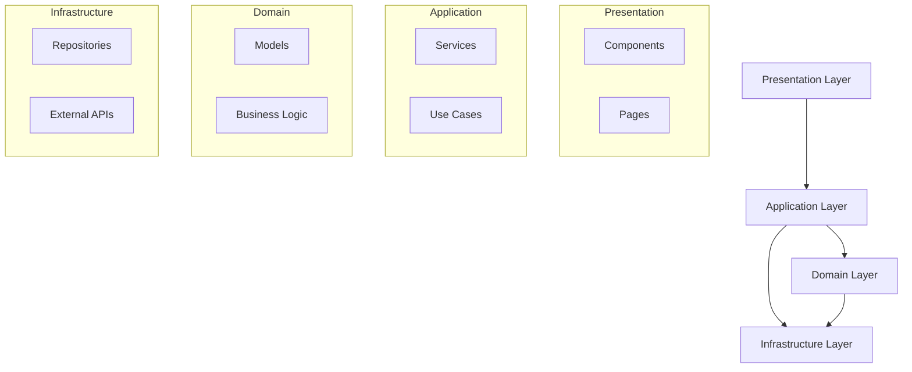
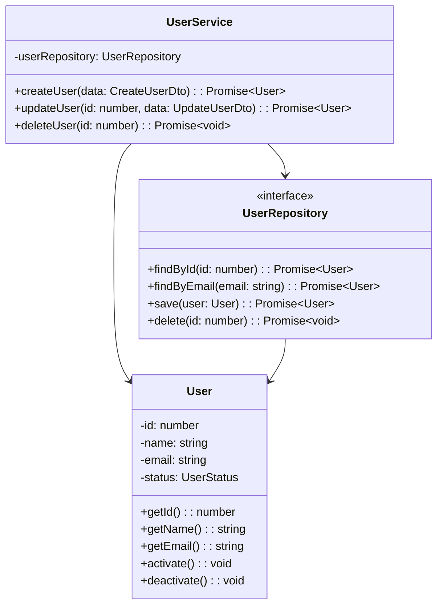
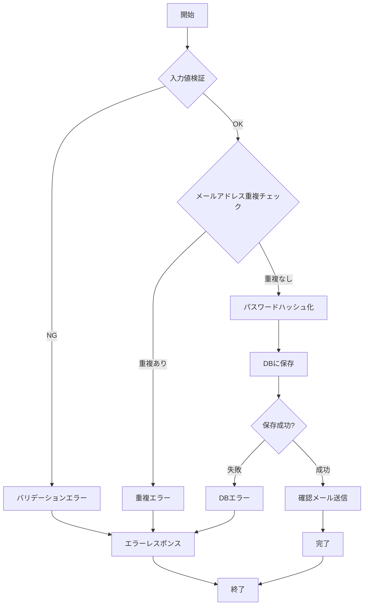
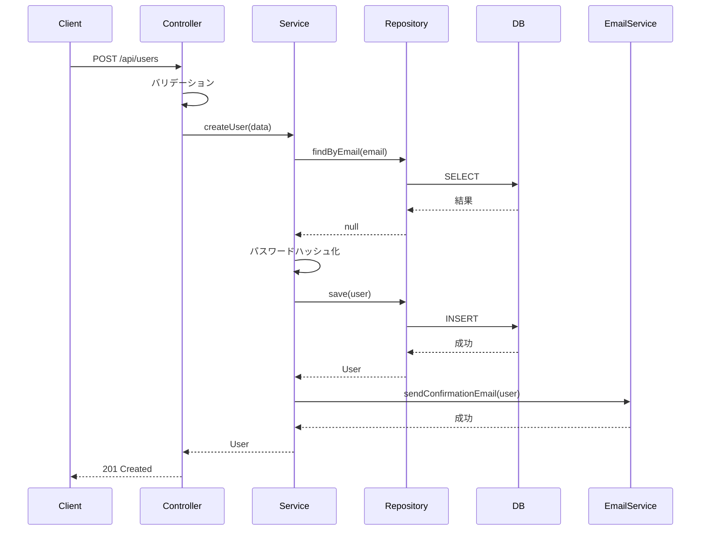

# 詳細設計書

## ドキュメント管理情報
| 項目 | 内容 |
|------|------|
| プロジェクト名 | |
| システム名 | |
| バージョン | |
| 作成日 | |
| 最終更新日 | |
| 作成者 | |
| 承認者 | |
| ステータス | 草案 / レビュー中 / 承認済み |

## 変更履歴
| 日付 | バージョン | 変更内容 | 変更者 |
|------|------------|----------|--------|
| | | | |

---

## 1. 概要

### 1.1 目的
本詳細設計書の目的と対象読者を記載

### 1.2 スコープ
本設計書が対象とする範囲を記載

### 1.3 関連ドキュメント
- 要件定義書: 
- 基本設計書: 
- その他参照ドキュメント: 

### 1.4 開発環境
| 項目 | 内容 |
|------|------|
| OS | |
| 言語 | |
| フレームワーク | |
| IDE | |
| バージョン管理 | |
| パッケージマネージャー | |

---

## 2. プロジェクト構成

### 2.1 ディレクトリ構成
```
project-root/
├── .github/                    # GitHub Actions等のCI/CD設定
│   └── workflows/
├── .vscode/                    # VSCode設定
├── docs/                       # ドキュメント
│   ├── requirements/
│   ├── design/
│   └── api/
├── src/                        # ソースコード
│   ├── frontend/              # フロントエンド
│   │   ├── public/
│   │   ├── src/
│   │   │   ├── components/   # UIコンポーネント
│   │   │   ├── pages/        # ページコンポーネント
│   │   │   ├── hooks/        # カスタムフック
│   │   │   ├── services/     # API通信
│   │   │   ├── store/        # 状態管理
│   │   │   ├── utils/        # ユーティリティ
│   │   │   ├── types/        # 型定義
│   │   │   ├── styles/       # スタイル
│   │   │   └── App.tsx
│   │   ├── package.json
│   │   └── tsconfig.json
│   ├── backend/               # バックエンド
│   │   ├── src/
│   │   │   ├── controllers/  # コントローラー
│   │   │   ├── services/     # ビジネスロジック
│   │   │   ├── models/       # データモデル
│   │   │   ├── repositories/ # データアクセス
│   │   │   ├── middlewares/  # ミドルウェア
│   │   │   ├── routes/       # ルーティング
│   │   │   ├── utils/        # ユーティリティ
│   │   │   ├── types/        # 型定義
│   │   │   ├── config/       # 設定
│   │   │   └── app.ts
│   │   ├── package.json
│   │   └── tsconfig.json
│   └── shared/                # 共通コード
│       ├── types/
│       ├── constants/
│       └── utils/
├── tests/                     # テストコード
│   ├── unit/
│   ├── integration/
│   └── e2e/
├── scripts/                   # スクリプト
├── config/                    # 設定ファイル
├── .env.example              # 環境変数サンプル
├── .gitignore
├── package.json
├── README.md
└── docker-compose.yml
```

### 2.2 ファイル命名規則
| 種別 | 命名規則 | 例 |
|------|----------|-----|
| コンポーネント | PascalCase | `UserProfile.tsx` |
| フック | camelCase (use始まり) | `useAuth.ts` |
| ユーティリティ | camelCase | `formatDate.ts` |
| 定数 | UPPER_SNAKE_CASE | `API_ENDPOINTS.ts` |
| 型定義 | PascalCase | `User.ts` |
| テストファイル | 対象ファイル名.test.拡張子 | `UserProfile.test.tsx` |

### 2.3 モジュール依存関係図


---

## 3. データベース物理設計

### 3.1 データベース構成
- **DBMS**: 
- **バージョン**: 
- **文字コード**: UTF-8
- **照合順序**: 
- **タイムゾーン**: 

### 3.2 テーブル物理設計

#### 3.2.1 [テーブル名]
```sql
CREATE TABLE table_name (
    id BIGINT UNSIGNED NOT NULL AUTO_INCREMENT COMMENT '主キー',
    name VARCHAR(100) NOT NULL COMMENT '名前',
    email VARCHAR(255) NOT NULL COMMENT 'メールアドレス',
    status TINYINT NOT NULL DEFAULT 1 COMMENT 'ステータス (1:有効, 0:無効)',
    created_at TIMESTAMP NOT NULL DEFAULT CURRENT_TIMESTAMP COMMENT '作成日時',
    updated_at TIMESTAMP NOT NULL DEFAULT CURRENT_TIMESTAMP ON UPDATE CURRENT_TIMESTAMP COMMENT '更新日時',
    deleted_at TIMESTAMP NULL DEFAULT NULL COMMENT '削除日時',
    PRIMARY KEY (id),
    UNIQUE KEY uk_email (email),
    KEY idx_status (status),
    KEY idx_created_at (created_at)
) ENGINE=InnoDB DEFAULT CHARSET=utf8mb4 COLLATE=utf8mb4_unicode_ci COMMENT='ユーザーテーブル';
```

**カラム詳細**
| カラム名 | 型 | NULL | デフォルト | 説明 | 備考 |
|----------|-----|------|------------|------|------|
| id | BIGINT UNSIGNED | NO | AUTO_INCREMENT | 主キー | |
| name | VARCHAR(100) | NO | - | 名前 | |
| email | VARCHAR(255) | NO | - | メールアドレス | ユニーク制約 |
| status | TINYINT | NO | 1 | ステータス | 1:有効, 0:無効 |
| created_at | TIMESTAMP | NO | CURRENT_TIMESTAMP | 作成日時 | |
| updated_at | TIMESTAMP | NO | CURRENT_TIMESTAMP | 更新日時 | 自動更新 |
| deleted_at | TIMESTAMP | YES | NULL | 削除日時 | 論理削除用 |

**インデックス設計**
| インデックス名 | 種別 | カラム | カーディナリティ | 使用目的 |
|----------------|------|--------|------------------|----------|
| PRIMARY | PRIMARY KEY | id | 高 | 主キー |
| uk_email | UNIQUE | email | 高 | メールアドレス一意性保証 |
| idx_status | INDEX | status | 低 | ステータス検索 |
| idx_created_at | INDEX | created_at | 高 | 作成日時ソート |

### 3.3 マイグレーション管理
- **マイグレーションツール**: 
- **マイグレーションファイル命名規則**: `YYYYMMDDHHMMSS_description.sql`
- **ロールバック方針**: 

---

## 4. クラス設計

### 4.1 クラス図


### 4.2 クラス詳細設計

#### 4.2.1 [クラス名]
**ファイルパス**: `src/backend/src/models/User.ts`

**責務**: ユーザーエンティティの表現とビジネスロジック

**プロパティ**
| プロパティ名 | 型 | アクセス修飾子 | 説明 |
|--------------|-----|----------------|------|
| id | number | private | ユーザーID |
| name | string | private | ユーザー名 |
| email | string | private | メールアドレス |
| status | UserStatus | private | ステータス |

**メソッド**
| メソッド名 | 引数 | 戻り値 | アクセス修飾子 | 説明 |
|------------|------|--------|----------------|------|
| constructor | id, name, email, status | - | public | コンストラクタ |
| getId | - | number | public | IDを取得 |
| getName | - | string | public | 名前を取得 |
| getEmail | - | string | public | メールアドレスを取得 |
| activate | - | void | public | ユーザーを有効化 |
| deactivate | - | void | public | ユーザーを無効化 |
| validate | - | void | private | バリデーション |

**設計方針**
- 不変性を保つため、プロパティはprivateとする
- ビジネスロジックはエンティティ内に実装
- バリデーションはコンストラクタで実行
- 状態変更は専用メソッドを通じて行う

---

## 5. 処理フロー設計

### 5.1 処理フロー一覧
| フローID | 処理名 | 機能ID | 複雑度 |
|----------|--------|--------|--------|
| FLOW001 | ユーザー登録処理 | F001 | 中 |

### 5.2 処理フロー詳細

#### 5.2.1 [処理名]
**フローID**: FLOW001

**フローチャート**


**シーケンス図**


**処理ステップ**
| ステップ | 処理内容 | 担当クラス/メソッド | エラー処理 |
|----------|----------|---------------------|------------|
| 1 | リクエスト受信 | UserController.create() | - |
| 2 | 入力値検証 | ValidationMiddleware | 400エラー返却 |
| 3 | メールアドレス重複チェック | UserService.checkEmailDuplicate() | 409エラー返却 |
| 4 | パスワードハッシュ化 | PasswordUtil.hash() | 500エラー返却 |
| 5 | ユーザー保存 | UserRepository.save() | トランザクションロールバック |
| 6 | 確認メール送信 | EmailService.send() | ログ記録（処理継続） |
| 7 | レスポンス返却 | UserController.create() | - |

**トランザクション境界**
- 開始: UserService.createUser()
- コミット: ユーザー保存成功時
- ロールバック: DB保存失敗時

---

## 6. API実装設計

### 6.1 エンドポイント実装

#### 6.1.1 [エンドポイント名]
**エンドポイント**: `POST /api/v1/users`

**レイヤー構成**
| レイヤー | 責務 | ファイル例 |
|----------|------|------------|
| Routes | ルーティング定義 | userRoutes.ts |
| Controllers | リクエスト/レスポンス処理 | UserController.ts |
| Services | ビジネスロジック | UserService.ts |
| Repositories | データアクセス | UserRepository.ts |
| Models | エンティティ | User.ts |
| Middlewares | 共通処理（認証、バリデーション） | authMiddleware.ts |
| Types | 型定義 | user.types.ts |

**処理フロー**
1. Routes: エンドポイントとコントローラーメソッドのマッピング
2. Middleware: 認証・バリデーション処理
3. Controller: リクエストパラメータの取得、Serviceの呼び出し
4. Service: ビジネスロジックの実行、Repositoryの呼び出し
5. Repository: データベースアクセス
6. Controller: レスポンスの返却

### 6.2 バリデーション設計
**バリデーションルール**
| 項目 | ルール | エラーメッセージ |
|------|--------|------------------|
| name | 必須、2-100文字 | Name is required / Name must be between 2 and 100 characters |
| email | 必須、メール形式 | Email is required / Invalid email format |
| password | 必須、8文字以上、大小英数字含む | Password is required / Password must be at least 8 characters / Password must contain uppercase, lowercase, and number |

**バリデーション実装方針**
- ミドルウェアでリクエストパラメータを検証
- バリデーションエラーは400ステータスで返却
- エラーメッセージは配列形式で返却

---

## 7. フロントエンド実装設計

### 7.1 コンポーネント設計

#### 7.1.1 [コンポーネント名]
**ファイルパス**: `src/frontend/src/components/UserProfile.tsx`

**責務**: ユーザープロフィール情報の表示

**Props**
```typescript
interface UserProfileProps {
  userId: number;
  onEdit?: () => void;
  onDelete?: () => void;
}
```

**State**
```typescript
interface UserProfileState {
  user: User | null;
  loading: boolean;
  error: Error | null;
}
```

**コンポーネント構造**
```
UserProfile
├── UserAvatar
├── UserInfo
│   ├── UserName
│   ├── UserEmail
│   └── UserStatus
└── UserActions
    ├── EditButton
    └── DeleteButton
```

**ライフサイクル**
1. マウント時: useEffectでユーザーデータを取得
2. ローディング状態: loading=trueの間、ローディング表示
3. エラー状態: エラー発生時、エラーメッセージ表示
4. 正常状態: ユーザー情報を表示
5. アンマウント時: クリーンアップ処理

**エラーハンドリング**
- API呼び出し失敗時はエラーメッセージを表示
- ユーザーが存在しない場合は「User not found」を表示

### 7.2 状態管理設計

#### 7.2.1 Store構成
**State構造**
```
store/
├── user/
│   ├── users: User[]
│   ├── currentUser: User | null
│   ├── loading: boolean
│   └── error: string | null
└── auth/
    ├── isAuthenticated: boolean
    ├── token: string | null
    └── user: User | null
```

**Actions**
| Action | 説明 | Payload |
|--------|------|---------|
| fetchUsers | ユーザー一覧取得 | - |
| setCurrentUser | 現在のユーザーを設定 | User |
| clearCurrentUser | 現在のユーザーをクリア | - |

**Reducers**
- 非同期処理はcreateAsyncThunkを使用
- pending/fulfilled/rejectedの3つの状態を管理
- Immutableな状態更新

### 7.3 カスタムフック設計
**useUser**
- **目的**: ユーザー情報の取得と管理
- **引数**: userId: number
- **戻り値**: { user, loading, error, refetch }
- **機能**:
  - マウント時にユーザー情報を取得
  - ローディング状態の管理
  - エラーハンドリング
  - 再取得機能（refetch）

---

## 8. エラーハンドリング実装

### 8.1 エラークラス設計
**エラークラス階層**
```
BaseError (抽象クラス)
├── NotFoundError (404)
├── ValidationError (400)
├── ConflictError (409)
├── UnauthorizedError (401)
└── ForbiddenError (403)
```

**エラークラス仕様**
| クラス名 | ステータスコード | 用途 |
|----------|------------------|------|
| BaseError | - | 基底クラス |
| NotFoundError | 404 | リソースが見つからない |
| ValidationError | 400 | バリデーションエラー |
| ConflictError | 409 | リソースの競合 |
| UnauthorizedError | 401 | 認証エラー |
| ForbiddenError | 403 | 認可エラー |

**プロパティ**
- message: エラーメッセージ
- statusCode: HTTPステータスコード
- isOperational: 運用エラーかどうか（予期されたエラー）

### 8.2 エラーハンドリングミドルウェア
**処理フロー**
1. エラーの種類を判定（BaseErrorのインスタンスか）
2. ログ出力（エラーメッセージ、スタックトレース、リクエスト情報）
3. クライアントへのレスポンス返却
4. 予期しないエラーの場合は500エラーを返却

**レスポンス形式**
```json
{
  "status": "error",
  "message": "エラーメッセージ"
}
```

---

## 9. ロギング設計

### 9.1 ログレベル定義
| レベル | 用途 | 出力先 |
|--------|------|--------|
| ERROR | エラー情報 | ファイル、監視システム |
| WARN | 警告情報 | ファイル |
| INFO | 一般情報 | ファイル |
| DEBUG | デバッグ情報 | ファイル（開発環境のみ） |

### 9.2 ログフォーマット
**ログ構造**
```json
{
  "timestamp": "YYYY-MM-DD HH:mm:ss",
  "level": "info|warn|error|debug",
  "message": "ログメッセージ",
  "context": {
    "userId": 123,
    "path": "/api/users",
    "method": "POST"
  }
}
```

**ログ出力先**
- ERROR: ファイル（logs/error.log）、監視システム
- WARN: ファイル（logs/combined.log）
- INFO: ファイル（logs/combined.log）
- DEBUG: ファイル（開発環境のみ）、コンソール（開発環境のみ）

### 9.3 ログ出力方針
- ユーザーアクション（作成、更新、削除）はINFOレベルで記録
- エラー発生時はERRORレベルで記録（スタックトレース含む）
- デバッグ情報はDEBUGレベルで記録（開発環境のみ）
- 個人情報（パスワード、トークンなど）はログに出力しない

---

## 10. テスト実装設計

### 10.1 単体テスト

#### 10.1.1 テストファイル構成
```
tests/
├── unit/
│   ├── models/
│   │   └── User.test.ts
│   ├── services/
│   │   └── UserService.test.ts
│   └── utils/
│       └── passwordUtil.test.ts
```

#### 10.1.2 テストケース設計
**正常系テストケース**
| テストケースID | テスト内容 | 期待結果 |
|----------------|------------|----------|
| UT-001 | 正常なユーザー作成 | ユーザーが作成される |
| UT-002 | ユーザー情報取得 | ユーザー情報が取得できる |

**異常系テストケース**
| テストケースID | テスト内容 | 期待結果 |
|----------------|------------|----------|
| UT-101 | メールアドレス重複 | ConflictErrorがスローされる |
| UT-102 | 存在しないユーザー取得 | NotFoundErrorがスローされる |

**モック設計**
- Repository層をモック化
- 外部API呼び出しをモック化
- データベースアクセスをモック化

### 10.2 結合テスト設計
**テスト環境**
- テスト用データベースを使用
- テストデータの事前準備（beforeAll）
- テストデータのクリーンアップ（afterAll）

**テストケース**
| テストケースID | エンドポイント | メソッド | テスト内容 | 期待ステータス |
|----------------|----------------|----------|------------|----------------|
| IT-001 | /api/v1/users | POST | ユーザー作成 | 201 |
| IT-002 | /api/v1/users/:id | GET | ユーザー取得 | 200 |
| IT-003 | /api/v1/users | POST | バリデーションエラー | 400 |

### 10.3 E2Eテスト設計
**テストシナリオ**
1. ユーザー登録フロー
   - 登録ページへ遷移
   - フォーム入力
   - 送信
   - 成功メッセージ確認
   - ログインページへ遷移

**テストツール**
- Playwright / Cypress

**テスト環境**
- ブラウザ: Chrome, Firefox, Safari
- 画面サイズ: デスクトップ、タブレット、モバイル

---

## 11. パフォーマンス最適化

### 11.1 データベース最適化
- **インデックス戦略**: 
  - 検索条件に使用するカラムにインデックスを作成
  - 複合インデックスの順序を考慮
  - カーディナリティの高いカラムを優先

- **クエリ最適化**: 
  - N+1問題の回避（JOIN、eager loading使用）
  - 不要なカラムの取得を避ける（SELECT *を避ける）
  - ページネーション実装

### 11.2 キャッシュ戦略
**キャッシュ対象**
| データ種別 | TTL | 無効化タイミング |
|------------|-----|------------------|
| ユーザー情報 | 1時間 | ユーザー更新時 |
| マスタデータ | 24時間 | マスタ更新時 |
| API レスポンス | 5分 | データ更新時 |

**キャッシュキー命名規則**
- `user:{userId}`: ユーザー情報
- `users:list:{page}`: ユーザー一覧
- `master:{type}`: マスタデータ

**キャッシュ操作**
- get: キャッシュから取得
- set: キャッシュに保存（TTL指定）
- delete: キャッシュから削除
- clear: パターンマッチでキャッシュクリア

### 11.3 フロントエンド最適化
- **コード分割**: React.lazy、動的import使用
- **画像最適化**: WebP形式、遅延読み込み
- **バンドルサイズ削減**: Tree shaking、不要な依存関係削除
- **メモ化**: React.memo、useMemo、useCallback使用

---

## 12. セキュリティ実装

### 12.1 認証実装
**認証フロー**
1. クライアントからAuthorizationヘッダーでトークンを受信
2. トークンの存在確認
3. JWTトークンの検証
4. デコードされたユーザー情報をリクエストに付与
5. 次のミドルウェアへ処理を渡す

**エラーハンドリング**
- トークンなし: UnauthorizedError（401）
- トークン無効: UnauthorizedError（401）

### 12.2 パスワードハッシュ化
**ハッシュ化方式**
- アルゴリズム: bcrypt
- ソルトラウンド: 10

**機能**
- hashPassword: パスワードをハッシュ化
- comparePassword: パスワードとハッシュを比較

### 12.3 入力サニタイゼーション
**サニタイゼーション対象**
- HTMLタグを含むユーザー入力
- XSS攻撃の可能性がある文字列

**機能**
- sanitizeHtml: HTMLをサニタイズ（DOMPurify使用）
- escapeHtml: HTML特殊文字をエスケープ

---

## 13. 環境設定

### 13.1 環境変数定義
**環境変数一覧**
| カテゴリ | 変数名 | 説明 | 例 |
|----------|--------|------|-----|
| Database | DB_HOST | データベースホスト | localhost |
| Database | DB_PORT | データベースポート | 3306 |
| Database | DB_NAME | データベース名 | myapp |
| Database | DB_USER | データベースユーザー | root |
| Database | DB_PASSWORD | データベースパスワード | password |
| Redis | REDIS_HOST | Redisホスト | localhost |
| Redis | REDIS_PORT | Redisポート | 6379 |
| JWT | JWT_SECRET | JWT秘密鍵 | your-secret-key |
| JWT | JWT_EXPIRES_IN | JWT有効期限 | 24h |
| Email | SMTP_HOST | SMTPホスト | smtp.example.com |
| Email | SMTP_PORT | SMTPポート | 587 |
| Application | NODE_ENV | 実行環境 | development/production |
| Application | PORT | アプリケーションポート | 3000 |
| Application | API_BASE_URL | APIベースURL | http://localhost:3000/api/v1 |
| Logging | LOG_LEVEL | ログレベル | info/debug/error |

### 13.2 設定ファイル設計
**データベース接続設定**
- ダイアレクト: MySQL
- 接続プール設定:
  - 最大接続数: 5
  - 最小接続数: 0
  - 接続タイムアウト: 30秒
  - アイドルタイムアウト: 10秒
- ログ出力: 開発環境のみ有効

---

## 14. デプロイメント

### 14.1 ビルド設定
**NPMスクリプト**
| スクリプト | コマンド | 用途 |
|------------|----------|------|
| dev | nodemon src/app.ts | 開発サーバー起動 |
| build | tsc | TypeScriptコンパイル |
| start | node dist/app.js | 本番サーバー起動 |
| test | jest | テスト実行 |
| test:watch | jest --watch | テスト監視モード |
| test:coverage | jest --coverage | カバレッジ計測 |
| lint | eslint . --ext .ts | Lint実行 |
| lint:fix | eslint . --ext .ts --fix | Lint自動修正 |

### 14.2 Docker設定
**マルチステージビルド**
1. Builder Stage
   - ベースイメージ: node:18-alpine
   - 依存関係インストール（npm ci）
   - TypeScriptビルド

2. Production Stage
   - ベースイメージ: node:18-alpine
   - ビルド成果物とnode_modulesをコピー
   - ポート3000を公開

**Docker Compose構成**
| サービス | イメージ | ポート | 説明 |
|----------|----------|--------|------|
| app | カスタムビルド | 3000 | アプリケーション |
| db | mysql:8.0 | 3306 | データベース |
| redis | redis:7-alpine | 6379 | キャッシュ |

---

## 15. 付録

### 15.1 コーディング規約
- **命名規則**: 
  - 変数・関数: camelCase
  - クラス・型: PascalCase
  - 定数: UPPER_SNAKE_CASE
  - ファイル: kebab-case

- **コメント**: 
  - 複雑なロジックには説明コメントを追加
  - JSDoc形式で関数・クラスを文書化

- **フォーマット**: 
  - Prettier使用
  - インデント: 2スペース
  - セミコロン: 必須

### 15.2 Git運用
- **ブランチ戦略**: Git Flow
  - main: 本番環境
  - develop: 開発環境
  - feature/*: 機能開発
  - hotfix/*: 緊急修正

- **コミットメッセージ**: Conventional Commits
  - feat: 新機能
  - fix: バグ修正
  - docs: ドキュメント
  - refactor: リファクタリング
  - test: テスト追加・修正

### 15.3 レビュー記録
| 日付 | レビュアー | 指摘事項 | 対応状況 |
|------|------------|----------|----------|
| | | | |