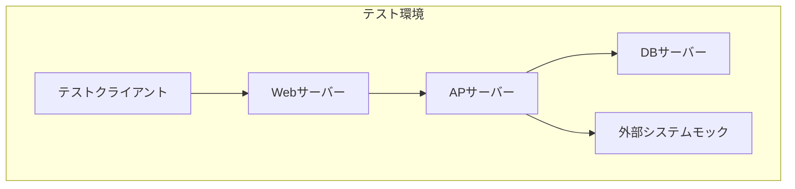
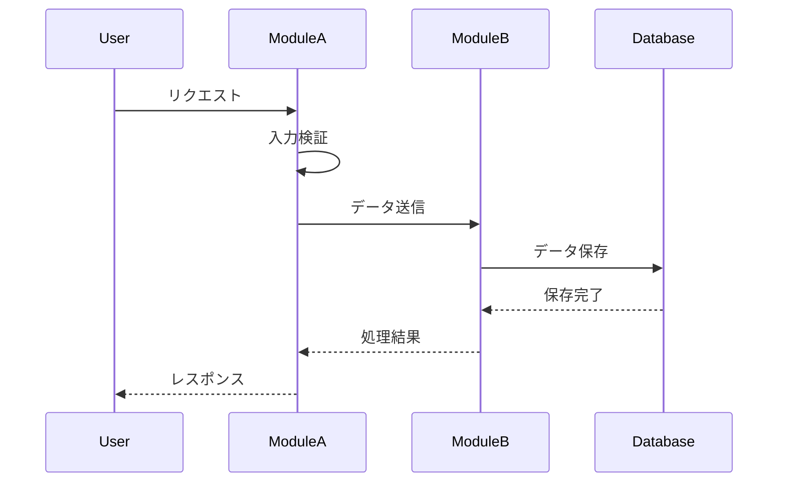

# IT仕様書（統合テスト仕様書）

## ドキュメント管理情報
| 項目 | 内容 |
|------|------|
| プロジェクト名 | |
| システム名 | |
| バージョン | |
| 作成日 | |
| 最終更新日 | |
| 作成者 | |
| 承認者 | |
| ステータス | 草案 / レビュー中 / 承認済み |

## 変更履歴
| 日付 | バージョン | 変更内容 | 変更者 |
|------|------------|----------|--------|
| | | | |

---

## 1. テスト概要

### 1.1 テスト目的
統合テストの目的を記載
- 複数のモジュール・コンポーネント間の連携動作を検証
- インターフェース仕様の妥当性を確認
- データフローの正常性を検証
- システム全体の整合性を確認

### 1.2 テスト範囲
本テストが対象とする範囲を記載

**対象範囲**
- 対象システム: 
- 対象機能: 
- 対象モジュール: 
- 統合対象: 

**対象外範囲**
- 

### 1.3 前提条件
- 単体テスト完了状況: 
- 参照ドキュメント: 
  - 要件定義書: 
  - 基本設計書: 
  - 詳細設計書: 
- 依存システム: 

### 1.4 用語定義
| 用語 | 定義 |
|------|------|
| | |

---

## 2. テスト環境

### 2.1 テスト環境構成


### 2.2 ハードウェア構成
| 項目 | 仕様 |
|------|------|
| サーバー | |
| CPU | |
| メモリ | |
| ストレージ | |
| ネットワーク | |

### 2.3 ソフトウェア構成
| カテゴリ | 項目 | バージョン | 備考 |
|----------|------|------------|------|
| OS | | | |
| Webサーバー | | | |
| APサーバー | | | |
| データベース | | | |
| ミドルウェア | | | |
| テストツール | | | |

### 2.4 テストデータ
**テストデータ準備方針**
- データ作成方法: 
- データ量: 
- データ種別: 

**テストデータ一覧**
| データID | データ名 | 件数 | 作成方法 | 備考 |
|----------|----------|------|----------|------|
| TD-001 | | | 手動作成/ツール生成/本番コピー | |

### 2.5 外部システム連携
| 連携先システム | 連携方式 | テスト方法 | 備考 |
|----------------|----------|------------|------|
| | | 実システム/モック/スタブ | |

---

## 3. テスト戦略

### 3.1 テストアプローチ
- **統合方式**: トップダウン / ボトムアップ / ビッグバン / サンドイッチ
- **テスト手法**: ブラックボックステスト / ホワイトボックステスト
- **自動化方針**: 

### 3.2 テストレベル
| レベル | 説明 | 実施タイミング |
|--------|------|----------------|
| モジュール間統合 | 関連するモジュール間の連携テスト | |
| サブシステム統合 | サブシステム間の連携テスト | |
| システム統合 | システム全体の統合テスト | |

### 3.3 テスト観点
| 観点 | 説明 | 優先度 |
|------|------|--------|
| 機能連携 | モジュール間の機能連携が正常に動作すること | 高 |
| データ整合性 | データの受け渡しが正確に行われること | 高 |
| エラー処理 | 異常系の処理が適切に行われること | 高 |
| トランザクション | トランザクション処理が正常に動作すること | 中 |
| 性能 | 統合時の性能要件を満たすこと | 中 |

### 3.4 テスト完了基準
- [ ] 全テストケースの実行完了
- [ ] 重大な不具合（Critical/High）がゼロ
- [ ] テストカバレッジが目標値（XX%）以上
- [ ] 未解決の不具合が承認済み
- [ ] テスト結果報告書の承認完了

---

## 4. 統合テストシナリオ

### 4.1 テストシナリオ一覧
| シナリオID | シナリオ名 | 統合対象 | 優先度 | 機能ID |
|------------|------------|----------|--------|--------|
| ITS-001 | | モジュールA ⇔ モジュールB | 高/中/低 | F-XXX |

### 4.2 テストシナリオ詳細

#### 4.2.1 [シナリオ名]
**シナリオID**: ITS-001

**目的**: 

**統合対象**
- モジュールA: 
- モジュールB: 
- インターフェース: 

**前提条件**
- 

**テストフロー**


**テストステップ**
| ステップ | 操作内容 | 期待結果 | 確認項目 |
|----------|----------|----------|----------|
| 1 | | | |
| 2 | | | |
| 3 | | | |

**事後条件**
- 

---

## 5. テストケース

### 5.1 テストケース一覧
| ケースID | テストケース名 | シナリオID | 種別 | 優先度 |
|----------|----------------|------------|------|--------|
| ITC-001 | | ITS-001 | 正常系/異常系 | 高/中/低 |

### 5.2 テストケース詳細

#### 5.2.1 [テストケース名]
**テストケースID**: ITC-001

**テスト目的**: 

**前提条件**
- 

**テスト手順**
| # | 操作 | 入力値 | 期待結果 | 実際の結果 | 判定 | 備考 |
|---|------|--------|----------|------------|------|------|
| 1 | | | | | OK/NG | |
| 2 | | | | | OK/NG | |
| 3 | | | | | OK/NG | |

**確認項目**
- [ ] 機能が正常に動作すること
- [ ] データが正しく連携されること
- [ ] エラーハンドリングが適切に行われること
- [ ] ログが正しく出力されること

**テストデータ**
| データ項目 | 入力値 | 説明 |
|------------|--------|------|
| | | |

**期待結果詳細**
- 画面表示: 
- データベース状態: 
- ログ出力: 
- API レスポンス: 

**事後条件**
- 

---

## 6. API統合テスト

### 6.1 APIテストケース一覧
| ケースID | エンドポイント | メソッド | テスト内容 | 優先度 |
|----------|----------------|----------|------------|--------|
| API-IT-001 | /api/v1/users | POST | ユーザー作成の統合テスト | 高 |

### 6.2 APIテストケース詳細

#### 6.2.1 [API名]
**テストケースID**: API-IT-001

**エンドポイント**: `/api/v1/resource`

**HTTPメソッド**: GET / POST / PUT / DELETE

**テスト目的**: 

**リクエスト**
```json
{
  "field1": "value1",
  "field2": "value2"
}
```

**期待レスポンス**
- **ステータスコード**: 200 / 201 / 400 / 404 / 500
- **レスポンスボディ**:
```json
{
  "status": "success",
  "data": {
    "id": 1,
    "name": "example"
  }
}
```

**検証項目**
- [ ] ステータスコードが正しいこと
- [ ] レスポンスボディの構造が正しいこと
- [ ] データベースに正しく保存されていること
- [ ] 関連するモジュールが正しく呼び出されていること

**実行結果**
| 項目 | 期待値 | 実際の値 | 判定 |
|------|--------|----------|------|
| ステータスコード | | | OK/NG |
| レスポンスタイム | | | OK/NG |
| データ整合性 | | | OK/NG |

---

## 7. データベース統合テスト

### 7.1 データ連携テスト
| テストID | テスト内容 | 対象テーブル | 確認項目 |
|----------|------------|--------------|----------|
| DB-IT-001 | | | データ整合性、外部キー制約、トランザクション |

### 7.2 トランザクションテスト
**テストケース**
| ケースID | シナリオ | 期待結果 |
|----------|----------|----------|
| TRX-001 | 正常コミット | データが正しく保存される |
| TRX-002 | ロールバック | データが元の状態に戻る |
| TRX-003 | デッドロック | 適切にエラーハンドリングされる |

---

## 8. 外部システム連携テスト

### 8.1 連携テストケース
| ケースID | 連携先 | 連携方式 | テスト内容 | 優先度 |
|----------|--------|----------|------------|--------|
| EXT-IT-001 | | REST API / SOAP / ファイル連携 | | 高/中/低 |

### 8.2 連携テスト詳細

#### 8.2.1 [連携先システム名]
**テストケースID**: EXT-IT-001

**連携先**: 

**連携方式**: 

**テスト内容**
- 正常系: データが正しく送受信されること
- 異常系: エラー時に適切に処理されること
- タイムアウト: タイムアウト時の処理が正しいこと
- リトライ: リトライ処理が正しく動作すること

**確認項目**
- [ ] データフォーマットが正しいこと
- [ ] 認証が正しく行われること
- [ ] エラーハンドリングが適切であること
- [ ] ログが正しく出力されること

---

## 9. 性能テスト（統合レベル）

### 9.1 性能要件
| 項目 | 目標値 | 測定方法 |
|------|--------|----------|
| レスポンスタイム | XX秒以内 | |
| スループット | XX TPS | |
| 同時接続数 | XX接続 | |

### 9.2 性能テストケース
| ケースID | テスト内容 | 負荷条件 | 目標値 | 実測値 | 判定 |
|----------|------------|----------|--------|--------|------|
| PERF-IT-001 | | | | | OK/NG |

---

## 10. セキュリティテスト（統合レベル）

### 10.1 セキュリティテストケース
| ケースID | テスト項目 | テスト内容 | 期待結果 |
|----------|------------|------------|----------|
| SEC-IT-001 | 認証 | 認証なしでのアクセス | 401エラーが返却される |
| SEC-IT-002 | 認可 | 権限なしでのアクセス | 403エラーが返却される |
| SEC-IT-003 | SQLインジェクション | 不正なSQL文の入力 | エラーが適切に処理される |
| SEC-IT-004 | XSS | スクリプトタグの入力 | サニタイズされる |
| SEC-IT-005 | CSRF | CSRFトークンなしのリクエスト | リクエストが拒否される |

---

## 11. エラー処理テスト

### 11.1 エラーハンドリングテスト
| ケースID | エラーシナリオ | 期待される動作 | 確認項目 |
|----------|----------------|----------------|----------|
| ERR-IT-001 | データベース接続エラー | エラーメッセージ表示、ログ記録 | |
| ERR-IT-002 | 外部API呼び出しエラー | リトライ処理、フォールバック | |
| ERR-IT-003 | タイムアウト | タイムアウトエラー、ロールバック | |
| ERR-IT-004 | バリデーションエラー | 適切なエラーメッセージ | |

---

## 12. 合格基準

### 12.1 定量的基準
| 項目 | 基準値 | 実績値 | 判定 |
|------|--------|--------|------|
| テストケース実行率 | 100% | | |
| テスト合格率 | 95%以上 | | |
| Critical不具合数 | 0件 | | |
| High不具合数 | 0件 | | |
| コードカバレッジ | XX%以上 | | |

### 12.2 定性的基準
- [ ] 全ての統合ポイントが正常に動作すること
- [ ] データの整合性が保たれていること
- [ ] エラー処理が適切に実装されていること
- [ ] 性能要件を満たしていること
- [ ] セキュリティ要件を満たしていること
- [ ] ログが適切に出力されていること

### 12.3 不具合管理基準
**不具合の重要度定義**
| 重要度 | 定義 | 対応方針 |
|--------|------|----------|
| Critical | システムが動作しない | 即座に修正 |
| High | 主要機能が動作しない | 優先的に修正 |
| Medium | 一部機能に問題がある | 計画的に修正 |
| Low | 軽微な問題 | 必要に応じて修正 |

---

## 13. テスト実施計画

### 13.1 テストスケジュール
| フェーズ | 開始日 | 終了日 | 担当者 | 備考 |
|----------|--------|--------|--------|------|
| テスト準備 | | | | |
| テスト実行 | | | | |
| 不具合修正 | | | | |
| 再テスト | | | | |
| テスト完了報告 | | | | |

### 13.2 テスト体制
| 役割 | 担当者 | 責任範囲 |
|------|--------|----------|
| テストマネージャー | | テスト全体の管理 |
| テストリーダー | | テスト実施の統括 |
| テスター | | テスト実行 |
| 開発担当 | | 不具合修正 |

### 13.3 リソース計画
| リソース | 必要数 | 確保状況 | 備考 |
|----------|--------|----------|------|
| テスター | | | |
| テスト環境 | | | |
| テストツール | | | |
| テストデータ | | | |

---

## 14. リスク管理

### 14.1 リスク一覧
| リスクID | リスク内容 | 発生確率 | 影響度 | 対策 | 担当者 |
|----------|------------|----------|--------|------|--------|
| RISK-001 | | 高/中/低 | 高/中/低 | | |

### 14.2 課題管理
| 課題ID | 課題内容 | 影響度 | 対応方針 | 担当者 | 期限 | ステータス |
|--------|----------|--------|----------|--------|------|------------|
| ISSUE-001 | | 高/中/低 | | | | Open/In Progress/Closed |

---

## 15. テスト結果サマリー

### 15.1 テスト実施結果
| 項目 | 計画 | 実績 | 達成率 |
|------|------|------|--------|
| テストケース数 | | | |
| 実行ケース数 | | | |
| 合格ケース数 | | | |
| 不合格ケース数 | | | |
| 未実施ケース数 | | | |

### 15.2 不具合サマリー
| 重要度 | 検出数 | 修正済み | 未修正 | 保留 |
|--------|--------|----------|--------|------|
| Critical | | | | |
| High | | | | |
| Medium | | | | |
| Low | | | | |
| **合計** | | | | |

### 15.3 カバレッジ
| 項目 | カバレッジ | 目標値 | 判定 |
|------|------------|--------|------|
| 機能カバレッジ | | | |
| コードカバレッジ | | | |
| 統合ポイントカバレッジ | | | |

---

## 16. 付録

### 16.1 テストツール
| ツール名 | 用途 | バージョン |
|----------|------|------------|
| | | |

### 16.2 参考資料
- 

### 16.3 用語集
| 用語 | 説明 |
|------|------|
| | |

### 16.4 テスト実施記録
| 日付 | 実施者 | 実施内容 | 結果 | 備考 |
|------|--------|----------|------|------|
| | | | | |

### 16.5 レビュー記録
| 日付 | レビュアー | 指摘事項 | 対応状況 |
|------|------------|----------|----------|
| | | | |