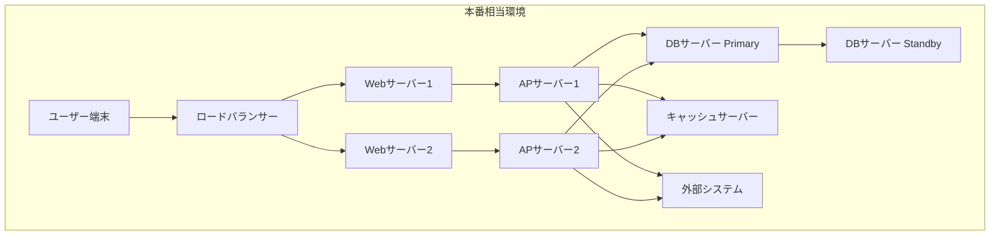
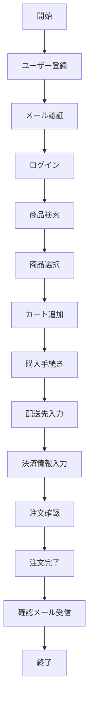

# ST仕様書（システムテスト仕様書）

## ドキュメント管理情報
| 項目 | 内容 |
|------|------|
| プロジェクト名 | |
| システム名 | |
| バージョン | |
| 作成日 | |
| 最終更新日 | |
| 作成者 | |
| 承認者 | |
| ステータス | 草案 / レビュー中 / 承認済み |

## 変更履歴
| 日付 | バージョン | 変更内容 | 変更者 |
|------|------------|----------|--------|
| | | | |

---

## 1. テスト概要

### 1.1 テスト目的
システムテストの目的を記載
- システム全体が要件定義通りに動作することを検証
- エンドツーエンドでの業務フローが正常に機能することを確認
- 非機能要件（性能、セキュリティ、ユーザビリティ等）を満たすことを検証
- 本番環境に近い条件での動作を確認
- ユーザー受入テストの準備

### 1.2 テスト範囲
本テストが対象とする範囲を記載

**対象範囲**
- 対象システム: 
- 対象機能: 全機能
- 対象業務フロー: 
- 対象環境: 本番相当環境

**対象外範囲**
- 

### 1.3 前提条件
- 統合テスト完了状況: 
- 参照ドキュメント: 
  - 要件定義書: 
  - 基本設計書: 
  - 詳細設計書: 
  - IT仕様書: 
- 環境準備状況: 

### 1.4 用語定義
| 用語 | 定義 |
|------|------|
| E2E | End-to-End（エンドツーエンド）テスト |
| UAT | User Acceptance Test（ユーザー受入テスト） |
| | |

---

## 2. テスト環境

### 2.1 テスト環境構成

### 2.2 ハードウェア構成
| 項目 | 仕様 | 台数 | 備考 |
|------|------|------|------|
| Webサーバー | | | 本番同等 |
| APサーバー | | | 本番同等 |
| DBサーバー | | | 本番同等 |
| ロードバランサー | | | |
| ストレージ | | | |

### 2.3 ソフトウェア構成
| カテゴリ | 項目 | バージョン | 備考 |
|----------|------|------------|------|
| OS | | | 本番同等 |
| Webサーバー | | | 本番同等 |
| APサーバー | | | 本番同等 |
| データベース | | | 本番同等 |
| ミドルウェア | | | 本番同等 |
| 監視ツール | | | |
| テストツール | | | |

### 2.4 ネットワーク構成
- **帯域**: 
- **セキュリティ**: ファイアウォール、SSL/TLS
- **冗長化**: 

### 2.5 テストデータ
**テストデータ準備方針**
- データ作成方法: 本番データの匿名化 / 大量データ生成ツール
- データ量: 本番想定量
- データ種別: マスタデータ、トランザクションデータ

**テストデータ一覧**
| データID | データ名 | 件数 | 作成方法 | 備考 |
|----------|----------|------|----------|------|
| STD-001 | ユーザーマスタ | XX件 | 本番データ匿名化 | |
| STD-002 | 商品マスタ | XX件 | 本番データコピー | |
| STD-003 | トランザクションデータ | XX件 | ツール生成 | 性能テスト用 |

### 2.6 外部システム連携
| 連携先システム | 連携方式 | テスト方法 | 備考 |
|----------------|----------|------------|------|
| | | 実システム/モック | |

---

## 3. テスト戦略

### 3.1 テストアプローチ
- **テスト手法**: ブラックボックステスト（ユーザー視点）
- **テストレベル**: システムテスト、受入テスト準備
- **自動化方針**: E2Eテストの自動化、回帰テストの自動化

### 3.2 テスト観点
| 観点 | 説明 | 優先度 | 実施方法 |
|------|------|--------|----------|
| 機能要件 | 全機能が要件通りに動作すること | 高 | 手動/自動 |
| 業務フロー | エンドツーエンドの業務が完遂できること | 高 | 手動 |
| 性能 | 性能要件を満たすこと | 高 | ツール |
| セキュリティ | セキュリティ要件を満たすこと | 高 | ツール/手動 |
| ユーザビリティ | 使いやすさが確保されていること | 中 | 手動 |
| 可用性 | システムが安定稼働すること | 中 | 長時間稼働テスト |
| 互換性 | 各種ブラウザ・デバイスで動作すること | 中 | 手動 |
| 運用性 | 運用・保守が容易であること | 低 | 手動 |

### 3.3 テスト完了基準
- [ ] 全テストケースの実行完了（実行率100%）
- [ ] テスト合格率95%以上
- [ ] Critical/High不具合がゼロ
- [ ] 性能要件を満たすこと
- [ ] セキュリティ要件を満たすこと
- [ ] ユーザビリティ要件を満たすこと
- [ ] 未解決の不具合が承認済み
- [ ] テスト結果報告書の承認完了
- [ ] UAT実施準備完了

---

## 4. エンドツーエンドテストシナリオ

### 4.1 業務シナリオ一覧
| シナリオID | シナリオ名 | 業務フロー | 優先度 | 要件ID |
|------------|------------|------------|--------|--------|
| E2E-001 | | ユーザー登録→ログイン→商品購入→決済 | 高/中/低 | REQ-XXX |

### 4.2 業務シナリオ詳細

#### 4.2.1 [シナリオ名]
**シナリオID**: E2E-001

**業務概要**: 

**対象ユーザー**: 

**前提条件**
- 

**業務フロー図**

**テストステップ**
| ステップ | 画面/機能 | 操作内容 | 入力データ | 期待結果 | 確認項目 |
|----------|-----------|----------|------------|----------|----------|
| 1 | ユーザー登録画面 | 新規登録 | 氏名、メールアドレス、パスワード | 登録完了メッセージ表示 | DB登録確認 |
| 2 | メール | 認証リンククリック | - | アカウント有効化 | ステータス更新確認 |
| 3 | ログイン画面 | ログイン | メールアドレス、パスワード | ホーム画面表示 | セッション確立 |
| 4 | 商品検索画面 | 検索 | キーワード | 検索結果表示 | 検索精度確認 |
| 5 | 商品詳細画面 | 商品選択 | - | 商品詳細表示 | 在庫確認 |
| 6 | カート画面 | カート追加 | 数量 | カート更新 | カート内容確認 |
| 7 | 購入画面 | 購入手続き | - | 配送先入力画面表示 | - |
| 8 | 配送先入力画面 | 配送先入力 | 住所、電話番号 | 決済情報入力画面表示 | - |
| 9 | 決済情報入力画面 | 決済情報入力 | カード情報 | 注文確認画面表示 | - |
| 10 | 注文確認画面 | 注文確定 | - | 注文完了画面表示 | 注文データ登録確認 |
| 11 | メール | 確認メール受信 | - | 注文確認メール受信 | メール内容確認 |

**成功条件**
- 全ステップが正常に完了すること
- データが正しく保存されること
- 適切な画面遷移が行われること
- 通知メールが正しく送信されること

**事後条件**
- 注文データがDBに保存されていること
- 在庫が減少していること
- 決済処理が完了していること

---

## 5. 機能テストケース

### 5.1 機能テストケース一覧
| ケースID | 機能名 | テストケース名 | 種別 | 優先度 | 要件ID |
|----------|--------|----------------|------|--------|--------|
| STC-001 | ユーザー管理 | ユーザー登録 | 正常系 | 高 | REQ-001 |
| STC-002 | ユーザー管理 | ユーザー登録（重複） | 異常系 | 高 | REQ-001 |

### 5.2 機能テストケース詳細

#### 5.2.1 [機能名] - [テストケース名]
**テストケースID**: STC-001

**テスト目的**: 

**前提条件**
- 

**テスト手順**
| # | 操作 | 入力値 | 期待結果 | 実際の結果 | 判定 | 備考 |
|---|------|--------|----------|------------|------|------|
| 1 | | | | | OK/NG | |
| 2 | | | | | OK/NG | |
| 3 | | | | | OK/NG | |

**確認項目**
- [ ] 機能が正常に動作すること
- [ ] 画面表示が正しいこと
- [ ] データが正しく保存されること
- [ ] エラーメッセージが適切に表示されること
- [ ] ログが正しく出力されること

**テストデータ**
| データ項目 | 入力値 | 説明 |
|------------|--------|------|
| | | |

**期待結果詳細**
- 画面表示: 
- データベース状態: 
- ログ出力: 
- 通知: 

**スクリーンショット**
- 実行前: 
- 実行後: 

---

## 6. 非機能要件テスト

### 6.1 性能テスト

#### 6.1.1 性能要件
| 項目 | 目標値 | 測定条件 | 測定方法 |
|------|--------|----------|----------|
| レスポンスタイム（平均） | XX秒以内 | 通常負荷時 | 負荷ツール |
| レスポンスタイム（95%ile） | XX秒以内 | 通常負荷時 | 負荷ツール |
| スループット | XX TPS | ピーク時 | 負荷ツール |
| 同時接続数 | XX接続 | ピーク時 | 負荷ツール |
| CPU使用率 | XX%以下 | ピーク時 | 監視ツール |
| メモリ使用率 | XX%以下 | ピーク時 | 監視ツール |

#### 6.1.2 負荷テストシナリオ
| シナリオID | シナリオ名 | 負荷パターン | 実施時間 | 目的 |
|------------|------------|--------------|----------|------|
| PERF-001 | 通常負荷テスト | 定常負荷 | 1時間 | 通常時の性能確認 |
| PERF-002 | ピーク負荷テスト | 段階的負荷増加 | 2時間 | ピーク時の性能確認 |
| PERF-003 | ストレステスト | 限界負荷 | 30分 | システム限界の確認 |
| PERF-004 | 耐久テスト | 定常負荷 | 24時間 | 長時間稼働の安定性確認 |

#### 6.1.3 性能テスト結果
| 項目 | 目標値 | 実測値 | 判定 | 備考 |
|------|--------|--------|------|------|
| レスポンスタイム（平均） | | | OK/NG | |
| レスポンスタイム（95%ile） | | | OK/NG | |
| スループット | | | OK/NG | |
| 同時接続数 | | | OK/NG | |
| CPU使用率 | | | OK/NG | |
| メモリ使用率 | | | OK/NG | |

**パフォーマンスグラフ**
- レスポンスタイム推移
- スループット推移
- リソース使用率推移

### 6.2 セキュリティテスト

#### 6.2.1 セキュリティ要件
| 項目 | 要件 | テスト方法 |
|------|------|------------|
| 認証 | 適切な認証機構が実装されていること | 手動テスト、ツール |
| 認可 | 適切な権限管理が実装されていること | 手動テスト |
| 暗号化 | 通信・保存データが暗号化されていること | ツール確認 |
| 入力検証 | 不正な入力が適切に処理されること | 手動テスト、ツール |
| セッション管理 | セッションが適切に管理されていること | 手動テスト |

#### 6.2.2 セキュリティテストケース
| ケースID | テスト項目 | テスト内容 | 期待結果 | 実施結果 | 判定 |
|----------|------------|------------|----------|----------|------|
| SEC-ST-001 | 認証 | 認証なしでのアクセス | 401エラー、ログイン画面へリダイレクト | | OK/NG |
| SEC-ST-002 | 認証 | 不正な認証情報でのログイン | 認証エラーメッセージ表示 | | OK/NG |
| SEC-ST-003 | 認可 | 権限なしでの機能アクセス | 403エラー、アクセス拒否 | | OK/NG |
| SEC-ST-004 | SQLインジェクション | 不正なSQL文の入力 | エラーが適切に処理される | | OK/NG |
| SEC-ST-005 | XSS | スクリプトタグの入力 | サニタイズされる | | OK/NG |
| SEC-ST-006 | CSRF | CSRFトークンなしのリクエスト | リクエストが拒否される | | OK/NG |
| SEC-ST-007 | セッション | セッションタイムアウト | 自動ログアウト | | OK/NG |
| SEC-ST-008 | パスワード | パスワードポリシー | 弱いパスワードが拒否される | | OK/NG |
| SEC-ST-009 | 暗号化 | 通信の暗号化 | HTTPS通信が確立される | | OK/NG |
| SEC-ST-010 | ファイルアップロード | 不正なファイルのアップロード | アップロードが拒否される | | OK/NG |

#### 6.2.3 脆弱性診断
**診断ツール**: 
**診断結果サマリー**
| 重要度 | 検出数 | 対応済み | 未対応 | 備考 |
|--------|--------|----------|--------|------|
| Critical | | | | |
| High | | | | |
| Medium | | | | |
| Low | | | | |

### 6.3 ユーザビリティテスト

#### 6.3.1 ユーザビリティ要件
| 項目 | 要件 | 評価方法 |
|------|------|----------|
| 操作性 | 直感的に操作できること | ユーザーテスト |
| 視認性 | 情報が見やすいこと | ユーザーテスト |
| 学習容易性 | 短時間で使い方を習得できること | ユーザーテスト |
| エラー防止 | エラーが発生しにくいこと | ユーザーテスト |
| アクセシビリティ | 誰でも使えること | ツール、手動テスト |

#### 6.3.2 ユーザビリティテストケース
| ケースID | テスト項目 | テスト内容 | 評価基準 | 評価結果 | 判定 |
|----------|------------|------------|----------|----------|------|
| UX-ST-001 | 操作性 | タスク完了時間測定 | XX分以内 | | OK/NG |
| UX-ST-002 | 視認性 | 情報の見つけやすさ | 3クリック以内 | | OK/NG |
| UX-ST-003 | エラーメッセージ | エラーメッセージの分かりやすさ | ユーザーが理解できる | | OK/NG |
| UX-ST-004 | レスポンシブ | 各デバイスでの表示 | 適切に表示される | | OK/NG |
| UX-ST-005 | アクセシビリティ | スクリーンリーダー対応 | 読み上げ可能 | | OK/NG |

#### 6.3.3 ユーザーフィードバック
| 項目 | フィードバック | 対応方針 |
|------|----------------|----------|
| | | |

### 6.4 互換性テスト

#### 6.4.1 ブラウザ互換性
| ブラウザ | バージョン | OS | テスト結果 | 備考 |
|----------|------------|-----|------------|------|
| Chrome | 最新版 | Windows/Mac | | |
| Firefox | 最新版 | Windows/Mac | | |
| Safari | 最新版 | Mac | | |
| Edge | 最新版 | Windows | | |
| Mobile Safari | 最新版 | iOS | | |
| Chrome Mobile | 最新版 | Android | | |

#### 6.4.2 デバイス互換性
| デバイス | 画面サイズ | OS | テスト結果 | 備考 |
|----------|------------|-----|------------|------|
| デスクトップ | 1920x1080 | Windows/Mac | | |
| ノートPC | 1366x768 | Windows/Mac | | |
| タブレット | 768x1024 | iOS/Android | | |
| スマートフォン | 375x667 | iOS/Android | | |

### 6.5 可用性テスト

#### 6.5.1 可用性要件
| 項目 | 目標値 | 測定方法 |
|------|--------|----------|
| 稼働率 | 99.9%以上 | 監視ツール |
| MTBF（平均故障間隔） | XX時間以上 | 長時間稼働テスト |
| MTTR（平均復旧時間） | XX分以内 | 障害復旧テスト |

#### 6.5.2 可用性テストケース
| ケースID | テスト項目 | テスト内容 | 期待結果 | 実施結果 | 判定 |
|----------|------------|------------|----------|----------|------|
| AVL-ST-001 | 長時間稼働 | 24時間連続稼働 | エラーなく稼働 | | OK/NG |
| AVL-ST-002 | 障害復旧 | サーバー障害時の自動切替 | XX秒以内に復旧 | | OK/NG |
| AVL-ST-003 | データバックアップ | バックアップ・リストア | データが復元される | | OK/NG |

### 6.6 運用性テスト

#### 6.6.1 運用性テストケース
| ケースID | テスト項目 | テスト内容 | 期待結果 | 実施結果 | 判定 |
|----------|------------|------------|----------|----------|------|
| OPE-ST-001 | ログ出力 | ログの出力確認 | 適切なログが出力される | | OK/NG |
| OPE-ST-002 | 監視 | 監視項目の確認 | 監視が正常に動作する | | OK/NG |
| OPE-ST-003 | バックアップ | バックアップ処理の実行 | バックアップが成功する | | OK/NG |
| OPE-ST-004 | リストア | リストア処理の実行 | データが復元される | | OK/NG |
| OPE-ST-005 | デプロイ | デプロイ手順の確認 | デプロイが成功する | | OK/NG |

---

## 7. 回帰テスト

### 7.1 回帰テスト方針
- 不具合修正後の影響範囲を確認
- 既存機能に影響がないことを確認
- 自動化されたテストケースを実行

### 7.2 回帰テストケース
| ケースID | テスト内容 | 実施タイミング | 自動化 |
|----------|------------|----------------|--------|
| REG-ST-001 | 主要機能の動作確認 | 不具合修正後 | ○ |
| REG-ST-002 | データ整合性確認 | 不具合修正後 | ○ |

---

## 8. 合格基準

### 8.1 定量的基準
| 項目 | 基準値 | 実績値 | 判定 |
|------|--------|--------|------|
| テストケース実行率 | 100% | | |
| テスト合格率 | 95%以上 | | |
| Critical不具合数 | 0件 | | |
| High不具合数 | 0件 | | |
| 性能要件達成率 | 100% | | |
| セキュリティ要件達成率 | 100% | | |

### 8.2 定性的基準
- [ ] 全ての機能要件を満たしていること
- [ ] エンドツーエンドの業務フローが完遂できること
- [ ] 性能要件を満たしていること
- [ ] セキュリティ要件を満たしていること
- [ ] ユーザビリティ要件を満たしていること
- [ ] 可用性要件を満たしていること
- [ ] 運用・保守が可能な状態であること
- [ ] UAT実施準備が整っていること

### 8.3 不具合管理基準
**不具合の重要度定義**
| 重要度 | 定義 | 対応方針 |
|--------|------|----------|
| Critical | システムが動作しない、データ損失の可能性 | 即座に修正、リリース不可 |
| High | 主要機能が動作しない、回避策なし | 優先的に修正、リリース判断要 |
| Medium | 一部機能に問題、回避策あり | 計画的に修正 |
| Low | 軽微な問題、影響小 | 必要に応じて修正 |

---

## 9. テスト実施計画

### 9.1 テストスケジュール
| フェーズ | 開始日 | 終了日 | 期間 | 担当者 | 備考 |
|----------|--------|--------|------|--------|------|
| テスト準備 | | | | | 環境構築、データ準備 |
| 機能テスト | | | | | |
| E2Eテスト | | | | | |
| 性能テスト | | | | | |
| セキュリティテスト | | | | | |
| ユーザビリティテスト | | | | | |
| 回帰テスト | | | | | |
| 不具合修正 | | | | | |
| 再テスト | | | | | |
| テスト完了報告 | | | | | |

### 9.2 テスト体制
| 役割 | 担当者 | 責任範囲 | 人数 |
|------|--------|----------|------|
| テストマネージャー | | テスト全体の管理、進捗管理 | |
| テストリーダー | | テスト実施の統括、品質管理 | |
| 機能テスター | | 機能テストの実行 | |
| 性能テスター | | 性能テストの実行 | |
| セキュリティテスター | | セキュリティテストの実行 | |
| 自動化エンジニア | | テスト自動化の実装 | |
| 開発担当 | | 不具合修正 | |
| ユーザー代表 | | ユーザビリティテスト参加 | |

### 9.3 リソース計画
| リソース | 必要数 | 確保状況 | 備考 |
|----------|--------|----------|------|
| テスター | | | |
| テスト環境 | | | 本番相当環境 |
| テストツール | | | 負荷ツール、セキュリティツール等 |
| テストデータ | | | 本番相当データ |
| テスト端末 | | | 各種ブラウザ・デバイス |

---

## 10. リスク管理

### 10.1 リスク一覧
| リスクID | リスク内容 | 発生確率 | 影響度 | 対策 | 担当者 | ステータス |
|----------|------------|----------|--------|------|--------|------------|
| RISK-001 | テスト環境の不安定 | 中 | 高 | 環境の冗長化 | | |
| RISK-002 | テストデータ不足 | 低 | 中 | 事前準備の徹底 | | |
| RISK-003 | スケジュール遅延 | 中 | 高 | バッファ確保 | | |
| RISK-004 | 重大な不具合発見 | 低 | 高 | 早期発見の仕組み | | |

### 10.2 課題管理
| 課題ID | 課題内容 | 影響度 | 対応方針 | 担当者 | 期限 | ステータス |
|--------|----------|--------|----------|--------|------|------------|
| ISSUE-001 | | 高/中/低 | | | | Open/In Progress/Closed |

---

## 11. テスト結果サマリー

### 11.1 テスト実施結果
| 項目 | 計画 | 実績 | 達成率 |
|------|------|------|--------|
| テストケース数 | | | |
| 実行ケース数 | | | |
| 合格ケース数 | | | |
| 不合格ケース数 | | | |
| 未実施ケース数 | | | |
| 自動化ケース数 | | | |

### 11.2 不具合サマリー
| 重要度 | 検出数 | 修正済み | 未修正 | 保留 | 備考 |
|--------|--------|----------|--------|------|------|
| Critical | | | | | |
| High | | | | | |
| Medium | | | | | |
| Low | | | | | |
| **合計** | | | | | |

### 11.3 カバレッジ
| 項目 | カバレッジ | 目標値 | 判定 |
|------|------------|--------|------|
| 機能カバレッジ | | 100% | |
| 要件カバレッジ | | 100% | |
| コードカバレッジ | | XX% | |
| 業務フローカバレッジ | | 100% | |

### 11.4 非機能要件達成状況
| 項目 | 目標値 | 実績値 | 達成率 | 判定 |
|------|--------|--------|--------|------|
| 性能 | | | | |
| セキュリティ | | | | |
| ユーザビリティ | | | | |
| 可用性 | | | | |
| 互換性 | | | | |

---

## 12. UAT準備

### 12.1 UAT実施準備状況
| 項目 | 状況 | 備考 |
|------|------|------|
| UAT環境準備 | 完了/未完了 | |
| UATテストケース準備 | 完了/未完了 | |
| UATテストデータ準備 | 完了/未完了 | |
| ユーザートレーニング | 完了/未完了 | |
| UAT実施計画書 | 完了/未完了 | |

### 12.2 UAT移行判定
- [ ] システムテスト完了基準を満たしている
- [ ] Critical/High不具合がゼロ
- [ ] UAT環境が準備できている
- [ ] UATテストケースが準備できている
- [ ] ユーザートレーニングが完了している

---

## 13. 付録

### 13.1 テストツール
| ツール名 | 用途 | バージョン | ライセンス |
|----------|------|------------|------------|
| | 負荷テスト | | |
| | E2Eテスト自動化 | | |
| | セキュリティ診断 | | |
| | 監視 | | |

### 13.2 テスト自動化
**自動化対象**
- E2Eテスト: 主要業務フロー
- 回帰テスト: 全機能
- 性能テスト: 負荷シナリオ

**自動化ツール**
- 

**自動化率**
- 目標: XX%
- 実績: XX%

### 13.3 参考資料
- 要件定義書
- 基本設計書
- 詳細設計書
- IT仕様書
- 運用手順書

### 13.4 用語集
| 用語 | 説明 |
|------|------|
| E2E | End-to-End（エンドツーエンド）テスト |
| UAT | User Acceptance Test（ユーザー受入テスト） |
| TPS | Transactions Per Second（1秒あたりのトランザクション数） |
| MTBF | Mean Time Between Failures（平均故障間隔） |
| MTTR | Mean Time To Repair（平均復旧時間） |

### 13.5 テスト実施記録
| 日付 | 実施者 | 実施内容 | 結果 | 備考 |
|------|--------|----------|------|------|
| | | | | |

### 13.6 レビュー記録
| 日付 | レビュアー | 指摘事項 | 対応状況 |
|------|------------|----------|----------|
| | | | |

### 13.7 承認記録
| 役割 | 氏名 | 承認日 | 署名 |
|------|------|--------|------|
| テストマネージャー | | | |
| プロジェクトマネージャー | | | |
| 品質保証責任者 | | | |
| ユーザー代表 | | | |